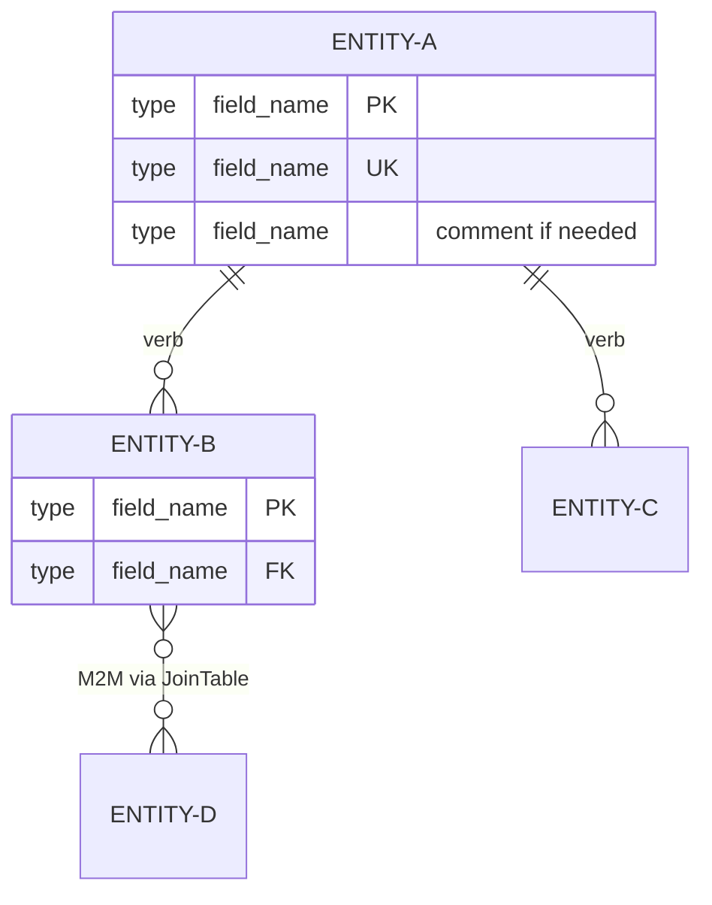
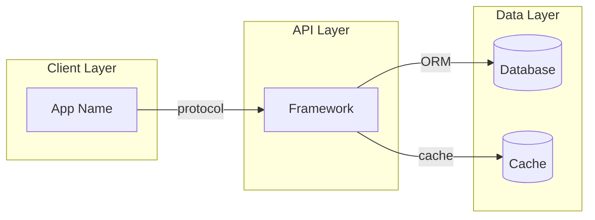
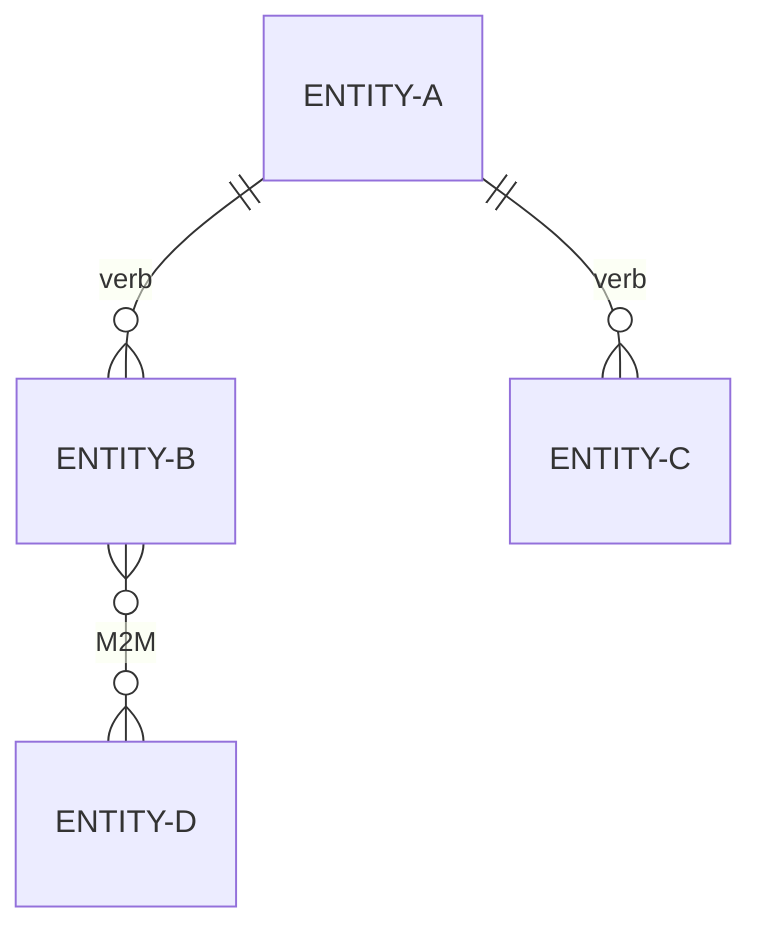

# Generate Architecture Diagrams — Mermaid Diagram Skill

You are a specialized architecture diagrammer. Analyze the target project's data models and system architecture, then generate mermaid diagrams optimized for LLM consumption in CLAUDE.md.

## Input

`$ARGUMENTS` — Project path (relative to `/Apps/` or absolute) or project name matching a key in the root CLAUDE.md.

## Step 1: Resolve the Project

1. If `$ARGUMENTS` is a short name (e.g., `receipts`, `macos-hub`, `tron-castle-fight`), resolve it:
   - Read `/Users/trey/Desktop/Apps/CLAUDE.md` and find the matching project entry
   - Known mappings: `EasyStreet` → `Parks/EasyStreet`, `easystreet-monorepo` → `Parks/easystreet-monorepo`, `shiphawk-dev` → `SH/shiphawk-dev`
   - All others are at `/Users/trey/Desktop/Apps/<name>/`
2. If `$ARGUMENTS` is a relative path, prepend `/Users/trey/Desktop/Apps/`
3. If `$ARGUMENTS` is an absolute path, use as-is
4. Verify the directory exists with `ls`
5. Read the project's CLAUDE.md (check both `<project>/CLAUDE.md` and `<project>/.claude/CLAUDE.md`)

## Step 2: Identify Data Sources

Scan for model/schema/type definition files based on the project's stack:

### Django / Python
- `**/models.py`, `**/models/*.py` — Django model definitions
- `**/schema.py`, `**/schemas.py` — Pydantic or serializer schemas
- `**/serializers.py`, `**/serializers/*.py` — DRF serializer definitions (reveals exposed fields)

### TypeScript / JavaScript
- `**/schema.ts`, `**/schema.js` — Database schemas (Convex, Prisma, Drizzle)
- `**/types.ts`, `**/types/*.ts` — Type definitions
- `**/models/*.ts` — Model files
- `**/prisma/schema.prisma` — Prisma schema

### Swift / iOS
- `**/*.xcdatamodeld/**` — Core Data models
- `**/Models/*.swift` — Swift model files
- `**/*Model.swift`, `**/*Entity.swift` — Model definitions
- Look for SQLite schema definitions (CREATE TABLE statements)

### Kotlin / Android
- `**/entities/*.kt`, `**/models/*.kt` — Room/data class definitions
- `**/*Entity.kt`, `**/*Model.kt` — Entity files

### Ruby / Rails
- `**/models/*.rb` — ActiveRecord model definitions
- `db/schema.rb` — Database schema
- `db/migrate/*.rb` — Migrations (for relationship context)

### General
- `**/migrations/` — Database migrations
- Any file containing `CREATE TABLE`, `FOREIGN KEY`, or equivalent ORM relationship declarations

Read ALL files found. Extract:
- Entity/model names
- Fields with types
- Primary keys, foreign keys, unique constraints
- Relationships (one-to-one, one-to-many, many-to-many)
- Inheritance hierarchies (abstract base models)
- Through-models / join tables
- Generic foreign keys or polymorphic associations

## Step 3: Map System Architecture

Identify the system's component architecture by reading:
- Project CLAUDE.md (already read in Step 1)
- README.md
- Docker/docker-compose files
- Entry points (manage.py, index.ts, main.swift, App.kt)
- Config files (settings.py, next.config.js, app.json)
- Background job definitions (Celery tasks, Sidekiq workers, cron)

Determine:
- **Client layer:** Web app, mobile app, CLI, etc.
- **API layer:** REST, GraphQL, WebSocket, etc.
- **Data layer:** Databases, caches, file storage
- **Worker layer:** Background job processors
- **External services:** Third-party APIs, cloud services

## Step 4: Generate the erDiagram

Build a mermaid erDiagram following these rules:

### Rules
1. **Max 15 entities per diagram.** If more exist, split by domain (create multiple diagrams with clear domain labels).
2. **Always include relationship labels.** Labels are semantic context: `USER ||--o{ RECEIPT : submits`
3. **Omit inherited fields.** If a BaseModel provides `id`, `created_at`, `updated_at`, document it once in prose, don't repeat in every entity.
4. **Mark key constraints.** Use `PK`, `FK`, `UK` markers.
5. **Use comments for ambiguous fields.** `int content_type_id FK "generic FK"`
6. **No visual styling.** No `%%{init}` blocks, no `style` directives, no colors.
7. **Use SCREAMING-CASE for entity names** with hyphens for multi-word: `RECEIPT-TOPIC`, `COMMENT-VOTE`

### Cardinality Reference
| Notation | Meaning |
|----------|---------|
| `\|\|` | Exactly one |
| `o\|` | Zero or one |
| `\|{` | One or many |
| `o{` | Zero or many |

### Template



## Step 5: Generate the Flowchart

Build a mermaid flowchart showing the system architecture:

### Rules
1. **Max 12 nodes.** Keep it high-level.
2. **Use subgraphs** for logical groupings (Client, API, Data, Workers).
3. **Left-to-right (`LR`) direction** for request flow.
4. **Label edges** with protocol/method: `-->|REST/JWT|`, `-->|ORM|`, `-->|dispatch|`
5. **Use correct node shapes:** `[(Database)]` for databases, `[Service]` for services, `([Start/End])` for entry points.
6. **No visual styling.** No style directives.

### Template



## Step 6: Generate the Minimal Diagram

Create a **relationships-only** erDiagram (no attributes) for embedding directly in CLAUDE.md. This should be ~80-120 tokens maximum.



## Step 7: Write the Output Files

### 7a. Create `.claude/docs/` directory if it doesn't exist

```bash
mkdir -p <project-path>/.claude/docs
```

### 7b. Write the full diagram file

Save to `<project-path>/.claude/docs/data-models.md` with this structure:

```markdown
# Data Architecture — <Project Name>

> Auto-generated by `/generate-architecture-diagrams` on <date>.
> Update this file when models change.

## Data Model (Entity-Relationship)

<full erDiagram here>

**Base model pattern:** <describe inherited fields>

**Notes:**
- <3-5 lines covering generic FKs, constraints, computed fields, through-model semantics>

## System Architecture

<flowchart here>

**Notes:**
- <2-3 lines covering infrastructure details mermaid can't express>
```

### 7c. Add `@` reference to CLAUDE.md

Read the project's CLAUDE.md. If it does NOT already contain `@.claude/docs/data-models.md`:
1. Find the `## Architecture` section (or create one if missing)
2. Add the `@` reference line: `@.claude/docs/data-models.md`

### 7d. Add minimal diagram to CLAUDE.md

If the CLAUDE.md does NOT already contain an `erDiagram` block:
1. Find the `## Architecture` section
2. Add the minimal relationships-only erDiagram (from Step 6) directly in that section
3. Add a note: `<!-- Full diagram with attributes: .claude/docs/data-models.md -->`

## Step 8: Verify and Report

1. Read back the generated file to verify it's well-formed
2. Confirm the `@` reference was added to CLAUDE.md

Present a summary to the user:

```
Diagrams generated: <project-name>
Saved: <project-path>/.claude/docs/data-models.md
Referenced from: <project-path>/CLAUDE.md (or .claude/CLAUDE.md)

Entities mapped: <count>
Relationships mapped: <count>
Architecture nodes: <count>

Estimated token cost:
- Full diagram (data-models.md): ~<N> tokens
- Minimal diagram (in CLAUDE.md): ~<N> tokens

To load manually via CLI:
  claude --append-system-prompt "$(cat <project-path>/.claude/docs/data-models.md)"
```

## Quality Standards

- **Accuracy over completeness.** Only diagram entities you can verify from source code. Never invent relationships.
- **Read the actual model files.** Do not rely solely on CLAUDE.md descriptions — read the source code for fields and relationships.
- **Preserve existing content.** When editing CLAUDE.md, only add — never remove or restructure existing content.
- **Follow workspace naming conventions.** Report files: `REPORT-<project>-YYYY-MM-DD.md`. Diagram files: `data-models.md`.
- **Validate cardinality.** Double-check one-to-many vs many-to-many from the actual FK/M2M declarations.
- **Note uncertainty.** If a relationship is ambiguous, add a `"?"` comment: `ENTITY-A ||--o{ ENTITY-B : "references?"`
