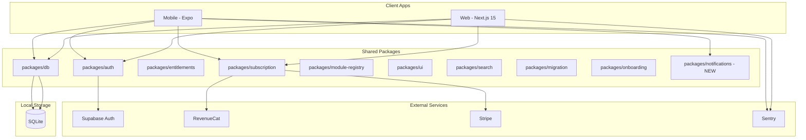
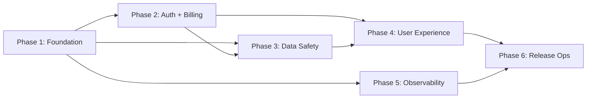

# Design Document: Production Release Readiness

## Overview

This design covers the full scope of work to take MyLife from its current pre-alpha state (445+ tests, 24 modules QA'd, TestFlight-verified) to a credible initial production release on iOS App Store, Google Play Store, and web. The release targets 9 GA modules and up to 20 Public Beta modules with real authentication, subscription billing, legal compliance, error reporting, data safety, onboarding, and app store submission infrastructure.

The work is organized into 6 implementation phases ordered by dependency:

1. **Foundation** (R9, R11, R13, R14, R28): Release states, error boundaries, logging, security, design tokens
2. **Auth and Billing** (R1, R2, R3): Authentication, subscription, legal compliance
3. **Data Safety and Privacy** (R5, R17, R19, R20, R21): Export, deletion, privacy dashboard, backup, module locks
4. **User Experience** (R6, R8, R10, R23, R24, R25, R26, R27): Onboarding, web UI, notifications, search, import, redesign
5. **Observability and Performance** (R4, R12, R18): Sentry, performance baselines, migration safety
6. **Release Operations** (R7, R15, R16, R22): EAS Build, trademark, CI/CD, cloud readiness

## Architecture

### System Context



### Phased Dependency Graph



### Key Architectural Decisions

1. **Auth via Supabase**: The `@mylife/auth` package already has a Supabase client, AuthService class, and AuthProvider. The stub needs to be completed with real session persistence and account deletion, not replaced.

2. **Dual billing providers**: RevenueCat for mobile IAP (handles Apple/Google receipt validation), Stripe for web. The `@mylife/subscription` package already has this split. The `@mylife/entitlements` package handles the unified gating layer.

3. **No new database**: All local features continue using the single SQLite file with table prefixes. No new database technology is introduced.

4. **Release state enforcement via existing registry**: `packages/module-registry/src/release-states.ts` already defines GA/Public_Beta/Merged states. The `hidden` state needs to be added for modules not yet visible.

5. **Notifications as a new shared package**: `packages/notifications` will provide a cross-module local notification API, abstracting expo-notifications on mobile and the Notifications API on web.

6. **Design token evolution in-place**: The 5-tier surface system extends `packages/ui/src/tokens/colors.ts` rather than replacing it.

## Components and Interfaces

### Phase 1: Foundation

#### R9: Module Release State Enforcement

**Changes to existing files:**

- `packages/module-registry/src/release-states.ts`: Add `'hidden'` to `ModuleReleaseState` union type. Move `garden`, `mail`, `subs` from their current states to `hidden`. Add `HIDDEN_MODULE_IDS` array.
- `packages/module-registry/src/types.ts`: No changes needed (release state is separate from ModuleDefinition).

**New behavior in host apps:**

- `apps/mobile/app/(hub)/discover.tsx`: Filter out hidden modules using `isUserVisibleModule()`. Show "Beta" badge via `getModuleReleaseLabel()` for public_beta modules.
- `apps/web/app/discover/page.tsx`: Same filtering and badge logic.
- Module home screens for public_beta modules: Add a dismissible beta disclaimer banner component.

```typescript
// packages/module-registry/src/release-states.ts (updated)
export type ModuleReleaseState = 'ga' | 'public_beta' | 'hidden' | 'merged';

export const HIDDEN_MODULE_IDS: readonly ModuleId[] = [
  'garden', 'mail', 'subs',
] as const;
```

#### R11: Web Error Boundary

**New file:** `apps/web/components/ModuleErrorBoundary.tsx`

React class component wrapping each module route. Catches render errors, displays module name + error message + "Try Again" / "Back to Hub" actions. Reports to Sentry (wired in Phase 5).

```typescript
interface ModuleErrorBoundaryProps {
  moduleId: ModuleId;
  moduleName: string;
  children: React.ReactNode;
}

interface ModuleErrorBoundaryState {
  hasError: boolean;
  error: Error | null;
}
```

**Integration point:** Each module route layout in `apps/web/app/[moduleId]/layout.tsx` wraps children with `<ModuleErrorBoundary>`.

#### R13: Structured Logging

**Changes to:** `deploy/self-host/api/src/` (after TypeScript migration from ROADMAP Block 3A)

Replace `console.*` calls with a pino logger instance. Configuration:

```typescript
// deploy/self-host/api/src/logger.ts
import pino from 'pino';

export const logger = pino({
  level: process.env.LOG_LEVEL || 'info',
  formatters: {
    level: (label) => ({ level: label }),
  },
  redact: ['req.headers.authorization', 'req.headers.cookie', 'body.password', 'body.email'],
  timestamp: pino.stdTimeFunctions.isoTime,
});
```

Request logging middleware adds method, path, status code, and response time to each log entry.

#### R14: Security Hardening

**Changes to existing files:**

- `apps/web/middleware.ts`: CSP already has `unsafe-eval` removed. Verify no regressions. Add nonce-based script-src for production if needed.
- `.github/workflows/ci.yml`: Add `pnpm audit --audit-level high` step that fails on critical/high.
- `apps/web/app/api/`: Add rate limiting middleware using a token bucket or sliding window (in-memory for web, can use `next-rate-limit` or custom).
- All API routes: Already use Zod validation via existing patterns. Audit for any unvalidated endpoints.

#### R28: Design System Token Evolution

**Changes to existing files:**

- `packages/ui/src/tokens/colors.ts`: Add 5-tier surface system:

```typescript
export const surfaceTiers = {
  lowest: '#0E0E13',
  low: '#1B1B20',
  container: '#1F1F25',
  high: '#2A292F',
  highest: '#35343A',
} as const;

export const hubAccent = '#C9894D';
export const hubAccentLight = '#FFB877';
```

- `packages/ui/src/tokens/glass.ts`: Formalize glass morphism tokens (already partially exists in `glassStyles`).
- `packages/ui/src/tokens/typography.ts`: Add Plus Jakarta Sans configuration with Inter fallback.

### Phase 2: Auth and Billing

#### R1: User Authentication

**Changes to existing files:**

- `packages/auth/src/service.ts`: The `AuthService` class exists with `signUp`, `signIn`, `signOut`, `getSession`, `onAuthStateChange`. Complete the implementation:
  - Add `deleteAccount()` method that calls Supabase admin API
  - Add session restoration on app restart via `getSession()`
  - Add secure token storage abstraction

- `packages/auth/src/provider.tsx`: The `AuthProvider` and `useAuth()` hook exist. Add:
  - Auto-restore session on mount
  - Error state handling with user-friendly messages (no email/password leak)

- `packages/auth/src/client.ts`: `getSupabaseClient()` exists. Add platform-specific storage:

```typescript
// Platform-specific session storage
interface SessionStorage {
  getItem(key: string): Promise<string | null>;
  setItem(key: string, value: string): Promise<void>;
  removeItem(key: string): Promise<void>;
}
```

Mobile: `expo-secure-store` (Keychain/Keystore). Web: httpOnly cookies via Supabase SSR helpers.

**New files:**

- `packages/auth/src/secure-storage.ts`: Platform-specific secure storage adapter
- `apps/mobile/app/(hub)/auth/sign-in.tsx`: Sign-in screen
- `apps/mobile/app/(hub)/auth/sign-up.tsx`: Sign-up screen
- `apps/web/app/auth/sign-in/page.tsx`: Web sign-in page
- `apps/web/app/auth/sign-up/page.tsx`: Web sign-up page

**Integration:**

- `apps/mobile/app/_layout.tsx`: AuthProvider already in provider chain. Wire session restoration.
- `apps/web/app/layout.tsx`: Same.
- Hub settings: Add "Sign In / Sign Up" or "Account" section based on auth state.

#### R2: Subscription Billing and Entitlement Gating

**Changes to existing files:**

- `packages/subscription/src/revenuecat.ts`: Already has `purchaseHubUnlock()` and `purchaseStandaloneModule()`. Add:
  - `restorePurchases()`: Calls RevenueCat restore flow
  - `getCustomerInfo()`: Returns current entitlement state
  - `checkEntitlement(moduleId)`: Boolean check for module access

- `packages/subscription/src/stripe.ts`: Already has `createCheckoutSession()` and `purchaseViaStripe()`. Add:
  - `getSubscriptionStatus()`: Returns current Stripe subscription state
  - `cancelSubscription()`: Initiates cancellation (access until period end)

- `packages/subscription/src/service.ts`: `createPaymentService()` exists. Add:
  - Entitlement caching layer (SQLite-backed for offline access)
  - Receipt validation error handling with fallback to cached state

- `packages/entitlements/src/`: Wire subscription state into the entitlement check. The existing `useModuleUnlocked()` hook in `apps/mobile/components/EntitlementsProvider.tsx` needs to check real subscription state.

**New files:**

- `apps/mobile/components/PaywallScreen.tsx`: Full-screen paywall shown when accessing premium module without subscription
- `apps/web/components/PaywallModal.tsx`: Modal paywall for web
- Hub settings subscription management section (view plan, cancel, resume)

**Free module gating:**

```typescript
// packages/module-registry/src/constants.ts already defines FREE_MODULES
// Entitlement check: if FREE_MODULES.includes(moduleId) -> always allowed
// Otherwise: check subscription state from @mylife/subscription
```

#### R3: Legal Compliance

**New files:**

- `apps/web/app/legal/privacy/page.tsx`: Privacy Policy page
- `apps/web/app/legal/terms/page.tsx`: Terms of Service page
- `apps/web/app/legal/health-data/page.tsx`: Consumer Health Data Privacy Policy (MHMDA/SB370/CTDPA)

**New component:**

- `packages/ui/src/components/HealthDataConsentDialog.tsx`: Shared consent dialog component

```typescript
interface HealthDataConsentDialogProps {
  moduleId: ModuleId;
  dataTypes: string[]; // e.g. ['vitals', 'medications', 'menstrual cycles']
  onConsent: () => void;
  onDecline: () => void;
}
```

**Health data modules requiring consent:** health, meds, cycle, mood, nutrition, workouts, fast, habits, presence

**Integration:**

- Module enable flow: Before enabling a health data module, check if consent has been given. If not, show `HealthDataConsentDialog`.
- Consent state stored in `hub_health_consent` SQLite table with columns: `module_id`, `consented_at`, `withdrawn_at`.
- Hub settings: "Health Data Consent" section showing per-module consent status with withdraw option.
- Withdrawal: Stops new data collection, offers deletion of existing health data.

### Phase 3: Data Safety and Privacy

#### R5: Data Export

**New file:** `packages/db/src/export.ts`

```typescript
interface ModuleExportData {
  moduleId: ModuleId;
  tables: Record<string, unknown[]>;
  exportedAt: string;
  error?: string;
}

interface HubExportData {
  version: string;
  exportedAt: string;
  modules: ModuleExportData[];
}

function exportAllModules(db: DatabaseAdapter, enabledModules: ModuleId[]): HubExportData;
```

Each module's CRUD layer already has query functions. The export iterates enabled modules, queries all tables by prefix, and assembles JSON. Module-level errors are caught and noted in the export without blocking other modules.

**Integration:**
- Mobile: System share sheet via `expo-sharing`
- Web: `Blob` + `URL.createObjectURL` for browser download
- Settings screen: "Export My Data" button on both platforms

#### R17: Module-Level Data Deletion

**New file:** `packages/db/src/deletion.ts`

```typescript
function deleteModuleData(db: DatabaseAdapter, moduleId: ModuleId, tablePrefix: string): void;
function resetModuleSchemaVersion(db: DatabaseAdapter, moduleId: ModuleId): void;
```

Drops all tables with the module's prefix, resets `hub_schema_versions` entry. For cloud modules (forums, market, surf, workouts), also calls Supabase deletion endpoint.

**Integration:**
- Settings > Module > "Delete Module Data" with two-step confirmation dialog
- Privacy Dashboard links to this action

#### R19: Privacy Dashboard

**New files:**

- `apps/mobile/app/(hub)/privacy.tsx`: Already exists (16 KB). Redesign to show:
  - Per-module expandable list with table names and row counts
  - Storage location indicator (local/cloud/both)
  - Total database size
  - "Delete Module Data" action per module
- `apps/web/app/privacy/page.tsx`: Web equivalent

```typescript
interface ModuleDataSummary {
  moduleId: ModuleId;
  tables: { name: string; rowCount: number }[];
  storageType: 'local' | 'cloud' | 'both';
  sizeBytes: number;
}
```

#### R20: Backup and Restore

**Changes to existing files:**

- `apps/mobile/app/(hub)/backup.tsx`: Already exists (8.5 KB). Enhance with:
  - SQLite file export via share sheet (not JSON, the actual .sqlite file)
  - Restore from .sqlite file with schema validation
  - Two-step confirmation before restore (warns about overwrite)

```typescript
interface BackupMetadata {
  version: string;
  createdAt: string;
  moduleCount: number;
  schemaVersions: Record<string, number>;
}

function validateBackupCompatibility(
  backupDb: DatabaseAdapter,
  currentSchemaVersions: Record<string, number>
): { compatible: boolean; errors: string[] };
```

**Restore flow:**
1. User selects .sqlite file
2. Open file as read-only, read `hub_schema_versions`
3. Compare against current schema versions
4. If compatible: confirm overwrite, replace database file, restart app
5. If incompatible: show error with details, preserve existing database

#### R21: Sensitive Module Protection

**New file:** `packages/auth/src/module-lock.ts`

```typescript
interface ModuleLockService {
  isLockEnabled(moduleId: ModuleId): Promise<boolean>;
  enableLock(moduleId: ModuleId, pin: string): Promise<void>;
  disableLock(moduleId: ModuleId): Promise<void>;
  authenticate(moduleId: ModuleId): Promise<boolean>; // biometric first, PIN fallback
  getFailedAttempts(moduleId: ModuleId): number;
  isLockedOut(moduleId: ModuleId): boolean; // true if 5+ failures within lockout window
}
```

**Lockable modules:** health, meds, mood, journal, budget, cycle, notes, mail

**Implementation:**
- PIN stored as scrypt hash in `hub_module_locks` SQLite table
- Biometric auth via `expo-local-authentication` (mobile) / WebAuthn (web)
- 5 failed PIN attempts triggers 60-second lockout (tracked in memory + SQLite)
- No biometric data stored; only boolean result from OS-level check

### Phase 4: User Experience

#### R6: Onboarding Flow

**Changes to existing files:**

- `apps/mobile/app/(onboarding)/index.tsx`: Already exists (22 KB) with 7-step FSM via `useOnboarding()`. Enhance with:
  - Privacy pledge / welcome screen
  - Module selection grid
  - Optional account creation step (clearly labeled as optional)
  - Health data consent for selected health modules
  - Completion state persistence (already exists via `useOnboardingComplete()`)

- `packages/onboarding/src/`: State machine already exists. Add health consent step integration.

#### R8: Web UI Completion for GA Modules

9 GA modules need real web UIs (not ModuleWebFallback): books, budget, fast, habits, health, meds, recipes, rsvp, words.

**Current state from codebase research:**
- books, fast, habits, health, meds, words: Already have real web UIs
- budget: Has web UI but some sub-routes use ModuleWebFallback (subscriptions, reports, goals, debt-payoff)
- recipes: Has web UI (14 files including cooking mode)
- rsvp: Has web UI (17 server actions)

**Remaining work:**
- Budget: Build real web pages for subscriptions, reports, goals, debt-payoff sub-routes
- Audit all 9 GA modules for any remaining ModuleWebFallback usage and replace

#### R10: Shared Notification Infrastructure

**New package:** `packages/notifications/`

```typescript
// packages/notifications/src/types.ts
interface ScheduledNotification {
  id: string;
  moduleId: ModuleId;
  title: string;
  body: string;
  scheduledAt: Date; // timezone-aware
  repeatInterval?: 'daily' | 'weekly' | 'custom';
  data?: Record<string, unknown>;
}

// packages/notifications/src/service.ts
interface NotificationService {
  schedule(notification: ScheduledNotification): Promise<string>;
  cancel(notificationId: string): Promise<void>;
  cancelAllForModule(moduleId: ModuleId): Promise<void>;
  getScheduled(moduleId?: ModuleId): Promise<ScheduledNotification[]>;
  rescheduleAll(): Promise<void>; // called on boot/reinstall
}
```

**Implementation:**
- Mobile: Wraps `expo-notifications` with timezone handling via `date-fns-tz`
- Web: Uses Notification API where available
- Persistence: `hub_scheduled_notifications` SQLite table for reschedule-on-boot
- Per-module preferences stored in `hub_notification_preferences` table

#### R23: Hub Search Reliability

**Changes to existing files:**

- `packages/search/src/query.ts`: Already has `search()` and `searchRecent()` with FTS5. Optimize for 200ms target:
  - Add query result caching (LRU, 50 entries, 30s TTL)
  - Ensure FTS5 index covers all enabled modules implementing `CrossModuleInterface`
  - Add performance logging for queries exceeding 200ms

- `packages/search/src/indexer.ts`: Already has `indexAllModules()`. Ensure incremental indexing on module data changes.

**Integration:**
- Search results grouped by module with accent color and icon (from MODULE_METADATA)
- Deep-link to module screen on result tap
- Empty state: Show 15 most recent cross-module actions via `searchRecent()`

#### R24: Import Wizard

**Changes to existing files:**

- `packages/migration/src/`: Already has importers for books (Goodreads), budget (YNAB). The `packages/onboarding/src/import/` directory has adapters for Goodreads, YNAB, MyFitnessPal, and Day One.

- `apps/mobile/app/(hub)/import-wizard.tsx`: Already exists (17 KB). Enhance with:
  - Source app selection (Goodreads, YNAB, MyFitnessPal, Day One)
  - Export instructions per source app
  - File upload with progress
  - Results summary with per-row error details
  - No network requirement for local file imports

#### R25, R26, R27: UI/UX Redesign

The redesign is a visual refresh using the Obsidian Noir design language documented in `docs/uiux-prompts/`. It preserves all existing functionality.

**Approach:**
1. Extend design tokens (Phase 1, R28) with 5-tier surfaces and hub accent
2. Hub shell screens (R25): 12 screens per `docs/uiux-prompts/hub-*.md` specs
3. GA module screens (R26): 9 modules per their respective prompt files
4. Public Beta module screens (R27): Priority order per R27.2, non-blocking for release

**Key patterns:**
- Glass morphism cards: `expo-blur` BlurView (mobile), `backdrop-filter` (web)
- Bento grid layouts for dashboard and discover
- Module accent colors from `MODULE_METADATA[moduleId].accentColor`
- Hub accent (#C9894D) for hub-level elements

### Phase 5: Observability and Performance

#### R4: Error Reporting (Sentry)

**New files:**

- `apps/mobile/lib/sentry.ts`: Initialize `@sentry/react-native` with DSN, source map upload config
- `apps/web/lib/sentry.ts`: Initialize `@sentry/nextjs`
- `apps/web/sentry.client.config.ts`: Sentry client-side config
- `apps/web/sentry.server.config.ts`: Sentry server-side config

**Integration points:**
- Mobile `ModuleErrorBoundary.componentDidCatch`: Report to Sentry with module context
- Web `ModuleErrorBoundary`: Same
- `DatabaseProvider` error handler: Report with module context
- Self-host API global error handler: Report with request context

**Context tags:** moduleId, screenName, hubMode, platform, enabledModules count

**PII scrubbing:** Strip email, user IDs from error reports. Use Sentry's `beforeSend` hook.

#### R12: Performance Baselines

**New file:** `docs/performance/BASELINE.md`

Measurements to capture:
- Cold start: < 3s on iPhone 12 (measured via EAS Build + Flipper/Perf Monitor)
- Lighthouse: >= 90 performance score
- LCP: < 2.5s on simulated 4G
- DB ops: < 100ms for standard CRUD (measured via benchmark script)
- Bundle size: < 500KB gzipped initial JS

**New script:** `scripts/benchmark-db.ts` for automated DB operation timing

#### R18: Fresh Install and Upgrade Migration Safety

**Changes to existing files:**

- `packages/db/src/`: The migration orchestrator already runs migrations sequentially. Ensure:
  - Transaction wrapping per module migration batch
  - `hub_schema_versions` tracking prevents duplicate execution
  - Failed module migration disables that module, logs error, continues
  - Loading indicator shown if migration exceeds 1 second

The existing `DatabaseProvider` in `apps/mobile/components/DatabaseProvider.tsx` already has error state with retry. Add migration progress state.

### Phase 6: Release Operations

#### R7: App Store Submission

**Changes to existing files:**

- `apps/mobile/eas.json`: Already exists. Verify development/preview/production profiles.
- Add store metadata files for iOS and Android (screenshots, descriptions, privacy policy URL, age rating)

**New files:**

- `docs/release/RELEASE_CHECKLIST.md`: Build, test, stage, submit, monitor, rollback steps
- `apps/mobile/store-metadata/`: Screenshots, descriptions, keywords per platform

#### R15: Trademark Resolution

Non-technical requirement. Design impact: all in-app references to "MyLife" must be abstracted behind a `BRAND_NAME` constant so a rebrand can be executed by changing one value.

```typescript
// packages/ui/src/constants/brand.ts
export const BRAND_NAME = 'MyLife';
export const BRAND_DOMAIN = 'mylife.app';
```

#### R16: CI/CD and Release Operations

**Changes to existing files:**

- `.github/workflows/ci.yml`: Add `pnpm audit --audit-level high` step (R14.2)
- Add staging deployment workflow for web (Vercel preview or equivalent)

**New files:**

- `docs/release/INCIDENT_RESPONSE.md`: Triage, communication, resolution runbook
- `docs/release/ROLLBACK.md`: Mobile (phased rollout revert) and web (redeploy previous) procedures

#### R22: Cloud Module Operational Readiness

**Changes to existing files:**

- `supabase/`: Ensure staging and production project configurations
- Cloud modules (forums, market, surf, workouts): Add environment-based Supabase client selection

```typescript
// packages/db/src/supabase-client.ts
function getSupabaseUrl(): string {
  return process.env.SUPABASE_ENV === 'staging'
    ? process.env.SUPABASE_STAGING_URL!
    : process.env.SUPABASE_PROD_URL!;
}
```

- RLS policies: Audit all Supabase tables for proper RLS enforcement
- Offline degradation: Cloud modules show cached data or "offline" message on network failure

## Data Models

### New SQLite Tables (hub_ prefix)

```sql
-- Health data consent tracking (R3)
CREATE TABLE hub_health_consent (
  module_id TEXT NOT NULL,
  consented_at TEXT NOT NULL,
  withdrawn_at TEXT,
  PRIMARY KEY (module_id)
);

-- Module lock configuration (R21)
CREATE TABLE hub_module_locks (
  module_id TEXT NOT NULL,
  pin_hash TEXT NOT NULL,
  salt TEXT NOT NULL,
  failed_attempts INTEGER DEFAULT 0,
  locked_until TEXT,
  created_at TEXT NOT NULL,
  PRIMARY KEY (module_id)
);

-- Scheduled notifications persistence (R10)
CREATE TABLE hub_scheduled_notifications (
  id TEXT PRIMARY KEY,
  module_id TEXT NOT NULL,
  title TEXT NOT NULL,
  body TEXT NOT NULL,
  scheduled_at TEXT NOT NULL,
  repeat_interval TEXT,
  data_json TEXT,
  created_at TEXT NOT NULL
);

-- Notification preferences (R10)
CREATE TABLE hub_notification_preferences (
  module_id TEXT NOT NULL,
  enabled INTEGER DEFAULT 1,
  updated_at TEXT NOT NULL,
  PRIMARY KEY (module_id)
);

-- Entitlement cache for offline access (R2)
CREATE TABLE hub_entitlement_cache (
  module_id TEXT NOT NULL,
  entitled INTEGER NOT NULL,
  source TEXT NOT NULL, -- 'revenuecat' | 'stripe' | 'free'
  cached_at TEXT NOT NULL,
  expires_at TEXT,
  PRIMARY KEY (module_id)
);
```

### Existing Tables Modified

- `hub_schema_versions`: No schema change, but migration safety (R18) ensures transactional updates
- `hub_settings`: Add keys for notification preferences, backup schedule, privacy consent state

### Supabase Tables (R22)

No new Supabase tables. Existing cloud module tables (forums, market, surf, workouts) need RLS policy audit and enforcement.


## Correctness Properties

*A property is a characteristic or behavior that should hold true across all valid executions of a system -- essentially, a formal statement about what the system should do. Properties serve as the bridge between human-readable specifications and machine-verifiable correctness guarantees.*

### Property 1: Auth round-trip (sign up then sign in)

*For any* valid email and password pair, signing up and then signing in with the same credentials should produce a valid authenticated session containing the same user identity.

**Validates: Requirements 1.2, 1.3**

### Property 2: Sign-out clears session

*For any* authenticated session, calling signOut should result in a null session state, and subsequent calls to getSession should return null.

**Validates: Requirements 1.4**

### Property 3: Local-only mode grants universal access

*For any* module ID, when the hub is in local-only mode, the entitlement check should return true without requiring authentication.

**Validates: Requirements 1.5**

### Property 4: Session persistence round-trip

*For any* valid authenticated session, persisting the session to secure storage and then restoring it should produce a session with the same user ID and equivalent access tokens.

**Validates: Requirements 1.6**

### Property 5: Invalid credentials produce safe error messages

*For any* invalid credential pair (wrong email, wrong password, or both), the error message returned by the auth service should not reveal which specific field was incorrect.

**Validates: Requirements 1.9**

### Property 6: Entitlement gating matches module tier and subscription state

*For any* module ID and subscription state, the entitlement check should return true if and only if the module is in FREE_MODULES or the user has an active (non-expired) subscription.

**Validates: Requirements 2.1, 2.2, 2.7**

### Property 7: Cached entitlements survive network failure

*For any* set of cached entitlement states, when a receipt validation request fails due to a network error, the entitlement check should return the cached state rather than revoking access.

**Validates: Requirements 2.5, 2.9**

### Property 8: Health data consent gating

*For any* module in the health data module list (health, meds, cycle, mood, nutrition, workouts, fast, habits, presence), enabling the module without prior consent should trigger the consent dialog, and the module should not collect data until consent is recorded.

**Validates: Requirements 3.4, 3.5, 6.6**

### Property 9: Health data deletion completeness

*For any* subset of health-related modules with stored data, requesting health data deletion should result in zero rows remaining in all health data tables for those modules.

**Validates: Requirements 3.8**

### Property 10: PII scrubbing in error reports

*For any* error context containing fields like email, userId, or session tokens, the Sentry beforeSend hook should strip all PII fields before transmission.

**Validates: Requirements 4.6**

### Property 11: Data export round-trip completeness

*For any* set of enabled modules with data in their SQLite tables, the export function should produce a JSON structure containing all records from all module tables, and the record count per table in the export should match the row count in the database.

**Validates: Requirements 5.1, 5.2**

### Property 12: Export error resilience

*For any* set of modules where one module's export throws an error, the export should still contain complete data from all non-failing modules, plus an error note for the failing module.

**Validates: Requirements 5.7**

### Property 13: Module data deletion clears all prefixed tables

*For any* module with a known table prefix and data in its tables, calling deleteModuleData should result in zero rows in all tables with that prefix, and the module's entry in hub_schema_versions should be removed.

**Validates: Requirements 17.1, 17.3, 5.6**

### Property 14: Release state completeness and visibility filtering

*For any* ModuleId in the registry, MODULE_RELEASE_STATES should have a defined state. For any module with state 'hidden' or 'merged', isUserVisibleModule should return false. For any module with state 'public_beta', getModuleReleaseLabel should return 'BETA'.

**Validates: Requirements 9.1, 9.2, 9.3, 9.4**

### Property 15: Notification timezone scheduling

*For any* timezone and scheduled datetime, the notification service should compute a trigger time that corresponds to the correct local time in that timezone, accounting for DST transitions.

**Validates: Requirements 10.2**

### Property 16: Notification persistence round-trip

*For any* set of scheduled notifications persisted to the hub_scheduled_notifications table, calling rescheduleAll should restore all notifications with matching IDs, titles, bodies, and scheduled times.

**Validates: Requirements 10.5**

### Property 17: Structured log format and request fields

*For any* HTTP request processed by the self-host API, the resulting log entry should be valid JSON containing timestamp, level, message, method, path, statusCode, and responseTime fields, with PII fields (email, password, authorization) redacted.

**Validates: Requirements 13.1, 13.3, 13.4**

### Property 18: Migration execution correctness

*For any* subset of modules and a fresh database, running all migrations should succeed, and hub_schema_versions should record the correct version for each module. For any module at version N with migrations up to M > N, only versions N+1 through M should execute.

**Validates: Requirements 18.1, 18.2, 18.5**

### Property 19: Migration failure isolation

*For any* set of modules where one module's migration throws an error, that module should be disabled, but all other modules' migrations should complete successfully and their data should be intact.

**Validates: Requirements 18.3**

### Property 20: Migration transactional safety

*For any* module migration that fails mid-execution, the database should not contain partially applied schema changes from that migration batch.

**Validates: Requirements 18.6**

### Property 21: Backup and restore round-trip

*For any* database state with data across multiple modules, backing up the SQLite file and then restoring from that backup should produce a database with identical table structures and row contents.

**Validates: Requirements 20.2**

### Property 22: Backup validation and restore safety

*For any* backup file, schema validation should correctly identify whether the backup is compatible with the current schema versions. For any incompatible or corrupt backup file, the restore process should fail gracefully and the original database should remain unchanged.

**Validates: Requirements 20.3, 20.5**

### Property 23: Module lock enforcement

*For any* module with lock enabled, attempting to access the module's content should require successful PIN or biometric authentication. Five consecutive failed PIN attempts should trigger a 60-second lockout; fewer than 5 should not.

**Validates: Requirements 21.2, 21.4**

### Property 24: Search result grouping by module

*For any* set of search results spanning multiple modules, the grouping function should produce groups keyed by moduleId, each with the correct accent color and icon from MODULE_METADATA.

**Validates: Requirements 23.2**

### Property 25: Import parsing with error tolerance

*For any* import file containing a mix of valid and invalid rows, the import process should successfully import all valid rows and return error details (row number, reason) for each invalid row.

**Validates: Requirements 24.2, 24.4**

### Property 26: API input validation

*For any* API endpoint and random invalid request body, the endpoint should return a validation error response rather than processing the invalid input.

**Validates: Requirements 14.4**

## Error Handling

### Authentication Errors
- Invalid credentials: Generic "Invalid email or password" message (never reveal which field failed)
- Network failure during auth: Show offline message, allow retry
- Session expiry: Silently attempt refresh; if refresh fails, prompt re-login
- Account deletion failure: Retry with exponential backoff, notify user of delay

### Subscription Errors
- Receipt validation failure: Fall back to cached entitlement state (never revoke on network error)
- Purchase failure: Show platform-specific error from RevenueCat/Stripe, allow retry
- Restore failure: Show error with "Contact Support" option

### Data Operations
- Export failure (per module): Skip failing module, include error note, continue with remaining modules
- Restore failure: Preserve original database, show descriptive error
- Migration failure: Disable failing module, log error with migration version and SQL, continue with other modules
- Deletion failure (cloud): Retry deletion, log failure, notify user that cloud data deletion is pending

### Module Errors
- Rendering crash (mobile): Existing ModuleErrorBoundary catches, shows recovery UI
- Rendering crash (web): New ModuleErrorBoundary catches, shows module name + "Try Again" / "Back to Hub"
- All caught errors reported to Sentry with module context

### Notification Errors
- Permission denied: Show guidance to enable in device settings
- Schedule failure: Log error, retry on next app launch
- Reschedule failure on boot: Log error, attempt individual notification reschedule

## Testing Strategy

### Unit Tests
- Auth service: sign up, sign in, sign out, session restore, error handling (mocked Supabase)
- Subscription service: purchase flow, entitlement caching, cancellation grace period (mocked RevenueCat/Stripe)
- Data export: JSON generation, module error handling, completeness
- Data deletion: per-module and all-data deletion, schema version reset
- Module lock: PIN hashing, lockout logic, attempt counting
- Notification service: scheduling, cancellation, timezone handling, persistence
- Migration orchestrator: fresh install, incremental upgrade, failure isolation, transaction safety
- Backup validation: schema compatibility checking, corrupt file handling
- Search: result grouping, FTS5 query sanitization, recent activity
- Import parsers: CSV/JSON parsing, error tolerance, row validation
- Release state: completeness, visibility filtering, label generation

### Property-Based Tests (Vitest + fast-check)
- Minimum 100 iterations per property test
- Each test tagged with: Feature: production-release-readiness, Property {N}: {title}
- Properties 1-26 as defined in the Correctness Properties section above
- Generators for: valid emails, passwords, module IDs, subscription states, SQLite data, CSV/JSON import files, timezone/datetime pairs, notification schedules

### Integration Tests
- Auth flow end-to-end with mocked Supabase (sign up -> sign in -> session restore -> sign out)
- Subscription purchase flow with mocked RevenueCat/Stripe
- Health data consent flow (enable module -> consent dialog -> data collection)
- Onboarding flow (welcome -> module selection -> account creation -> dashboard)
- Cloud module offline degradation (mock network failure, verify cached data display)
- Web error boundary (trigger module crash, verify recovery UI, verify Sentry report)

### E2E Tests (Playwright for web)
- Full onboarding flow
- Module enable/disable with entitlement gating
- Data export download
- Privacy dashboard navigation
- Search across modules
- Import wizard file upload flow

### Smoke Tests
- Privacy policy and ToS pages render
- EAS Build profiles exist in eas.json
- CSP header does not contain unsafe-eval
- npm audit passes with zero critical/high
- CI pipeline runs all required checks
- Sentry initialization on both platforms
