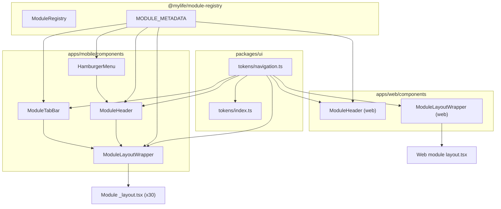
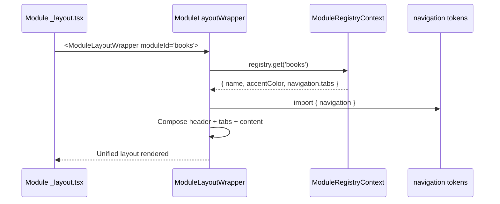

# Design Document: Unified Module Navigation

## Overview

This feature replaces 30 independently implemented module navigation layouts (headers, tab bars, content spacing) with a single shared component system. Today, each module's `_layout.tsx` defines its own header, tab bar height, blur intensity, icon style, and content padding, resulting in visual inconsistency and high maintenance cost. The unified system introduces four shared components (ModuleHeader, ModuleTabBar, HamburgerMenu, ModuleLayoutWrapper) backed by a new `navigation.ts` token file, so that every module achieves identical chrome by providing only a module ID and optional overrides.

The design leverages the existing `ModuleDefinition.navigation.tabs` array from `@mylife/module-registry` as the canonical Tab_Action_Config source, avoiding a new data structure. On web, a parallel ModuleHeader and ModuleLayoutWrapper standardize per-module headers that currently vary in height, padding, and typography.

### Key Design Decisions

1. **Reuse ModuleTab from module-registry** rather than inventing a new Tab_Action_Config type. Each module already declares `navigation.tabs` with `key`, `label`, and `icon`. The shared tab bar reads this directly.
2. **Token-driven dimensions** so that changing a single value in `packages/ui/src/tokens/navigation.ts` propagates to all 30 modules.
3. **Composition over inheritance**: ModuleLayoutWrapper composes ModuleHeader + content slot + ModuleTabBar rather than subclassing Expo Router's Tabs.
4. **Optional FAB slot** on ModuleTabBar for modules like budget that need a floating action button, avoiding per-module tab bar forks.
5. **Incremental migration**: modules can adopt ModuleLayoutWrapper one at a time; the wrapper is a drop-in replacement for inline Tabs configuration.

## Architecture



### Data Flow

1. Module `_layout.tsx` renders `<ModuleLayoutWrapper moduleId="books">` with child `<Tabs.Screen>` declarations.
2. ModuleLayoutWrapper resolves module metadata (name, accentColor, navigation.tabs) from the registry context.
3. ModuleLayoutWrapper renders ModuleHeader (top), children content area (middle), and passes tab config to Expo Router's `<Tabs>` `screenOptions` via ModuleTabBar.
4. ModuleHeader renders back button (left), module name (center), hamburger icon (right).
5. ModuleTabBar renders as the `tabBar` prop of `<Tabs>`, applying unified styling from navigation tokens.
6. HamburgerMenu is triggered from ModuleHeader and renders as a Modal overlay listing enabled modules.

## Components and Interfaces

### 1. Navigation Tokens (`packages/ui/src/tokens/navigation.ts`)

```typescript
export const navigation = {
  /** Fixed header height excluding safe area inset */
  headerHeight: 56,
  /** Fixed tab bar height excluding safe area inset */
  tabBarHeight: 80,
  /** Bottom padding inside tab bar for home indicator clearance */
  tabBarBottomPadding: 28,
  /** Top padding inside tab bar above icons */
  tabBarTopPadding: 12,
  /** BlurView intensity for tab bar glass effect */
  tabBarBlurIntensity: 80,
  /** Top corner radius for tab bar */
  tabBarBorderRadius: 32,
  /** Inactive tab icon/label tint */
  inactiveTint: 'rgba(228, 225, 233, 0.4)',
  /** Tab label font size */
  tabLabelFontSize: 10,
  /** Tab icon size */
  tabIconSize: 22,
  /** Horizontal content padding for module screens */
  contentPaddingHorizontal: 16,
  /** Tab bar horizontal inset from screen edges */
  tabBarHorizontalInset: 0,
  /** Header horizontal padding */
  headerPaddingHorizontal: 16,
  /** Web header height */
  webHeaderHeight: 64,
  /** Web content max width */
  webContentMaxWidth: 1200,
  /** Web content horizontal padding */
  webContentPaddingHorizontal: 24,
} as const;

export type NavigationTokens = typeof navigation;
```

### 2. ModuleHeader (`apps/mobile/components/ModuleHeader.tsx`)

```typescript
interface ModuleHeaderProps {
  /** Module identifier used to resolve name and accent color */
  moduleId: ModuleId;
  /** Optional override for the displayed module name */
  title?: string;
  /** Optional right-side accessory element (replaces hamburger icon) */
  rightAccessory?: React.ReactNode;
  /** Whether to show the hamburger menu icon (default: true) */
  showHamburger?: boolean;
}
```

Responsibilities:
- Renders a fixed-height header using `navigation.headerHeight` + top safe area inset
- Left: back chevron icon + "Apps" label, navigates via `router.replace('/(hub)')`
- Center: module display name in the module's accent color from `colors.modules[moduleId]`
- Right: hamburger menu icon (three-line) that opens HamburgerMenu
- Background: transparent or module base surface, no border/shadow

### 3. ModuleTabBar (`apps/mobile/components/ModuleTabBar.tsx`)

```typescript
interface ModuleTabBarProps {
  /** Per-module accent color for active tab tint */
  accentColor: string;
  /** Optional FAB configuration */
  fab?: {
    icon: string;
    onPress: () => void;
    label: string;
    gradientColors?: [string, string];
  };
}
```

This component is used as the `tabBar` prop of Expo Router's `<Tabs>`. It receives the standard `BottomTabBarProps` from `@react-navigation/bottom-tabs` and renders:
- BlurView background with `navigation.tabBarBlurIntensity`, `navigation.tabBarBorderRadius`
- Fixed height: `navigation.tabBarHeight + bottom safe inset`
- Active tint: `accentColor` prop
- Inactive tint: `navigation.inactiveTint`
- Icon size: `navigation.tabIconSize`
- Label style: uppercase, `navigation.tabLabelFontSize`, letter-spacing 0.7
- Optional FAB: rendered above the center tab position when `fab` is provided

### 4. HamburgerMenu (`apps/mobile/components/HamburgerMenu.tsx`)

```typescript
interface HamburgerMenuProps {
  visible: boolean;
  onClose: () => void;
  /** Currently active module ID for highlighting */
  currentModuleId: ModuleId;
}
```

Responsibilities:
- Renders as a React Native `Modal` with slide animation from the right
- Semi-transparent backdrop that dismisses on tap
- Lists all enabled modules from `ModuleRegistry.getEnabled()` with icon + name
- Highlights the current module
- Includes "Home" link to hub and "Settings" link
- Uses glass morphism styling consistent with the design system

### 5. ModuleLayoutWrapper (`apps/mobile/components/ModuleLayoutWrapper.tsx`)

```typescript
interface ModuleLayoutWrapperProps {
  /** Module identifier */
  moduleId: ModuleId;
  /** Tab screen declarations as children */
  children: React.ReactNode;
  /** Optional FAB config passed through to ModuleTabBar */
  fab?: ModuleTabBarProps['fab'];
  /** Optional header title override */
  headerTitle?: string;
  /** Optional right header accessory */
  headerRightAccessory?: React.ReactNode;
  /** Optional additional Tabs screenOptions overrides */
  screenOptions?: Partial<BottomTabNavigationOptions>;
}
```

Responsibilities:
- Wraps Expo Router `<Tabs>` with unified `screenOptions`
- Sets `header` to `<ModuleHeader moduleId={moduleId} />`
- Sets `tabBar` to `<ModuleTabBar accentColor={colors.modules[moduleId]} fab={fab} />`
- Sets `sceneStyle.backgroundColor` to `surfaceTiers.lowest` (or module-specific base)
- Applies `tabBarStyle` dimensions from navigation tokens
- Children are `<Tabs.Screen>` declarations (unchanged from current pattern)

### 6. Web ModuleHeader (`apps/web/components/ModuleHeader.tsx`)

```typescript
interface WebModuleHeaderProps {
  moduleId: ModuleId;
  title?: string;
  navLinks?: Array<{ href: string; label: string }>;
  maxWidth?: number;
}
```

Responsibilities:
- Renders a consistent header bar with module name, optional nav links
- Uses `navigation.webHeaderHeight` for height
- Glass morphism background via `backdrop-filter`
- Replaces per-module inline header implementations

### 7. Web ModuleLayoutWrapper (`apps/web/components/ModuleLayoutWrapper.tsx`)

```typescript
interface WebModuleLayoutWrapperProps {
  moduleId: ModuleId;
  children: React.ReactNode;
  navLinks?: Array<{ href: string; label: string }>;
  maxWidth?: number;
}
```

Responsibilities:
- Applies `margin: '-32px'` to counteract root layout padding
- Renders WebModuleHeader at top
- Wraps children in a content container with `navigation.webContentPaddingHorizontal` and `navigation.webContentMaxWidth` (overridable via `maxWidth` prop)
- Sets background to `var(--background)`


## Data Models

### Tab Action Config

The design reuses the existing `ModuleTab` interface from `@mylife/module-registry/types`:

```typescript
// Already exists in packages/module-registry/src/types.ts
interface ModuleTab {
  key: string;    // Route name (e.g., 'index', 'transactions')
  label: string;  // Display label (e.g., 'Budget', 'Transactions')
  icon: string;   // MaterialSymbol icon name (e.g., 'account_balance_wallet')
}
```

Each module's `MODULE_METADATA[moduleId].navigation.tabs` already contains this array. The ModuleLayoutWrapper reads it from the registry context, so individual module `_layout.tsx` files do not need to redeclare tab configurations unless they differ from the registry definition.

### FAB Configuration

For modules requiring a floating action button (currently only budget):

```typescript
interface FabConfig {
  /** MaterialSymbol icon name */
  icon: string;
  /** Press handler */
  onPress: () => void;
  /** Accessibility label */
  label: string;
  /** Optional gradient colors [start, end] */
  gradientColors?: [string, string];
}
```

### Navigation Token Shape

```typescript
interface NavigationTokens {
  headerHeight: number;
  tabBarHeight: number;
  tabBarBottomPadding: number;
  tabBarTopPadding: number;
  tabBarBlurIntensity: number;
  tabBarBorderRadius: number;
  inactiveTint: string;
  tabLabelFontSize: number;
  tabIconSize: number;
  contentPaddingHorizontal: number;
  tabBarHorizontalInset: number;
  headerPaddingHorizontal: number;
  webHeaderHeight: number;
  webContentMaxWidth: number;
  webContentPaddingHorizontal: number;
}
```

### Module Resolution Flow



### Migrated Module _layout.tsx (Example: Notes)

Before (current):
```typescript
// ~80 lines of inline Tabs config, custom TabIcon, headerLeft, tabBarStyle...
export default function NotesLayout() {
  return (
    <Tabs screenOptions={{
      tabBarStyle: { backgroundColor: colors.surface, ... },
      tabBarActiveTintColor: colors.modules.notes,
      headerLeft: () => <BackToHubButton />,
      // ...20+ lines of inline styling
    }}>
      <Tabs.Screen name="index" options={{ title: 'Home', tabBarIcon: ... }} />
      {/* ...more screens */}
    </Tabs>
  );
}
```

After (migrated):
```typescript
import { ModuleLayoutWrapper } from '../../../components/ModuleLayoutWrapper';

export default function NotesLayout() {
  return (
    <ModuleLayoutWrapper moduleId="notes">
      <Tabs.Screen name="index" />
      <Tabs.Screen name="search" />
      <Tabs.Screen name="folders" />
      <Tabs.Screen name="graph" />
      <Tabs.Screen name="settings" />
      <Tabs.Screen name="note-editor" options={{ href: null }} />
      {/* ...hidden screens */}
    </ModuleLayoutWrapper>
  );
}
```


## Correctness Properties

*A property is a characteristic or behavior that should hold true across all valid executions of a system -- essentially, a formal statement about what the system should do. Properties serve as the bridge between human-readable specifications and machine-verifiable correctness guarantees.*

### Property 1: Module metadata resolution correctness

*For any* valid `ModuleId`, when ModuleLayoutWrapper (or ModuleHeader/ModuleTabBar) resolves the module's display name and accent color, the resolved name SHALL equal `MODULE_METADATA[moduleId].name` and the resolved accent color SHALL equal `colors.modules[moduleId]`.

**Validates: Requirements 1.3, 1.4, 2.3, 6.2**

### Property 2: Tab config rendering fidelity

*For any* valid array of `ModuleTab` items passed to ModuleTabBar, the rendered tab bar SHALL contain exactly `tabs.length` tab elements, and each rendered tab SHALL display the `label` and `icon` specified in the corresponding `ModuleTab` entry.

**Validates: Requirements 2.1, 2.2**

### Property 3: Content area top offset calculation

*For any* non-negative top safe area inset value, the ModuleLayoutWrapper SHALL apply a top offset (padding or margin) to the content area equal to `navigation.headerHeight + topSafeInset`, ensuring no content renders behind the header.

**Validates: Requirements 4.1**

### Property 4: Content area bottom offset calculation

*For any* non-negative bottom safe area inset value, the ModuleLayoutWrapper SHALL apply a bottom offset (padding or margin) to the content area equal to `navigation.tabBarHeight + bottomSafeInset`, ensuring no content is hidden behind the tab bar.

**Validates: Requirements 4.2**

### Property 5: Hamburger menu lists all enabled modules

*For any* subset of enabled modules returned by `ModuleRegistry.getEnabled()`, the HamburgerMenu SHALL render a navigation item for each enabled module, and the count of rendered module items SHALL equal the count of enabled modules.

**Validates: Requirements 5.2**

## Error Handling

### Invalid Module ID
If `ModuleLayoutWrapper` receives a `moduleId` not present in `MODULE_METADATA`, it should:
- Fall back to a default display name ("Module") and the base accent color (`colors.accent`)
- Log a warning via `console.warn` for developer visibility
- Continue rendering without crashing

### Missing Module Registry Context
If the `ModuleRegistryContext` is not available (e.g., component rendered outside the provider tree):
- HamburgerMenu should render an empty module list with a "No modules available" message
- ModuleHeader should still render with the fallback module name
- No crash or blank screen

### Safe Area Inset Unavailable
If `useSafeAreaInsets()` returns zero values (e.g., in a test environment or unsupported device):
- Components should gracefully use zero insets, resulting in no extra padding
- The layout remains functional, just without safe area compensation

### Empty Tab Configuration
If a module's `navigation.tabs` array is empty:
- ModuleTabBar should render an empty tab bar (no tab items) without crashing
- The content area should still be properly offset

### FAB Configuration Errors
If the `fab.onPress` handler throws:
- The error should be caught and logged, not propagated to crash the tab bar
- The FAB should remain visible but non-functional until the next render

## Testing Strategy

### Unit Tests (Example-Based)

Focus on specific scenarios and edge cases:

- **ModuleHeader**: renders back button, hamburger icon, correct module name; back button calls `router.replace('/(hub)')`; header height matches token; safe area inset is respected
- **ModuleTabBar**: inactive tint matches token; height matches token; BlurView props match tokens; FAB renders when config provided, absent when not; tab press triggers navigation
- **HamburgerMenu**: opens/closes correctly; hub link present; settings link present; module tap navigates and closes; backdrop tap dismisses
- **ModuleLayoutWrapper**: composes all three sub-components; scene background color correct; works with Tabs.Screen children
- **Navigation tokens**: all required token values are defined and are positive numbers
- **Web components**: shared header renders with correct dimensions; negative margin applied; content max-width respected

### Property-Based Tests

Using `fast-check` for property-based testing. Each test runs a minimum of 100 iterations.

- **Property 1**: Generate random `ModuleId` values from the known set, verify name and accent color resolution matches `MODULE_METADATA` and `colors.modules`.
  Tag: `Feature: unified-module-navigation, Property 1: Module metadata resolution correctness`

- **Property 2**: Generate random arrays of `ModuleTab` objects (varying length 1-8, random icon names and labels), render ModuleTabBar, verify rendered tab count and content matches input.
  Tag: `Feature: unified-module-navigation, Property 2: Tab config rendering fidelity`

- **Property 3**: Generate random non-negative integers (0-100) for top safe area inset, verify content area top offset equals `navigation.headerHeight + inset`.
  Tag: `Feature: unified-module-navigation, Property 3: Content area top offset calculation`

- **Property 4**: Generate random non-negative integers (0-100) for bottom safe area inset, verify content area bottom offset equals `navigation.tabBarHeight + inset`.
  Tag: `Feature: unified-module-navigation, Property 4: Content area bottom offset calculation`

- **Property 5**: Generate random subsets of `ModuleId` values as "enabled modules", mock the registry, render HamburgerMenu, verify rendered module count matches enabled count.
  Tag: `Feature: unified-module-navigation, Property 5: Hamburger menu lists all enabled modules`

### Integration Tests

- Render a full module layout (e.g., notes) with ModuleLayoutWrapper and verify the complete component tree renders without errors
- Verify that budget's FAB slot integrates correctly with the unified tab bar
- Verify web ModuleLayoutWrapper renders correctly within the Next.js root layout context

### Migration Verification (Smoke Tests)

- Static analysis: grep all 30 module `_layout.tsx` files for absence of inline `tabBarStyle`, `headerStyle`, and `header:` overrides after migration
- Verify all module `navigation.tabs` entries use MaterialSymbol icon names (no emoji characters)
- Verify `packages/ui/src/tokens/navigation.ts` exports all required token keys

