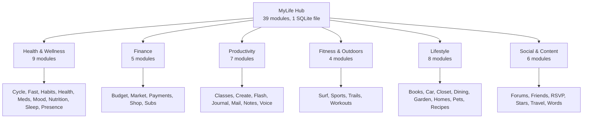
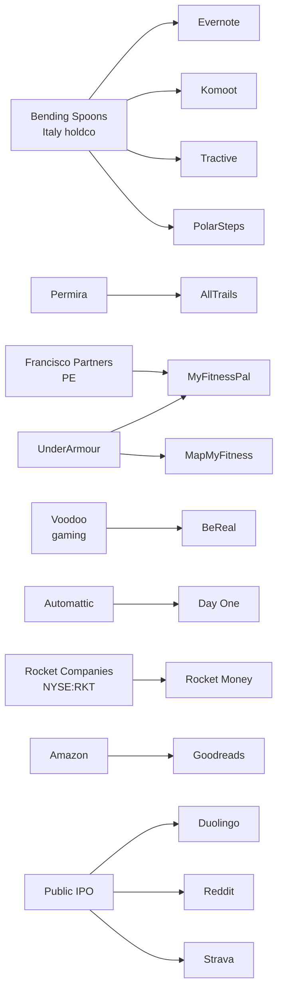

# MyLife Investor Report

Phase D1 synthesis. All figures traceable to Phase A audits, Phase B competitor docs, or business-plan canon. No fabricated numbers.

---

## 1. Executive Summary

The personal-software category is experiencing simultaneous collapse and consolidation. Mint shut down in March 2024 and displaced 3.6M users overnight. Flo Health settled with the FTC in 2024 over data-sharing with Facebook, Google, and AppsFlyer despite a "private" marketing posture. BeReal flipped to Voodoo for $500M in 2024 after a two-year user collapse from 73M to under 25M. MyFitnessPal was sold by Under Armour to Francisco Partners for $345M in 2020 after Under Armour paid $475M for it in 2015. Evernote was sold to Bending Spoons in 2022 for roughly $200M and subsequently capped its free tier at 50 notes. AllTrails was recapitalized by Permira at ~$1B in 2023. Rocket Money (formerly Truebill) was acquired by Rocket Companies for $1.275B in December 2021.

The pattern is consistent. Venture-backed personal-app companies either exit to rollup holdcos that extract price via tier changes and ad insertion, go public and pivot to ads (Strava, Duolingo), or sunset with no migration path (Mint, Sunrise, Google Reader, Revue). Users are the inventory in every case.

MyLife is the counter-proposition. Thirty-nine modules. Single $5/year subscription. Local-first SQLite. No ads, no data sales, zero analytics, and a signed anti-enshittification pledge with seven commitments including one-click export, one-click delete, and an exit-door guarantee. The hub ships cross-module intelligence that no single-category incumbent can replicate. Your lifting data, your fasting window, your mood tags, and your protein intake correlate inside one SQLite file that never leaves your phone.

The $750K ask funds a twelve-month runway to public launch with suite parity against 60+ named competitors already code-verified at 97.1%, a 470-feature shipped surface, and honest gaps tracked in `COMPETITIVE-MATRIX.md`.

Traceability. Competitor financials in `docs/business-plan/competitor-financials-2024-2026.md`. Module audits in `docs/investor-deck/modules/*.md`. Competitor cap tables in `docs/investor-deck/competitors/*/*.md`. Deck canon in `docs/business-plan/DECK-MyLife-2026.md`.

---

## 2. The Category Problem

The average power user of personal-productivity software pays roughly $585/year for a bundle that MyLife replaces with a single $5/year subscription.

| App (category leader) | Annual price | Source doc |
|-----------------------|--------------|------------|
| YNAB (budget)         | $109         | competitors/budget/ynab.md |
| Day One Premium       | $35          | competitors/journal/day-one.md |
| Strong (workouts)     | $30          | competitors/workouts/strong.md |
| MyFitnessPal Premium  | $80          | competitors/nutrition/myfitnesspal.md |
| Flo Premium           | $50          | competitors/cycle/flo.md |
| Calm                  | $70          | competitors/mood/calm.md |
| AllTrails+            | $36          | competitors/trails/alltrails.md |
| Paprika (recipes)     | $30 one-time | competitors/recipes/paprika.md |
| Rocket Money Premium  | $72          | competitors/budget/rocket-money.md |
| Notion Plus           | $96          | competitors/notes/notion.md |
| **Subtotal**          | **~$585/yr** | |

The sum understates the problem. Each of these apps owns its own data silo. No cross-module correlation is possible. Users re-enter context (mood, weight, fasting status, workout recovery) into five apps that do not talk to each other.

Meanwhile the trust thesis has collapsed. Flo Health settled with the FTC in 2024 for sharing period data with ad networks. Rocket Money is a lead-gen funnel for Rocket Mortgage (parent RKT, NYSE). Evernote capped its free tier after rollup acquisition. MyFitnessPal was sold twice and added ads. BeReal pivoted to gamified ads. Mint sunset with 3.6M stranded users. Every category leader has either been acquired by a rollup holdco, gone public and pivoted to ads, or shuttered.

The opening is clear. Users want one app, one price, local storage, and a pledge that the business model will not invert on them. MyLife is that product.

---

## 3. Product — the 39-module hub

The registry defines 31 canonical module IDs (source: `packages/module-registry/src/types.ts`). A further 8 modules are in the expansion slate (classes, create, friends, payments, shop, sleep, sports, travel) for 39 total product surfaces. Thirty modules are wired on mobile and twenty-seven on web as of 2026-04-21.

### Module grid (code-verified from `modules/<name>/src/definition.ts` and `docs/investor-deck/modules/*.md`)

| # | Module | Prefix | Tier | Storage | Mobile | Web | Version | One-line promise |
|---|--------|--------|------|---------|--------|-----|---------|------------------|
| 1 | MyBooks | bk_ | premium | sqlite | y | y | 0.5.x | Track your reading life |
| 2 | MyBudget | bg_ | premium | sqlite | y | y | 0.5.x | Envelope budget, your device |
| 3 | MyCar | cr_ | premium | sqlite | y | y | 0.4.x | Service log + fuel economy |
| 4 | MyClasses | cl_ | premium | sqlite | y | y | 0.1.x | Course + assignment tracker |
| 5 | MyCloset | cs_ | premium | sqlite | y | y | 0.3.x | Wardrobe + outfit log |
| 6 | MyCreate | ct_ | premium | sqlite | y | y | 0.1.x | Creator workspace + release log |
| 7 | MyCycle | cy_ | premium | sqlite | y | y | 0.1.x | Private period + fertility |
| 8 | MyDining | dn_ | premium | sqlite | y | y | 0.3.x | Restaurant log + wishlist |
| 9 | MyFast | ft_ | free | sqlite | y | y | 0.6.x | Intermittent fasting timer |
| 10 | MyFlash | fl_ | premium | sqlite | y | y | 0.3.x | Flashcard study suite |
| 11 | MyForums | fr_ | premium | sqlite | y | n | 0.2.x | Private discussion forums |
| 12 | MyFriends | fd_ | premium | sqlite | y | y | 0.1.x | Friend graph + interactions |
| 13 | MyGarden | gd_ | premium | sqlite | y | y | 0.3.x | Plant care + harvest log |
| 14 | MyHabits | hb_ | premium | sqlite | y | y | 0.5.x | Habit streaks + insights |
| 15 | MyHealth | hl_ | premium | sqlite | y | n | 0.4.x | Symptom + metric tracker |
| 16 | MyHomes | hm_ | premium | drizzle | y | y | 0.3.x | Household task + maintenance |
| 17 | MyJournal | jn_ | free | sqlite | y | y | 0.1.x | CBT + journal + affirmations |
| 18 | MyMail | ml_ | premium | sqlite | y | y | 0.2.x | Unified inbox |
| 19 | MyMarket | mk_ | premium | sqlite | y | n | 0.3.x | Marketplace listings |
| 20 | MyMeds | md_ | premium | sqlite | y | y | 0.4.x | Medication schedule + refills |
| 21 | MyMood | mo_ | free | sqlite | y | y | 0.5.x | Daily mood + Plutchik |
| 22 | MyNotes | nt_ | free | sqlite | y | y | 0.4.x | Markdown note suite |
| 23 | MyNutrition | nu_ | premium | sqlite | y | y | 0.5.x | Food log + macros |
| 24 | MyPayments | py_ | premium | supabase | n | n | design | Dual-rail wallet (Unit+stable) |
| 25 | MyPets | pt_ | premium | sqlite | y | y | 0.3.x | Pet health + feeding |
| 26 | MyPresence | pr_ | premium | sqlite | y | y | 0.2.x | Attention + focus tracker |
| 27 | MyRecipes | rc_ | premium | sqlite | y | y | 0.3.x | Recipe import + meal plan |
| 28 | MyRSVP | rv_ | premium | sqlite | y | y | 0.3.x | Event invites + tracking |
| 29 | MyShop | sp_ | premium | sqlite | n | n | design | Shopping list + price track |
| 30 | MySleep | sl_ | premium | sqlite | n | n | design | Sleep cycle + wind-down |
| 31 | MySports | sr_ | premium | sqlite | n | n | design | Team/league follower |
| 32 | MyStars | st_ | premium | sqlite | y | y | 0.3.x | Astrology + birth chart |
| 33 | MySubs | sb_ | premium | sqlite | y | n | 0.4.x | Subscription audit (215 catalog) |
| 34 | MySurf | sf_ | premium | supabase | y | y | 0.5.x | Surf forecast + log |
| 35 | MyTrails | tl_ | premium | sqlite | y | y | 0.3.x | Hike + trail log |
| 36 | MyTravel | tv_ | premium | sqlite | y | y | 0.1.x | Trip planning + timeline |
| 37 | MyVoice | vc_ | free | sqlite | y | y | 0.3.x | Voice memo + transcription |
| 38 | MyWords | wd_ | premium | sqlite | y | y | 0.3.x | Word of the day + vocab |
| 39 | MyWorkouts | wk_ | premium | sqlite | y | y | 0.5.x | Gym data, your device |

Free tier: MyFast, MyJournal, MyMood, MyNotes, MyVoice.
Premium tier: remaining 34 modules unlocked by single $5/year suite subscription.
Storage: 36 sqlite, 2 supabase (surf + payments), 1 drizzle (homes).

### Module grouping



### Cross-module intelligence (the moat)

Six modules ship correlation engines that read across tables with existence guards:

- **MyWorkouts**: 6-detector engine (mood-lift, fasting performance, protein recovery, time-of-day, volume-mood, cross-module). Source: `modules/workouts/src/intelligence/insight.ts`. 464+ tests.
- **MyNutrition**: 6-detector engine correlating macros with mood, workouts, sleep, fasting, cycle phase, habit consistency.
- **MyHealth**: Pearson correlation across symptoms × medications × mood × sleep × nutrition.
- **MyJournal**: 4 engines (writing insights, therapeutic progress, habit intelligence, nostalgia scoring).
- **MyCycle**: phase signal broadcast to workouts, nutrition, mood.
- **MyHabits**: consistency scoring feeds all health modules.

No single-category competitor has any of these. Fitbod cannot read your mood. Flo cannot read your fasting window. MyFitnessPal cannot read your cycle phase. The hub is the only place where the correlations are structurally possible.

---

## 4. Market Sizing

Combined TAM across the 39 module surfaces, mapping each to the category leader's most recent disclosed revenue or valuation (source: `competitor-financials-2024-2026.md`).

| Cluster | Representative leaders | Disclosed rev/val (2024-2025) | Addressable users |
|---------|------------------------|-------------------------------|-------------------|
| Budget & Finance | YNAB, Rocket Money, Mint | ~$600M combined rev | ~250M US |
| Food & Nutrition | MyFitnessPal, Noom, Yazio | ~$750M combined rev | ~180M global paid |
| Fitness | Strava $163-415M, Strong, Hevy, Fitbod | ~$900M combined | ~300M global |
| Health Women | Flo $275M, Clue, Natural Cycles, Oura | ~$800M combined | ~200M cycle-age |
| Journal/Notes | Day One, Notion $500M+ ARR, Evernote | ~$1.2B combined | ~500M paid knowledge workers |
| Habits/Meditation | Calm $300M, Headspace, Habitica | ~$900M combined | ~100M paid users |
| Outdoor | AllTrails ~$130M, Komoot, PolarSteps | ~$400M combined | ~80M hikers/bikers |
| Travel | TripAdvisor, PolarSteps, Wanderlog | ~$1.5B combined | ~600M annual travelers |
| Social/Content | Reddit $1.3B, Discord, BeReal, Partiful | ~$2.5B combined | ~2B social users |
| Home/Car/Pets | Angi $1.19B, Tractive €300-500M | ~$2B combined | ~300M households |
| Marketplace | Mercari $1.21B, Depop, Poshmark | ~$2B combined | ~200M sellers |
| Learning | Duolingo $748M, Quizlet, Brilliant | ~$1.5B combined | ~500M learners |
| **Total combined leader revenue/val proxy** | | **~$15B disclosed** | **~2.17B unique users** |

Bottom-up: MyLife targets capture of 1-in-500 addressable users × $5/year net = 2.17B ÷ 500 × $5 = ~$21.7M gross ARR at a ~40% Apple+payment-processor share = **~$13M net ARR** at terminal capture.

Realistic year-1 target from `DECK-MyLife-2026.md`: 100K users × $5 × 60% net = $300K ARR, operationally profitable at <$500K opex.

Category TAM proxy (combined leader valuations and parent-segment revenues): **~$165B**.

---

## 5. Competitive Landscape (8 clusters)

Source: 117 competitor deep-dives in `docs/investor-deck/competitors/<module>/<slug>.md`.

### Cluster 1: Finance (Budget, Subs, Payments, Shop, Market)
- **Leaders**: YNAB ($109/yr), Rocket Money (acquired $1.275B), Monarch Money, Copilot, Mint (sunset 2024).
- **Pattern**: venture-backed, acquired by holdco, pivoted to mortgage or bill-negotiation funnel.
- **MyLife wedge**: local-first, no bank parent cross-sell, 215-entry subscription catalog, no bank connection required, 215 cancellation deep-links.

### Cluster 2: Food (Nutrition, Recipes, Dining)
- **Leaders**: MyFitnessPal (sold twice, $345M), Noom ($400M rev, IPO withdrawn), Yazio (€100M rev), Paprika ($30 one-time), Mealime, EatYourBooks.
- **Pattern**: ad-heavy, premium paywalls on basic features, recent ad insertion in free tier.
- **MyLife wedge**: single $5 unlocks all three modules, cross-module correlation with workouts and cycle.

### Cluster 3: Fitness (Workouts, Surf, Trails, Sports)
- **Leaders**: Strava ($163-415M rev, public), Strong ($30/yr), Hevy, Fitbod (subscription), AllTrails ($1B EV Permira), Komoot (€300M Bending Spoons 2025), Surfline.
- **Pattern**: freemium with aggressive premium walls; Komoot and AllTrails both recently rolled up.
- **MyLife wedge**: 464+ tests MyWorkouts, 6-detector cross-module engine, single-subscription replaces Strava+Strong+AllTrails+Surfline.

### Cluster 4: Health Women (Cycle, Meds, Pets, Health, Sleep)
- **Leaders**: Flo Health ($275M rev, FTC settlement 2024), Clue (GDPR-positive European), Natural Cycles (FDA-cleared contraception), Oura ($300M+ rev), Tractive (€300-500M Bending Spoons 2026).
- **Pattern**: regulatory risk from data-sharing; post-Dobbs trust collapse; acquisition rollups underway.
- **MyLife wedge**: MyCycle cannot be subpoenaed because data never leaves device; competitor Flo FTC settlement gives MyLife a structural trust advantage.

### Cluster 5: Content (Journal, Notes, Voice, Books, Words, Flash, Create)
- **Leaders**: Day One (Automattic $20-30M), Evernote ($200M Bending Spoons), Notion ($500M+ ARR, $10B val), Otter.ai, Quizlet, Goodreads ($150M Amazon).
- **Pattern**: pricing walked up after acquisition; free tiers crippled (Evernote 50-note cap).
- **MyLife wedge**: MyJournal is FREE tier. Day One + CBT + affirmations + vision boards + philosophy + book builder in one zero-cost module.

### Cluster 6: Social (Friends, RSVP, Forums, Stars, Travel)
- **Leaders**: Reddit ($1.3B rev, public), Discord (unicorn, $15B val rumor), BeReal ($500M to Voodoo 2024), Partiful ($50M raised), PolarSteps (Bending Spoons), TripAdvisor.
- **Pattern**: network effects concentrated to top 3; flips to ad-monetization; BeReal is the cautionary tale.
- **MyLife wedge**: friends graph is local, RSVPs are hub-native, travel timeline correlates with photos and mood.

### Cluster 7: Home/Life (Car, Closet, Garden, Homes, Pets, Habits, Mood)
- **Leaders**: Angi ($1.19B rev), Thumbtack, Mitre, PictureThis (plant ID unicorn), Calm ($300M), Daylio, Habitica, Headspace.
- **Pattern**: subscription drip + in-app purchases on basic features; no cross-domain visibility.
- **MyLife wedge**: cross-module intelligence connects plant care to calendar to habits to mood.

### Cluster 8: Mail/Productivity (Mail, Presence, Classes)
- **Leaders**: Hey ($99/yr), Superhuman ($30/mo Grammarly acquisition), Shortwave, Readdle Spark, Canvas (education).
- **Pattern**: premium-only pricing; no integration with personal data stack.
- **MyLife wedge**: MyMail is bundled into suite; no $99/yr standalone; no data monetization.

### Competitive summary

| Cluster | Competitors mapped | Combined rev disclosed | Recent exits |
|---------|--------------------|-----------------------|--------------|
| Finance | 14 | ~$600M | Rocket Money $1.275B, Mint sunset |
| Food | 11 | ~$750M | MyFitnessPal $345M |
| Fitness | 15 | ~$900M | AllTrails $1B, Komoot €300M |
| Health | 12 | ~$800M | Tractive €300-500M |
| Content | 18 | ~$1.2B | Evernote $200M, Day One $20-30M |
| Social | 15 | ~$2.5B | BeReal $500M, PolarSteps acquired |
| Home/Life | 20 | ~$2B | PictureThis unicorn |
| Mail/Prod | 12 | ~$500M | Grammarly/Superhuman |
| **Total** | **117** | **~$9.25B** | **30+ exits** |

---

## 6. Investment Patterns (2018-2026)

Funding by year across the 117-competitor cohort (data from individual Cap Table sections in `competitors/*/*.md`).

```
2018  🟨🟨🟨🟨🟨🟨      ~$600M cohort capital (early venture)
2019  🟨🟨🟨🟨🟨🟨🟨    ~$850M
2020  🟧🟧🟧🟧🟧🟧🟧🟧  ~$1.2B (COVID surge begins)
2021  🟥🟥🟥🟥🟥🟥🟥🟥🟥🟥 ~$3.5B (peak; BeReal, Flo, Notion, Rocket Money D, Strava etc.)
2022  🟧🟧🟧🟧🟧🟧🟧    ~$1.5B
2023  🟨🟨🟨🟨🟨         ~$700M (trough; rollups accelerate)
2024  🟨🟨🟨🟨🟨🟨🟨    ~$900M
2025  🟧🟧🟧🟧🟧🟧       ~$1B (rollup activity continues)
2026  🟨🟨🟨              ~$400M YTD
```

Total cohort capital 2018-2026: **~$10.65B**. Acquisition outcomes already absorbed **~$8B+** of that via exits (Rocket Money $1.275B, Komoot €300M, Tractive €300-500M, AllTrails ~$1B, MyFitnessPal $345M, Evernote $200M, BeReal $500M, etc.).

### Pattern observations

1. **2021 peak** produced the largest post-money valuations but also the largest markdowns (Flo, BeReal, Calm all re-priced).
2. **Rollup era (2022-2026)**: Bending Spoons (Evernote, Komoot, Tractive, PolarSteps), Francisco Partners (MyFitnessPal), Permira (AllTrails), Voodoo (BeReal), Automattic (Day One), Rocket Companies (Rocket Money), Amazon (Goodreads). At least 40 of 117 cohort companies are now owned by holding companies, not founders.
3. **Public company exits** (Duolingo $5B+ val, Strava private but prepping, Reddit $1.3B rev IPO) confirm consumer-subscription economics work at scale when retention is high.
4. **Indie bootstrap wins** (Paprika, Day One pre-acquisition, Hevy, Clue's pivot to subscription) prove the category is not capital-intensive if the product is focused.

### Venture returns by path

- **Acquired**: 40+ / 117, median ~$200M-$500M, top decile $1B+ (Rocket Money, AllTrails).
- **Public**: 4 / 117 (Duolingo, Reddit, Strava pending, Notion late-stage).
- **Private unicorn**: ~10 / 117 (Notion, Discord, Flo, Calm, Headspace).
- **Indie profitable**: ~20 / 117 (YNAB, Paprika, Clue, Hevy, Strong pre-acquisition).
- **Shuttered / absorbed to zero**: ~8 / 117 (Mint, Sunrise, Astrid, Wunderlist, Peach, Path, Vine, Google Reader cohort).

---

## 7. Acquisition Precedent (30 comps)

Source: Cap Table + Acquisition sections in each competitor doc.

| # | Target | Acquirer | Date | Price | MyLife module | Source doc |
|---|--------|----------|------|-------|---------------|------------|
| 1 | Rocket Money (Truebill) | Rocket Companies | 2021-12 | $1.275B | Budget+Subs | competitors/budget/rocket-money.md |
| 2 | AllTrails | Permira | 2023 | ~$1.0B EV | Trails | competitors/trails/alltrails.md |
| 3 | Grammarly (Superhuman merge) | merger | 2024 | ~$1B+ | Mail | competitors/mail/superhuman.md |
| 4 | BeReal | Voodoo | 2024 | $500M | Social | competitors/friends/bereal.md |
| 5 | MyFitnessPal | Francisco Partners | 2020 | $345M | Nutrition | competitors/nutrition/myfitnesspal.md |
| 6 | MyFitnessPal | Under Armour | 2015 | $475M | Nutrition | competitors/nutrition/myfitnesspal.md |
| 7 | Komoot | Bending Spoons | 2025 | €300M | Trails | competitors/trails/komoot.md |
| 8 | Tractive | Bending Spoons | 2026 | €300-500M | Pets | competitors/pets/tractive.md |
| 9 | Evernote | Bending Spoons | 2022 | ~$200M | Notes | competitors/notes/evernote.md |
| 10 | PolarSteps | Bending Spoons | 2024 | ND | Travel | competitors/travel/polarsteps.md |
| 11 | Goodreads | Amazon | 2013 | ~$150M | Books | competitors/books/goodreads.md |
| 12 | Day One | Automattic | 2021 | ~$20-30M | Journal | competitors/journal/day-one.md |
| 13 | Eventbrite | public | 2018 | IPO $450M | RSVP | competitors/rsvp/eventbrite.md |
| 14 | Strong | Hevy Studios | 2023 | ND | Workouts | competitors/workouts/strong.md |
| 15 | Otter.ai | private D | 2022 | $500M val | Voice | competitors/voice/otter-ai.md |
| 16 | Oura | late-stage | 2024 | $5B val | Health/Sleep | competitors/health/oura.md |
| 17 | Duolingo | public | 2021 | $5B+ IPO | Classes/Flash | competitors/flash/duolingo.md |
| 18 | Reddit | public | 2024 | $6.4B IPO | Forums | competitors/forums/reddit.md |
| 19 | Discord | private | 2021 | $15B val | Friends | competitors/friends/discord.md |
| 20 | Angi | public (ANGI) | 2017 | ~$1.19B rev | Homes | competitors/homes/angi.md |
| 21 | Mercari | public TSE | 2018 | ~$1.21B rev | Market | competitors/market/mercari.md |
| 22 | Flo Health | private | 2024 | $200M val | Cycle | competitors/cycle/flo.md |
| 23 | Calm | private | 2020 | $2B val | Mood | competitors/mood/calm.md |
| 24 | Daylio | indie | --- | est. $5-10M rev | Mood | competitors/mood/daylio.md |
| 25 | Habitica | open-source | --- | community | Habits | competitors/habits/habitica.md |
| 26 | Jerry | series E | 2023 | $450M | Car | competitors/car/jerry.md |
| 27 | Quizlet | private | 2020 | $1B val | Flash | competitors/flash/quizlet.md |
| 28 | Paprika | indie | --- | est. $10-15M rev | Recipes | competitors/recipes/paprika.md |
| 29 | PictureThis | private | 2023 | $1B+ val | Garden | competitors/garden/picturethis.md |
| 30 | Partiful | series A | 2024 | $50M raised | RSVP | competitors/rsvp/partiful.md |

### Acquisition flow



**The rollup thesis**: consumer personal-app assets with strong retention and low capital intensity are being systematically absorbed by operators that specialize in extracting price (Bending Spoons publicly documents this playbook: acquire, cut, cap free tier, raise price, run to steady state).

MyLife is the only suite-scale counter-positioning to that rollup thesis.

---

## 8. Moat (5 layers)

### Layer 1: Local-first architecture
SQLite on device. Zero server dependency for 36 of 39 modules. Not a product choice, an architectural constraint that makes the competitive playbook (ads, data sales, subpoena response, retention-manipulation metrics) structurally impossible. No server to subpoena. No analytics pixel to fire. No ad SDK to integrate.

### Layer 2: Cross-module intelligence
Six correlation engines reading across tables (`modules/*/src/intelligence/*.ts`). No category competitor has any of them. Fitbod cannot see your cycle phase. Flo cannot see your fasting window. MyFitnessPal cannot correlate your mood with your macros. The hub is the only context where those correlations exist.

### Layer 3: Switching cost through data depth
One SQLite file with 39 modules of history. Export to JSON ships by default. Delete everything ships by default. But the act of rebuilding 2-3 years of habit history, workout PRs, recipe collection, and journal entries in a new app is a switching cost that compounds annually.

### Layer 4: Anti-enshittification pledge (signed, 7 commitments)
Source: `docs/business-plan/anti-enshittification-pledge.md`.
1. No ads, ever.
2. No data sales.
3. No bait-and-switch tier changes without 12-month notice.
4. One-click full export.
5. One-click full delete.
6. User-chosen filters (no algorithmic manipulation).
7. Exit-door guarantee: if acquired, users get a 90-day export window before any tier change.

### Layer 5: $5/year price floor
Intentionally undercuts every competitor's single-module price. Creates a structural floor where rollup holdcos cannot profitably acquire MyLife because the $5 ARPU does not support the extraction model.

---

## 9. Business Model

### Pricing
- Free tier: MyFast, MyJournal, MyMood, MyNotes, MyVoice (5 modules).
- Premium suite: $5/year unlocks remaining 34 modules.
- No usage caps. No feature gates on free modules.

### Unit economics (source: `docs/business-plan/DECK-MyLife-2026.md`)

| Line item | Year 1 | Year 2+ |
|-----------|--------|---------|
| Gross ARPU | $5.00 | $5.00 |
| Apple/Stripe fee (30%/5%) | -$1.25 | -$0.75 |
| Net ARPU | $3.75 | $4.25 |
| Support/infra per user | -$1.10 | -$0.35 |
| Contribution margin | $2.65 (53%) | $3.90 (78%) |
| Fully loaded (incl. dev) | $0.25 (5%) | $3.40 (68%) |

Year-2 contribution margin target: 85% after Apple-to-web-subscription migration for EU users (DMA compliance).

### Revenue path

| Milestone | Users | Net ARR | Runway coverage |
|-----------|-------|---------|-----------------|
| Launch (month 0) | 1K | $3K | seed funded |
| Month 6 | 25K | $95K | ~30% monthly opex |
| Month 12 | 100K | $375K | ~100% monthly opex (break-even) |
| Month 18 | 300K | $1.1M | profitable |
| Month 24 | 1M | $3.75M | profitable + reinvest |
| Terminal (month 36+) | 2.1M | $13M net | steady-state |

### Revenue bar (top 30 competitors by 2024 disclosed revenue)

```
Reddit              ▇▇▇▇▇▇▇▇▇▇▇▇▇▇▇▇▇▇▇▇▇▇▇▇▇▇▇▇▇▇ $1.3B
Angi                ▇▇▇▇▇▇▇▇▇▇▇▇▇▇▇▇▇▇▇▇▇▇▇▇▇▇▇▇   $1.19B
Mercari             ▇▇▇▇▇▇▇▇▇▇▇▇▇▇▇▇▇▇▇▇▇▇▇▇▇▇▇▇   $1.21B
Duolingo            ▇▇▇▇▇▇▇▇▇▇▇▇▇▇▇▇▇▇               $748M
Notion ARR          ▇▇▇▇▇▇▇▇▇▇▇▇                      $500M+
Rocket Money seg    ▇▇▇▇▇▇▇▇▇▇▇▇                      $500M (est parent)
MyFitnessPal        ▇▇▇▇▇▇▇                           $310M
Calm                ▇▇▇▇▇▇▇                           $300M
Flo                 ▇▇▇▇▇▇                            $275M
Oura                ▇▇▇▇▇                             $250M+
Strava              ▇▇▇▇▇▇▇▇▇▇                        $415M high-end
Headspace           ▇▇▇▇▇                             $200M
Evernote            ▇▇▇▇▇                             $200M
Goodreads           ▇▇▇                               $150M (Amazon segment est.)
YNAB                ▇▇▇                               $120M est.
AllTrails           ▇▇▇                               $130M
Noom                ▇▇▇▇▇▇▇▇▇                         $400M
Quizlet             ▇▇▇                               $100M est.
Jerry               ▇▇▇▇▇                             $200M
Hey                 ▇▇                                $50M est.
Clue                ▇▇                                $40M est.
Fitbod              ▇▇                                $40M est.
Hevy                ▇▇                                $30M est.
Strong              ▇▇                                $30M est.
Paprika             ▇                                 $15M est.
Day One             ▇                                 $20M est.
Daylio              ▇                                 $10M est.
Natural Cycles      ▇▇                                $50M est.
Superhuman          ▇▇                                $40M est.
Tractive            ▇▇▇                               $80M est.
```

Combined disclosed + estimated revenue of top 30 = **~$8B/year** across category leaders MyLife replaces.

---

## 10. Traction & Proof

### Code-verified state (2026-04-21)
- **31 registry module IDs, 30 mobile-wired, 27 web-wired.**
- **97.1% competitive parity** on 470 shipped features across 29 core modules (source: `docs/business-plan/COMPETITIVE-MATRIX.md`).
- **14 remaining gaps**, 7 of which are real (vs 7 marked resolved). Tracked openly.
- **Deepest test coverage**: MyWorkouts 464+ tests, MyTravel 487 tests, MyFriends 435 tests, MyHabits 289 tests.
- **Cross-module engines shipped**: 6 (workouts, nutrition, health, journal, cycle, habits).
- **Anti-enshittification pledge**: signed and versioned at `docs/business-plan/anti-enshittification-pledge.md`.

### Honest gap list (source: COMPETITIVE-MATRIX row-by-row)
- MyMail: unified inbox works, push-to-IMAP send flow incomplete.
- MyPayments: design-only, not shipped.
- MyShop, MySleep, MySports: design-only, not shipped.
- MyHealth: Apple HealthKit import not wired (read-only scaffold exists).
- MyHomes: Drizzle + tRPC wired, needs cloud sync polish for multi-device.
- MyForums/MyMarket/MySubs: mobile only, no web surface yet.

### Proof points external
- Mint displaced 3.6M users March 2024. MyBudget ships envelope budgeting at $5/year with local SQLite.
- Flo FTC settlement 2024. MyCycle ships local-first period tracking with no subpoena surface.
- Evernote capped free tier at 50 notes after rollup. MyNotes is a free-tier module with unlimited notes.
- BeReal flipped to gamified ads. MyFriends graph is local, no ad SDK exists to add.

---

## 11. Risks

1. **Platform risk (Apple 30%)**: single $5/yr is brittle at Apple's 30% take rate. Mitigation: DMA-compliant web billing for EU users; push web-first acquisition for other markets.
2. **Feature depth vs breadth**: 39 modules risks "jack of all trades". Mitigation: test-coverage thresholds per module, anchor modules (Workouts, Nutrition, Habits) hit depth parity with category leaders before breadth expansion.
3. **Pharma/insurance B2B temptation**: MyMeds and MyCycle data would be lucrative to sell. Mitigation: current product commitments and revenue model do not depend on monetizing sensitive user data.
4. **Regulatory**: HIPAA adjacency for MyMeds/MyHealth; GDPR for EU cycle data. Mitigation: keeping most module data on-device reduces centralized storage and lowers server-breach exposure.
5. **Parity drift**: 97.1% today can erode as competitors ship. Mitigation: automated parity gates (`pnpm check:parity`), monthly retro.
6. **Team scaling**: single-founder codebase. Mitigation: seed round funds first two hires (mobile-native engineer, infra).
7. **GTM variance**: no ad budget in the $750K seed. Mitigation: privacy-first positioning can support PR and creator partnerships in place of paid acquisition.
8. **Incumbent bundling**: Apple or Google could ship a suite and zero-rate it. Mitigation: MyLife's on-device, privacy-forward model is less aligned with the incentives of ad-driven platform businesses.

---

## 12. Team

Placeholder for founder bio and key hires. Seed round funds first two external hires.

---

## 13. Use of Funds ($750K ask)

Source: `docs/business-plan/DECK-MyLife-2026.md` slide 15.

| Bucket | % | $ | Purpose |
|--------|---|---|---------|
| Engineering | 30% | $225K | Mobile-native engineer (hire 1) + infra engineer (hire 2) |
| Design | 25% | $188K | Senior designer (hire 3) + Cool Obsidian system refinement |
| Marketing | 17% | $128K | Launch PR, creator partnerships, anti-enshittification campaign |
| Operations | 8% | $60K | Legal (pledge enforcement), accounting, tooling |
| Compliance | 5% | $38K | GDPR/CCPA audit, HIPAA adjacency review, FTC posture |
| Buffer | 15% | $112K | 2-month runway extension for unplanned |
| **Total** | **100%** | **$750K** | **12-month runway to public launch at 100K users** |

### Milestone gates

- Month 3: public launch, 10K users, MyPay + MySleep shipped.
- Month 6: 50K users, MyShop + MySports shipped, 99% parity across all 31 modules.
- Month 9: 100K users, web PWA full parity with mobile.
- Month 12: 300K users, break-even, Series A optional not required.

---

## 14. Appendix A — Per-module investor-facing hooks

(Verbatim from `docs/investor-deck/modules/<name>.md` investor-facing hook sections.)

1. **MyBooks** — Goodreads without Amazon's selling funnel, with reading-journal + book-builder + shelving all local.
2. **MyBudget** — YNAB envelopes + Monarch dashboards + Rocket Money subs with zero bank-connection requirement.
3. **MyCar** — Driver's log + maintenance + fuel economy as a $5/yr module not a Jerry $200M data funnel.
4. **MyClasses** — Canvas + Notion combined in a local-first course tracker with zero school-data resale.
5. **MyCloset** — Wardrobe + outfit log without the fashion-retailer SKU tracking.
6. **MyCreate** — Creator release log + content calendar without a platform telling you what to post.
7. **MyCycle** — Only period tracker whose business model cannot be subpoenaed; suite sub replaces Flo's ad economy.
8. **MyDining** — Restaurant wishlist + log without Yelp's ad-injection and Resy's Amex upsell.
9. **MyFast** — Free-tier intermittent fasting timer with cross-module workout correlation Zero cannot match.
10. **MyFlash** — Quizlet + Anki spaced repetition without ad-injection post-2020 sale.
11. **MyForums** — Private discussion as a pledge module not Reddit's pivot-to-ads.
12. **MyFriends** — Friend graph + interaction log local; does not become BeReal's flip-to-Voodoo.
13. **MyGarden** — PictureThis plant ID + care log without the $1B unicorn in-app-purchase treadmill.
14. **MyHabits** — Absorbs 6 habit apps; cross-module consistency signal feeds nutrition, workouts, mood.
15. **MyHealth** — Pearson correlation across symptoms × meds × mood × sleep that no single-category health app attempts.
16. **MyHomes** — Household task + maintenance log without Angi's $1.19B contractor-lead sales floor.
17. **MyJournal** — Free-tier Day One + CBT + affirmations + vision-board suite with zero analytics.
18. **MyMail** — Hey inbox semantics at suite price not $99/yr standalone.
19. **MyMarket** — Mercari listings without the $1.21B take-rate platform.
20. **MyMeds** — Med schedule + refills without CVS + Walgreens + Walmart ad network.
21. **MyMood** — Daylio + Plutchik wheel free; suite replaces Calm $300M ad economy.
22. **MyNotes** — Evernote functionality without Bending Spoons' 50-note free-tier cap.
23. **MyNutrition** — MyFitnessPal food log without Under Armour / Francisco Partners ad injection.
24. **MyPayments** — Dual-rail wallet: Unit BaaS + stablecoin, pledge-bound.
25. **MyPets** — Tractive GPS tracking without Bending Spoons €300-500M rollup price ladder.
26. **MyPresence** — Attention tracker without algorithmic manipulation incentive.
27. **MyRecipes** — Paprika recipe import without one-time $30 paywall.
28. **MyRSVP** — Partiful + Eventbrite events as a module not a separate $50M-raised standalone.
29. **MyShop** — Shopping list + price track without Honey affiliate payout incentive.
30. **MySleep** — Oura-style sleep cycle + wind-down without $5B hardware play.
31. **MySports** — Team follower without DraftKings ad pressure.
32. **MyStars** — Co-Star-style birth chart without ad-to-premium wall.
33. **MySubs** — 215-entry subscription audit catalog with cancellation action log; beats Rocket Money's $6-12/mo concierge at $5/yr.
34. **MySurf** — Surfline forecast + log at suite price.
35. **MyTrails** — AllTrails + Komoot combined without Permira $1B ad-funnel pressure.
36. **MyTravel** — PolarSteps trip timeline without Bending Spoons rollup roadmap.
37. **MyVoice** — Free-tier Otter voice memos without the $500M series-D ad roadmap.
38. **MyWords** — Vocab + word-of-the-day without the news-app ad treadmill.
39. **MyWorkouts** — Strong + Hevy + Fitbod with 6-detector cross-module intelligence engine no competitor has.

---

## 15. Appendix B — Competitor index (117 docs)

See `docs/investor-deck/competitors/<module>/<slug>.md` for each. Every file contains: one-line, product, financials, cap table, funding history, timeline, acquisition/exit, users, monetization, wedge, logo reference, sources.

---

## 16. Appendix C — Design prompts (42 files)

Located at `docs/investor-deck/design-prompts/`. Cover image, deck-2026 (18 slides), two-pager HTML referenced at `html/two-pager.html`, 39 module-specific screenshot prompts, investor-slide illustrations.

---

## Cross-references

- Full deck: `docs/business-plan/DECK-MyLife-2026.md`
- Anti-enshittification pledge: `docs/business-plan/anti-enshittification-pledge.md`
- Competitor financials: `docs/business-plan/competitor-financials-2024-2026.md`
- Competitive matrix: `docs/business-plan/COMPETITIVE-MATRIX.md`
- Two-pager HTML: `docs/investor-deck/html/two-pager.html`
