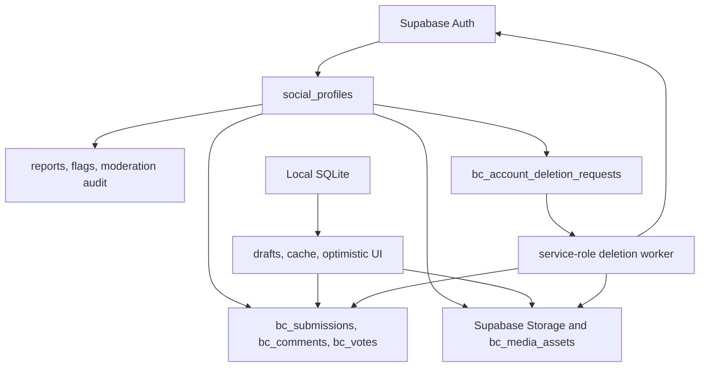

# BestChef Server Source Of Truth Runbook

Date: 2026-04-26

Status: P0 architecture audit started. Public beta and GA remain blocked.

## Launch Rule

BestChef public launch-critical flows use Supabase Auth, Postgres/RLS, Storage, Edge Functions, and server jobs as the source of truth. Local SQLite is an offline draft, cache, optimistic UI, and internal beta compatibility layer only.

BestChef public launch must not depend on LAN peer sync, nearby peer transport, BLE, WebRTC, mesh relay, or local-only device communication for identity, account restore, social posting, comments, votes, media delivery, moderation, provider calls, recovery, or deletion.

## Static Audit Result

Reviewed on 2026-04-26:

- `apps/bestchef/app/(root)/providers/DatabaseProvider.tsx` imports `@mylife/sync` for internal beta local change capture. Public-launch builds now disable this startup through `shouldEnableBestChefMeshSync`.
- `apps/bestchef/app/(root)/data/local-submissions.ts` writes `rc_bestchef_*` rows and records sync changes only when the adapter exposes `recordSyncChange`. These rows are not public launch source of truth.
- `apps/bestchef/app/(root)/data/cloud-submissions.ts` maps local or demo ids to `bc_submission_aliases`. Demo alias creation remains blocked by public data policy unless explicitly allowlisted.
- `modules/bestchef/src/cloud/schema.sql` and Supabase migrations define public `bc_*` source-of-truth tables, RLS policies, public delta RPCs, media asset records, moderation records, and account lifecycle records.
- No BestChef public flow should treat `sync_change_log`, sync identity, device public keys, or peer state as recoverable public account state.

## Public Flow Boundaries

| Flow | Server source of truth | Local SQLite role | Blocked launch path |
|------|------------------------|-------------------|---------------------|
| Auth and identity | Supabase Auth plus `social_profiles` | Secure session cache and account UI state | Anonymous-only identity for public users |
| Account linking and recovery | Supabase Auth session, email/provider identity, `bc_current_identity_status()` | Settings form state and local data preservation during link | Mesh identity, device id, or local profile handle |
| Account restore | Supabase Auth plus owned `bc_*` rows | Rehydrated cache after sign-in, not durable restore source | Reinstall restore through local DB, sync secrets, or peer state |
| Submissions | `bc_submissions`, `bc_recipe_snapshots`, `bc_submission_aliases` | Draft and optimistic submission rows before server write | Local `rc_bestchef_submissions` as public data |
| Comments and votes | `bc_comments`, `bc_votes`, public RLS and RPC guards | Optimistic UI cache only | `rc_bestchef_comments`, `rc_bestchef_votes`, or `sync_change_log` as public data |
| Media | Supabase Storage plus `bc_media_assets` and `bc_media_variants` | Pending `file://` capture, compression queue, offline retry cache | `file://` or local cache URI in public rows |
| Moderation and reporting | `bc_flags`, `bc_photo_reports`, moderation tables, audit events | Optimistic report submission and local hidden-state cache | Local block/report tables as public moderation state |
| Provider calls | Planned Edge Function broker and server-side secrets | Local manual fallback and internal beta-only provider experiments | User-entered provider keys in public launch builds |
| Account deletion | `bc_account_deletion_requests`, lifecycle audit events, service-role worker | Local wipe and cache/media deletion | Client-side service-role work or mesh propagation |

## Launch Flow Diagram

## Current Controls

- Public launch builds disable BestChef mesh sync startup through `shouldEnableBestChefMeshSync`.
- Public launch builds reject staging Supabase config unless an internal-only override is set and the explicit public launch flag is not set.
- Native auth callback handling can now exchange PKCE codes, set implicit sessions, or verify token-hash links.
- `bc_media_assets.remote_url` and `bc_media_variants.remote_url` enforce HTTPS server media URLs at the schema layer.
- Demo cloud aliases are blocked by default in production and public-launch builds.
- `bestchef-delete-account` is scaffolded as a server-only service-role worker gated by a private worker secret.
- `bestchef-media-upload` and `bestchef-media-finalize` are scaffolded as server-mediated Storage upload/finalize functions. They reject local/remote URL payloads and keep finalized assets pending/private until later moderation approval.
- Provider broker functions are scaffolded locally, and public-launch builds hide BYO provider key UI.

## Open P0 Items

- Deploy the service-role deletion worker for `bc_account_deletion_requests`, configure server-only secrets, and run a staging deletion drill.
- Deploy signed upload/finalize Edge Functions, create hosted Storage buckets, wire the app upload queue, and add moderation/public-delivery approval.
- Deploy the server provider broker with production provider credentials, persistent rate limits, usage logging, and provider/legal approval.
- Add RLS integration smoke tests against staging for anonymous, durable user, moderator, admin, and unauthenticated public reader roles.
- Build seed content import, labeling, approval, and rollback workflow before any public seed data is enabled.
