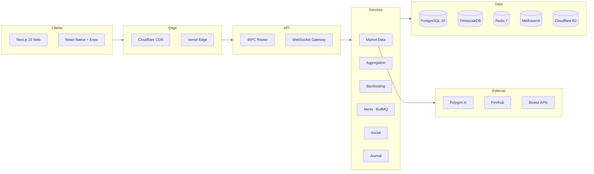

# Architecture Index

> System architecture, technology stack, monorepo structure, and key technical decisions for TheMarlinTraders.

---

## Overview

The architecture is designed around five principles: real-time first, TypeScript everywhere, modular monorepo, performance as a feature, and provider abstraction. Every data path supports streaming. A single language spans web, mobile, API, workers, and strategy engine. External dependencies sit behind adapter interfaces.

Two documents define the architecture:

- [Technical Architecture](technical-architecture.md) — System design, frontend/backend/mobile architecture, data pipeline, database schema, infrastructure, and security
- [Stack Recommendation](../stack-evaluation/stack-recommendation.md) — Technology choices with version-level justifications, monorepo directory structure, key decision trade-offs, and cost projections

---

## High-Level System Diagram



---

## Core Tech Stack

| Layer | Technology | Why |
|-------|-----------|-----|
| **Monorepo** | Turborepo + pnpm | Smart caching, workspace protocol, fast installs |
| **Language** | TypeScript 5.7+ (strict) | Single language across all packages |
| **Web** | Next.js 15 (App Router) | Server Components, ISR for SEO, Vercel deployment |
| **Mobile** | React Native + Expo SDK 52+ | Shared TypeScript, OTA updates, managed workflow |
| **State** | Zustand 5.x | Per-domain stores, minimal boilerplate, web + mobile shared |
| **API** | tRPC 11.x | End-to-end type safety, zero codegen, WebSocket subscriptions |
| **Runtime** | Bun 1.2+ | 2-3x faster HTTP, native TypeScript execution |
| **ORM** | Drizzle 0.40+ | SQL-like queries, 50KB client (vs. Prisma's 2MB) |
| **Database** | PostgreSQL 16 | Relational data (users, portfolios, social) |
| **Time-Series** | TimescaleDB 2.x | OHLCV data, hypertables, continuous aggregates, 90%+ compression |
| **Cache** | Redis 7.x | Sub-ms reads, pub/sub fan-out, BullMQ backend |
| **Search** | Meilisearch 1.x | Sub-50ms, typo tolerance, no per-query fees |
| **Storage** | Cloudflare R2 | S3-compatible, zero egress fees |
| **Auth** | Clerk 5.x | Pre-built UI, MFA, JWT, org support |
| **Jobs** | BullMQ 5.x | Priorities, retries, cron, Redis-backed |
| **WebSocket** | ws 8.x | Fastest Node.js WS lib, custom protocol control |
| **Components** | shadcn/ui + Radix UI | Full ownership, Mira style, WAI-ARIA accessible |
| **Styling** | Tailwind CSS 4.x | Zero runtime, Oxide engine, CSS variable theming |
| **Layout** | Dockview 4.13+ | Docking, floating panels, multi-monitor popout |
| **Charts (Web)** | TradingView Lightweight Charts 5.1 | 35KB, Canvas 2D, production MVP charting |
| **Charts (Mobile)** | React Native Skia 1.x | GPU-direct, 120fps on ProMotion devices |
| **Testing** | Vitest + Playwright + RTL | Unit, E2E, component testing |
| **Hosting** | Vercel / Railway / Fly.io / Cloudflare | Web / API+DB / WebSocket / CDN+storage |

---

## Monorepo Structure

```
TheMarlinTraders/
├── apps/
│   ├── web/                    # Next.js 15 (App Router)
│   ├── mobile/                 # React Native + Expo
│   └── api/                    # Backend services (Bun runtime)
│       └── src/
│           ├── routers/        # tRPC routers
│           ├── services/       # Business logic
│           ├── adapters/       # Provider adapters (Polygon, brokers)
│           ├── jobs/           # BullMQ processors
│           ├── ws/             # WebSocket gateway
│           └── db/             # Drizzle schema, migrations
├── packages/
│   ├── shared/                 # Types, indicators, risk, validation, utils
│   ├── ui/                     # shadcn/ui primitives + trading components
│   ├── charts/                 # Charting engine (Lightweight Charts wrapper + custom)
│   ├── data/                   # tRPC client, WebSocket client, Zustand stores
│   └── config/                 # ESLint, TypeScript, Tailwind shared configs
├── services/
│   ├── market-data/            # Real-time data pipeline
│   ├── backtesting/            # Strategy execution engine
│   └── notifications/          # Alert delivery (push, email, webhook)
├── tools/
│   └── scripts/                # Build, deploy, migration scripts
├── turbo.json
├── pnpm-workspace.yaml
└── package.json
```

---

## Key Technical Decisions

The [Stack Recommendation](../stack-evaluation/stack-recommendation.md) documents 8 key decisions with full trade-off analysis:

| Decision | Chose | Over | Key Reason |
|----------|-------|------|------------|
| Web framework | Next.js 15 | Vite + React Router | Server Components + ISR for SEO-critical social content |
| State management | Zustand | Redux Toolkit | Per-domain stores, less boilerplate, web + mobile shared |
| API layer | tRPC | GraphQL | End-to-end type safety with zero codegen |
| ORM | Drizzle | Prisma | 50KB vs. 2MB client; SQL-like queries; schema-as-TypeScript |
| Server runtime | Bun | Node.js | 2-3x faster HTTP; native TypeScript execution |
| Layout system | Dockview | GoldenLayout | Zero-dep React docking; floating panels; multi-monitor popout |
| Charting (Phase 1) | Lightweight Charts | Custom Canvas | 35KB production-quality MVP; custom engine in Phase 2-3 |
| Auth | Clerk | Custom | Weeks of dev time saved; MFA, OAuth, org support built-in |

---

## Performance Targets

| Metric | Target |
|--------|--------|
| Chart load (1yr daily) | <500ms |
| Quote-to-screen latency | <100ms |
| Chart rendering | 60fps (16ms budget) |
| Order entry to broker | <200ms |
| Symbol search (Cmd+K) | <200ms |
| Mobile chart frame rate | 60fps (120fps ProMotion) |
| JS bundle (gzipped) | <200KB |
| Concurrent WebSocket connections | 100K (Phase 1), 1M (Phase 3) |

---

## Full Documents

- [Technical Architecture](technical-architecture.md) — Complete system design with mermaid diagrams, database ER schema, data pipeline flow, security model, and scalability plan
- [Stack Recommendation](../stack-evaluation/stack-recommendation.md) — 57-row technology table, monorepo structure, decision trade-offs, development tooling, and third-party cost breakdown (~$771/mo at 10K MAU)
