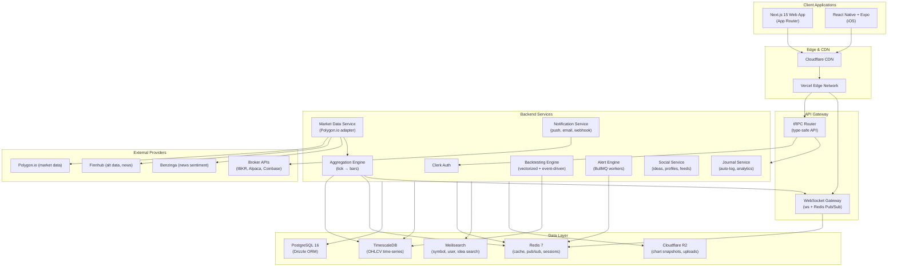
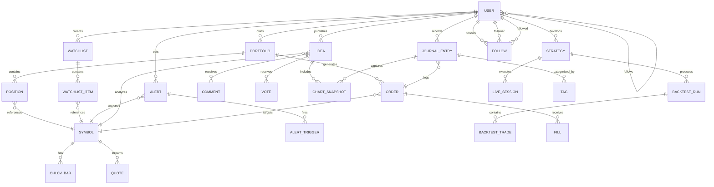
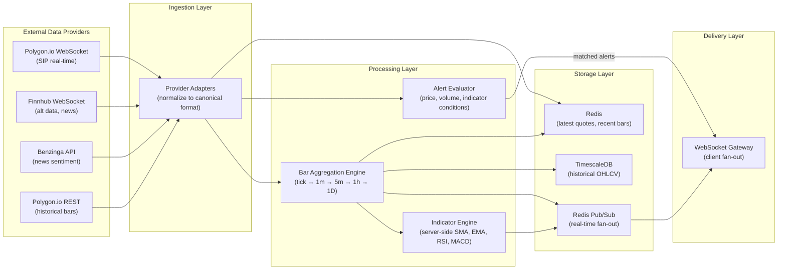

# TheMarlinTraders — Technical Architecture

> Definitive system architecture for the TheMarlinTraders trading platform.
> Last updated: 2026-02-13

---

## 1. Architecture Overview

### High-Level System Architecture



### Design Principles

1. **Real-time first.** Every data path is designed for streaming. REST endpoints serve historical data; WebSockets serve live data. The architecture never forces polling where push is possible.

2. **TypeScript everywhere.** A single language across web frontend, mobile frontend, API layer, background workers, and strategy engine eliminates type translation errors and enables shared business logic packages.

3. **Modular monorepo.** Turborepo orchestrates independent packages that can be deployed, tested, and versioned separately while sharing types, utilities, and configurations.

4. **Performance is a feature.** Chart rendering targets 60fps. Quote-to-screen latency targets sub-100ms. Initial page load targets under 2 seconds. These are not aspirational — they are architectural constraints that drive every decision.

5. **Provider abstraction.** Every external dependency (market data, broker, search, storage) sits behind an adapter interface. Swapping Polygon.io for another provider requires changing one adapter file, not the entire codebase.

---

## 2. Frontend Architecture (Web)

### Framework: Next.js 15 (App Router)

Next.js 15 is the foundation for the web application. The decision was evaluated against Vite + React Router and Remix.

**Why Next.js 15:**
- **Server Components** reduce client bundle size by rendering data-fetching panels (news feeds, fundamentals, screener results) on the server. Chart components and real-time watchlists remain Client Components.
- **App Router** with nested layouts maps perfectly to the docking/workspace paradigm — the top-level layout handles authentication and WebSocket connection; nested layouts handle workspace-specific state.
- **Vercel deployment** provides zero-config edge functions, ISR for public pages (published ideas, user profiles), and automatic image optimization.
- **React 19 compatibility** delivers `useOptimistic` for instant order submission feedback and `use()` for cleaner async data loading.

**Why not Vite + React Router:** No built-in SSR/ISR for SEO-critical pages (published ideas must be crawlable for organic growth, per research doc 05). Would require bolting on SSR manually.

**Why not Remix:** Weaker ecosystem support for the component libraries we need (shadcn/ui, Dockview). Less mature deployment story for WebSocket-heavy applications.

### State Management: Zustand

Zustand manages client-side state across the application. Evaluated against Redux Toolkit and Jotai.

**Why Zustand:**
- **Minimal boilerplate.** A store is a function, not a class with actions, reducers, and selectors. For a real-time trading platform where state changes 100+ times per second, less ceremony means faster iteration.
- **Subscription granularity.** Components subscribe to specific slices of state with selectors. A watchlist row re-renders only when its specific symbol's price changes, not when any price changes.
- **React Native compatibility.** The same Zustand stores work identically in web and mobile, enabling a shared `packages/shared/` state layer.
- **Middleware ecosystem.** `persist` middleware for layout/preferences, `devtools` for debugging, `immer` for immutable updates when needed.

**Why not Redux Toolkit:** More boilerplate (slices, reducers, selectors, dispatch). For a platform with 10+ stores (market data, positions, orders, alerts, layout, preferences, social, journal, indicators, watchlists), RTK's ceremony compounds. RTK Query is powerful but tRPC already handles server state caching.

**Why not Jotai:** Excellent for fine-grained reactivity, but the atom-based model becomes harder to reason about at scale. Zustand's store-based model provides clearer boundaries between domains.

### Charting Engine: Phased Approach

The charting engine follows a three-phase strategy informed by the rendering technology analysis in research doc 04:

**Phase 1 (MVP):** TradingView Lightweight Charts v5.1 — 35KB bundle, Canvas 2D rendering, supports candlestick, bar, line, area, baseline, and histogram chart types. Indicators are computed in Web Workers and fed as overlay series. This gets a production-quality chart into users' hands with minimal custom code.

**Phase 2 (Differentiation):** Custom Canvas 2D renderers for features Lightweight Charts cannot provide — order flow visualization, volume profile, depth chart, footprint charts, and custom drawing tools. These render on a stacked canvas layer above the Lightweight Charts base.

**Phase 3 (Scale):** Custom WebGL/WebGPU engine for datasets exceeding 500K points (tick charts, multi-year intraday). WebGPU compute shaders enable GPU-side aggregation and rendering at 1M+ points at 60fps.

### Layout System: Dockview

Dockview (`dockview-react` v4.13+) provides the docking, tiling, and floating panel system. Per research doc 10, it is the only React-native docking library with zero dependencies, floating groups, and multi-window popout support.

- Layouts serialize to JSON via `toJSON()` for persistence to localStorage and server.
- Workspace presets (Chart Focus, Order Flow, Research) are named layout snapshots switchable via `Cmd+1` through `Cmd+9`.
- Multi-monitor support via `window.open()` popout windows sharing the same React context and WebSocket connections.

### Component Library: shadcn/ui + Radix UI

shadcn/ui provides full ownership of every component — source code is copied into the project and customized freely. The Mira style (dense interfaces) aligns with trading platform requirements. Radix UI primitives underneath guarantee WAI-ARIA accessibility compliance.

Custom-built components: chart rendering, watchlist price cells (direct DOM manipulation via refs for performance), order book depth visualization, drawing tools, and real-time data grids.

### Styling: Tailwind CSS v4

Tailwind v4's Rust-based Oxide engine delivers 10x faster builds with zero-config content detection. CSS custom property theme tokens enable runtime theme switching (dark/light, colorblind mode, regional price colors) without rebuilding CSS. Zero runtime cost — all styles resolve at build time.

### Real-Time Data: WebSocket with Web Worker Processing

The client-side data pipeline follows the three-thread architecture from research doc 04:

- **WS Worker:** Manages WebSocket connection lifecycle (heartbeat, reconnection with exponential backoff and jitter). Passes raw messages to the Data Worker.
- **Data Worker:** Parses messages, updates in-memory bar builders, computes indicators (SMA, EMA, RSI, MACD), formats data for chart consumption. Uses `Float64Array` typed arrays for memory efficiency.
- **Main Thread:** Receives render-ready data, updates chart canvas. No heavy computation runs here. Price cell updates use `requestAnimationFrame` batching with direct DOM manipulation (not React state) for 100+ updates/second.

### Virtual Scrolling: @tanstack/react-virtual v3

All scrollable lists (watchlists with 500+ symbols, order history, news feeds) use TanStack Virtual for viewport-based rendering — only ~60 DOM nodes exist regardless of list size. ~12KB, headless, supports variable row heights.

### Animation: Motion (Framer Motion) for UI

Motion v12+ handles panel transitions, modal entrances, and micro-interactions. `LazyMotion` defers ~30KB until first animation fires. Real-time data paths (price updates, chart rendering) skip animation entirely and use raw `requestAnimationFrame`.

---

## 3. Mobile Architecture (iOS)

### React Native with Expo

React Native with Expo SDK 52+ provides the iOS application. Expo's managed workflow handles builds, OTA updates, and native module integration without ejecting.

### Chart Rendering: React Native Skia

`@shopify/react-native-skia` v1.x wraps the Skia graphics engine (same engine powering Chrome and Flutter), drawing directly to the GPU and bypassing React Native's bridge. This achieves 120fps chart rendering on modern iOS devices. Per research doc 10, Skia is the only option that delivers TradingView-quality smoothness for candlestick rendering, interactive crosshairs, and drawing tools on mobile.

### Navigation: React Navigation v7

Bottom tab navigation with five tabs: Chart | Watchlist | Trade | Portfolio | More. Stacked bottom sheets for order entry using `@gorhom/bottom-sheet` v5 with snap points at 25% (peek), 50% (quick order), and 90% (advanced options).

### Gesture Handling

`react-native-gesture-handler` v2 + `react-native-reanimated` v3:
- Long press (300ms) activates crosshair mode on charts
- Single-finger horizontal drag pans the chart
- Two-finger pinch zooms the time axis
- Gesture disambiguation handles one-to-two finger transitions without jarring

### State: Shared Zustand Stores

The same Zustand stores from `packages/shared/` power mobile state management. This guarantees consistency between web and mobile business logic — indicator calculations, position sizing, alert evaluation, and order validation all share one codebase.

### Push Notifications

Apple Push Notification service (APNs) via `expo-notifications`. Server-side alert engine (BullMQ) evaluates conditions and dispatches push payloads through the notification service. Rich notifications include ticker, alert condition, current price, and a deep link to the relevant chart.

---

## 4. Backend Architecture

### Runtime: Node.js with Bun

Bun serves as the JavaScript runtime for backend services. Bun was chosen over stock Node.js for three reasons:

1. **2-3x faster HTTP request handling** via Bun's native HTTP server, critical for the WebSocket gateway handling 100K+ concurrent connections.
2. **Built-in TypeScript execution** — no transpilation step in development, enabling sub-second server restarts.
3. **Native SQLite** for local development and testing without external database dependencies.

Bun maintains full Node.js API compatibility, so all npm packages (Drizzle, BullMQ, ws) work without modification. If Bun stability becomes a concern for any specific service, that service can run on Node.js without code changes.

### API Layer: tRPC

tRPC provides type-safe client-server communication. Evaluated against REST (OpenAPI) and GraphQL.

**Why tRPC:**
- **End-to-end type safety.** Change a server procedure's return type and the TypeScript compiler immediately flags every client call site that needs updating. In a trading platform where API contract errors can mean incorrect order submissions, this is a safety-critical advantage.
- **Zero code generation.** Unlike GraphQL (which requires codegen for typed clients) or OpenAPI (which requires spec-first or code-first generation), tRPC types flow automatically from server to client through TypeScript inference.
- **Subscriptions for real-time.** tRPC v11 supports WebSocket subscriptions natively, enabling type-safe real-time data channels alongside standard queries and mutations.
- **Batching.** Multiple tRPC calls batch into a single HTTP request automatically, reducing round trips for pages that load multiple data sources.

**Why not GraphQL:** Overly complex for a single-team TypeScript monorepo where the API consumer and producer share a type system. The resolver pattern, schema definition, and codegen pipeline add overhead without proportional benefit.

**Why not REST:** No automatic type safety between client and server. Would require OpenAPI spec generation and client codegen to approximate what tRPC provides natively.

### Real-Time: WebSocket Server

The `ws` library powers the WebSocket gateway with Redis Pub/Sub for horizontal scaling:

- **Connection management:** Registry mapping `userId -> Set<WebSocket>` for multi-device support. Sticky sessions at the load balancer level.
- **Subscription model:** Clients subscribe to symbol channels. The gateway fans out normalized market data from Redis Pub/Sub to subscribed clients.
- **Heartbeat:** 25-second ping/pong intervals with 35-second dead connection timeout.
- **Backpressure:** During market open surges (5-10x normal volume), intermediate ticks are dropped and latest-state snapshots are delivered to prevent client overwhelm.
- **Horizontal scaling:** Each gateway server handles 10K-50K connections. Redis Pub/Sub ensures all servers receive all market data. Auto-scaling based on connection count.

### Authentication: Clerk

Clerk handles authentication, session management, and user profiles. Evaluated against Auth.js and custom auth.

**Why Clerk:**
- **Pre-built UI components** for sign-in, sign-up, user profile, and organization management — saving weeks of development on non-differentiating features.
- **Multi-factor authentication** out of the box (TOTP, SMS, email) — non-negotiable for a platform handling financial data and broker connections.
- **JWT-based sessions** with configurable expiry and refresh, compatible with both tRPC middleware and WebSocket authentication.
- **Organization support** for future institutional features (team workspaces, compliance roles).

**Why not Auth.js:** More flexible but requires implementing every feature (MFA, session management, user UI) manually. The development time saved by Clerk is significant.

**Why not custom auth:** Security-critical code that must handle token rotation, MFA, rate limiting, and account recovery. Building this in-house introduces risk without competitive advantage.

### Background Jobs: BullMQ with Redis

BullMQ processes asynchronous work:
- **Alert evaluation:** Incoming market data triggers alert condition checks. Matched alerts dispatch notifications.
- **Backtest execution:** Long-running backtests run as BullMQ jobs with progress reporting via WebSocket.
- **Data pipeline:** Scheduled jobs for EOD data sync, corporate actions processing, and earnings calendar updates.
- **Social:** Idea publishing, notification fan-out, reputation calculation.

---

## 5. Database Architecture

### Primary: PostgreSQL 16 (via Drizzle ORM)

PostgreSQL serves as the primary relational database for all non-time-series data: users, portfolios, orders, alerts, ideas, comments, strategies, and journal entries.

**Why Drizzle ORM over Prisma:**
- **SQL-like query builder.** Drizzle's API mirrors SQL syntax (`select().from().where().leftJoin()`), which means the ORM never hides what query is actually running. For a trading platform where query performance matters, this transparency is critical.
- **No query engine overhead.** Prisma runs a Rust-based query engine as a sidecar process. Drizzle generates SQL strings directly — zero runtime overhead.
- **Smaller bundle.** Drizzle's client is ~50KB vs Prisma's ~2MB engine binary. Matters for serverless deployment where cold start time scales with bundle size.
- **Schema-as-code.** Drizzle schema files are TypeScript that define tables, relations, and indexes. Migrations are generated from schema diffs, similar to Prisma but without the separate schema language.

### Time-Series: TimescaleDB Extension

TimescaleDB extends PostgreSQL for OHLCV bar storage and querying. Runs as a PostgreSQL extension — no separate database to operate.

- **Hypertables** automatically partition data by time for fast range queries ("give me 1-minute bars for AAPL from 2024-01-01 to 2024-12-31").
- **Continuous aggregates** materialize higher-timeframe bars from lower-timeframe data. A continuous aggregate on 1-minute bars produces 5-minute, 15-minute, 1-hour, and daily bars automatically, updated in near-real-time.
- **Compression** achieves 90%+ storage reduction on historical bar data, critical for storing 20+ years of minute-level data across 10,000+ symbols.

### Cache: Redis 7

Redis serves three distinct roles:
1. **Hot data cache:** Latest quotes per symbol, recent bars, reference data. Sub-millisecond reads.
2. **Pub/Sub bus:** Normalized market data is published to Redis channels. WebSocket gateway servers subscribe and fan out to clients.
3. **Session store:** Clerk session tokens and WebSocket connection state.

### Search: Meilisearch

Meilisearch powers symbol search, user search, and idea discovery. Sub-50ms search latency with typo tolerance and fuzzy matching. Chosen over Elasticsearch for simplicity (single binary, zero configuration) and over Algolia for cost (self-hosted, no per-search pricing).

### File Storage: Cloudflare R2

R2 stores chart snapshots (auto-captured on idea publishing and trade journal entries), user uploads, and strategy code bundles. S3-compatible API with zero egress fees — a meaningful cost advantage over AWS S3 for a platform that serves millions of chart images.

### Core Entity Relationship Diagram



---

## 6. Data Pipeline

### Market Data Flow



### Normalization Layer

All upstream providers deliver data in different formats. The normalization layer produces canonical internal types:

```typescript
interface NormalizedTrade {
  symbol: string;        // Canonical: "AAPL"
  price: number;
  size: number;
  timestamp: number;     // Unix ms
  exchange: string;      // MIC code: "XNAS"
  conditions: string[];
  source: 'polygon' | 'finnhub' | 'alpaca';
}

interface NormalizedBar {
  symbol: string;
  timeframe: '1m' | '5m' | '15m' | '1h' | '4h' | '1D' | '1W' | '1M';
  open: number;
  high: number;
  low: number;
  close: number;
  volume: number;
  timestamp: number;     // Period start, Unix ms
}
```

A `ProviderAdapter` interface defines the contract each provider must implement. Swapping providers means implementing one adapter — zero downstream changes.

### Real-Time Aggregation Pipeline

Tick data flows into bar builders that maintain rolling state per symbol per timeframe. On each tick: update `high = max(high, price)`, `low = min(low, price)`, `close = price`, `volume += size`. When the period boundary is crossed, the completed bar is emitted to Redis Pub/Sub, persisted to TimescaleDB, and the builder resets.

TimescaleDB continuous aggregates handle higher-timeframe aggregation (1m -> 5m -> 15m -> 1h -> 4h -> 1D -> 1W -> 1M) automatically with near-real-time refresh.

### Caching Strategy (Multi-Level)

| Level | Technology | Data | TTL | Access Time |
|-------|-----------|------|-----|-------------|
| L1 — Memory | In-browser typed arrays (`Float64Array`) | Visible viewport + 2x buffer | Session | <1ms |
| L2 — Client | IndexedDB | Historical bars loaded this session | 7 days | 1-5ms |
| L3 — Server | Redis | Latest quotes, recent bars, reference data | 1 hour | 1-5ms |
| L4 — Database | TimescaleDB | Full historical OHLCV | Permanent | 10-50ms |

Client-side: The Data Worker manages L1 and L2. When the user pans the chart left, the worker checks IndexedDB (L2) first, then requests from the API (which reads from Redis L3 or TimescaleDB L4).

---

## 7. Algo/Backtesting Engine

### Strategy Language: TypeScript-Primary with Python Interop

Per research doc 09, TheMarlinTraders uses a tiered language strategy:

- **Tier 0 — Visual Builder:** Zero-code drag-and-drop for beginners. Generates TypeScript under the hood. Users who outgrow it "eject" into the code editor.
- **Tier 1 — TypeScript:** Primary language. Native to the platform stack. Full IDE with IntelliSense, breakpoint debugging, and WebAssembly compilation for performance-critical paths.
- **Tier 2 — Python:** Supported via sandboxed runtime (containerized Python or Pyodide/WASM in browser). Captures the quant community's existing ML/data science workflows.
- **Tier 3 — Pine Script Import:** Transpiler for migrating TradingView strategies. Growth hack targeting their 100M+ user base.

### Hybrid Backtesting Engine

**Vectorized mode** for rapid research: Processes entire datasets in batch using typed arrays. 10-100x faster than event-driven. Used for parameter sweeps and alpha exploration.

**Event-driven mode** for final validation: Processes each tick/bar chronologically through the same event loop used for paper and live trading. Models order book depth, partial fills, slippage, and realistic commission structures. Ensures parity between backtest and live performance.

### Sandboxed Execution

Strategies execute in isolated environments to prevent malicious code from accessing user data or system resources:

- **Browser:** Web Workers with `isolated-vm` for TypeScript strategies. No access to DOM, localStorage, or network.
- **Server:** Containerized runtimes (Docker) for Python strategies with CPU/memory limits and no network access.
- **Resource limits:** Maximum execution time per bar (10ms), maximum memory per strategy (256MB), maximum total strategy instances per user.

### Strategy Pipeline

```
Visual Builder / Code Editor
    → Backtest (vectorized, rapid iteration)
    → Walk-Forward Optimization (validate robustness)
    → Monte Carlo Simulation (stress-test)
    → Paper Trading (live data, simulated fills)
    → Live Trading (real broker execution)
```

Each stage gates the next. The platform requires minimum trade counts (30+) and out-of-sample validation before allowing promotion to the next stage.

---

## 8. Infrastructure & DevOps

### Deployment Topology

| Service | Platform | Justification |
|---------|----------|---------------|
| Web frontend | Vercel | Zero-config Next.js deployment, edge functions, ISR, image optimization |
| API services | Railway | Managed containers with auto-scaling, built-in Redis and PostgreSQL |
| WebSocket gateway | Fly.io | Global edge deployment with persistent connections, low-latency WebSocket routing |
| Background workers | Railway | BullMQ workers co-located with Redis and PostgreSQL |
| CDN | Cloudflare | Global CDN for static assets, R2 storage, DDoS protection |
| Search | Meilisearch Cloud | Managed search with zero operational overhead |

### CI/CD: GitHub Actions

```
Push to feature branch → Lint + Type Check + Unit Tests (Vitest)
                       → Preview Deploy (Vercel)
                       → Integration Tests (Playwright)

Merge to main → Full Test Suite
              → Build All Packages (Turborepo)
              → Deploy API (Railway)
              → Deploy WebSocket Gateway (Fly.io)
              → Deploy Web (Vercel)
              → Smoke Tests (Playwright against production)
```

### Monitoring Stack

- **Sentry:** Error tracking and performance monitoring across web, mobile, and backend. Source maps for readable stack traces.
- **Grafana + Prometheus:** Custom dashboards for WebSocket connection counts, message throughput, quote-to-screen latency, API response times, and database query performance.
- **Uptime monitoring:** Synthetic checks for API health, WebSocket connectivity, and market data freshness.

### Environment Management

Three environments with strict promotion:
- **Development:** Local dev with Bun, local PostgreSQL, local Redis. Mock market data adapter for offline development.
- **Staging:** Full infrastructure mirror on Railway/Fly.io. Connected to Polygon.io sandbox. Used for integration testing and QA.
- **Production:** Auto-scaling infrastructure. Connected to Polygon.io live SIP feed. Feature flags (LaunchDarkly or Vercel Feature Flags) for gradual rollouts.

---

## 9. Security Architecture

### Authentication Flow

1. User authenticates via Clerk (email/password, OAuth, or MFA).
2. Clerk issues a signed JWT with user ID, session ID, and organization membership.
3. JWT is sent with every tRPC request via `Authorization: Bearer <token>` header.
4. tRPC middleware validates the JWT signature and extracts the user context.
5. WebSocket connections authenticate during the initial handshake by including the JWT as a query parameter, validated before the connection is upgraded.
6. Refresh tokens rotate automatically with configurable session duration (default: 7 days).

### API Key Management for Broker Connections

- Broker API credentials (IBKR, Alpaca) are encrypted at rest using AES-256-GCM with per-user encryption keys derived from a master key stored in a secrets manager (Railway secrets or AWS Secrets Manager).
- Credentials are never exposed to the frontend. All broker API calls are proxied through backend services.
- Users can revoke broker connections instantly, which triggers credential deletion and session invalidation with the broker.

### Data Encryption

- **In transit:** TLS 1.3 for all HTTP/WebSocket connections. HSTS headers enforced.
- **At rest:** PostgreSQL transparent data encryption (TDE). Cloudflare R2 server-side encryption. Redis AUTH with TLS.
- **Sensitive fields:** Broker credentials, user financial data, and PII are encrypted at the application level before database storage.

### Rate Limiting and DDoS Protection

- **Cloudflare:** DDoS mitigation at the network edge. Rate limiting rules for API endpoints (100 requests/minute for authenticated users, 20/minute for unauthenticated).
- **Application-level:** Per-user rate limiting on expensive operations (backtests, screener queries, order submissions) using Redis-backed token buckets.
- **WebSocket:** Connection limits per user (max 5 concurrent connections), subscription limits per connection (max 200 symbols).

### Financial Data Compliance

- Market data redistribution agreements with Polygon.io govern what data can be displayed to end users and whether it requires exchange entitlements.
- Delayed data (15 minutes) is available on the free tier without exchange agreements. Real-time data requires paid Polygon.io plan with appropriate exchange authorizations.
- All market data displayed includes required exchange attribution.

### WebSocket Authentication

WebSocket connections cannot use standard HTTP headers after the initial handshake. Authentication uses:
1. JWT token passed as a query parameter during the WebSocket upgrade request.
2. Server validates the token before completing the upgrade (rejecting with 401 if invalid).
3. Periodic re-authentication: the server sends a challenge every 30 minutes requiring the client to respond with a fresh JWT. Expired sessions are disconnected gracefully.

---

## 10. Performance Requirements & Targets

| Metric | Target | Measurement Method |
|--------|--------|-------------------|
| Chart rendering | 60fps minimum, <16ms per frame | `requestAnimationFrame` timing, Chrome DevTools Performance tab |
| Quote-to-screen latency | <100ms (provider → user's chart) | End-to-end timestamp comparison: provider timestamp vs DOM update timestamp |
| Initial page load (LCP) | <2 seconds | Lighthouse CI, Vercel Speed Insights |
| First Input Delay (FID) | <100ms | Web Vitals monitoring |
| Cumulative Layout Shift (CLS) | <0.1 | Skeleton screens prevent layout shift |
| WebSocket reconnection | <500ms | Client-side reconnection timing with exponential backoff starting at 1s |
| API response times | p50 <50ms, p99 <200ms | Grafana percentile dashboards |
| Search latency | <50ms | Meilisearch query timing |
| Historical data load | <500ms for 1 year of daily bars | API response timing |
| Strategy backtest | 1 year of daily data in <2s (vectorized) | BullMQ job completion timing |
| Concurrent WebSocket connections | 100K+ per gateway server | Load testing with `k6` |
| Client memory budget | <200MB per tab (single chart, 5 indicators, 1 year 1-min data) | Chrome DevTools Memory tab |

---

## 11. Scalability Plan

### Horizontal Scaling Strategy

| Service | Scaling Trigger | Scaling Method |
|---------|----------------|----------------|
| Web frontend | Traffic volume | Vercel auto-scales edge functions automatically |
| tRPC API | CPU/memory utilization >70% | Railway horizontal auto-scaling (add instances) |
| WebSocket gateway | Connection count >40K per instance | Fly.io machine scaling; new instances join Redis Pub/Sub |
| Background workers | Queue depth >1000 | BullMQ worker concurrency increase + additional Railway instances |
| PostgreSQL | Query latency >100ms p99 | Read replicas for read-heavy queries (screener, social feeds) |
| TimescaleDB | Storage >500GB or query latency increase | Table partitioning by symbol range + read replicas for historical queries |
| Redis | Memory >70% utilization | Redis Cluster with hash-slot-based sharding |
| Meilisearch | Index size >10GB | Meilisearch Cloud auto-scales |

### Database Scaling

- **Read replicas:** PostgreSQL read replicas for screener queries, social feed rendering, and analytics dashboards. Write traffic (orders, ideas, journal entries) goes to the primary.
- **Partitioning:** TimescaleDB hypertables automatically partition by time. Additional partitioning by symbol range for extremely high-volume queries.
- **Connection pooling:** PgBouncer or Drizzle's built-in connection pool to prevent connection exhaustion under load.

### WebSocket Server Clustering

Each WebSocket gateway instance maintains its own connection registry. Redis Pub/Sub ensures all instances receive all market data. When a client reconnects (potentially to a different instance), the new instance restores their subscription state from Redis.

### CDN and Edge Computing

- Cloudflare CDN caches static assets (JS bundles, fonts, images) at 300+ edge locations globally.
- Vercel Edge Functions handle geolocation-based content (market hours display adjusted to user timezone, regional price color defaults).
- Published ideas are ISR-cached at the edge with 1-hour revalidation — enabling instant page loads for the SEO-critical social content that drives organic growth.

### Cost Projections

| Scale | Users | Est. Monthly Infrastructure Cost | Key Cost Drivers |
|-------|-------|--------------------------------|-----------------|
| Seed | 1K MAU | ~$500 | Railway (API + workers), Polygon.io Starter ($29), Vercel Pro ($20) |
| Growth | 10K MAU | ~$2,500 | Polygon.io Developer ($79), Railway scaling, Redis Cloud, Fly.io WebSocket |
| Scale | 100K MAU | ~$15,000 | Polygon.io Business ($500+), multiple WebSocket instances, read replicas, Meilisearch Cloud |
| Enterprise | 1M MAU | ~$80,000-120,000 | Multi-region deployment, dedicated database clusters, premium data feeds, CDN bandwidth |

These projections assume a freemium model where 5-10% of users are paying subscribers. At 100K MAU with 8% conversion at $29/month average, revenue is ~$232K/month — infrastructure costs represent ~6.5% of revenue, well within healthy SaaS margins.

---

*This architecture document is designed to be actionable. An engineering team can start building from this specification. Every decision is justified with specific trade-offs, and every component has a clear role in serving the platform's core mission: real-time trading with institutional-grade analysis at a price accessible to retail traders.*
