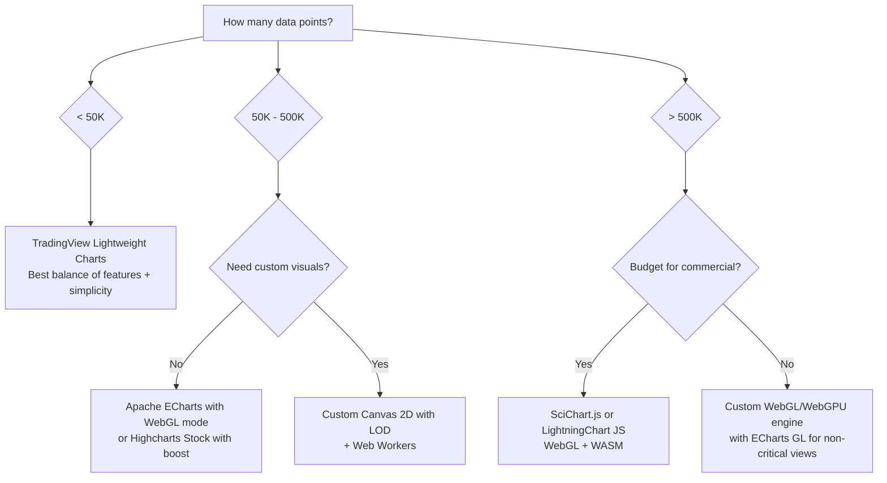
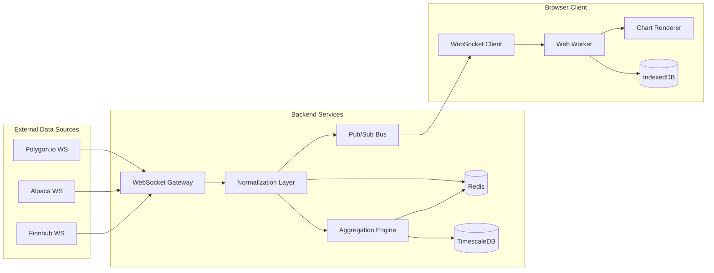
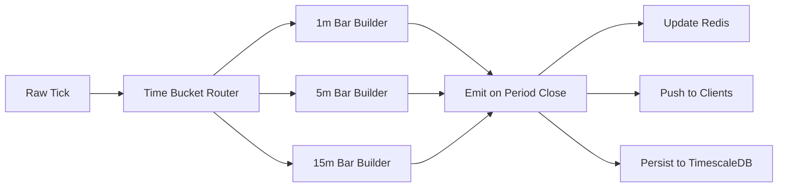

# Market Data Infrastructure Research

> Research document for TheMarlinTraders — comprehensive analysis of market data providers, delivery protocols, charting libraries, and real-time architecture patterns.

---

## Table of Contents

1. [Market Data Providers](#1-market-data-providers)
2. [Data Types & Formats](#2-data-types--formats)
3. [Delivery Protocols](#3-delivery-protocols)
4. [Charting Libraries & Rendering](#4-charting-libraries--rendering)
5. [Real-Time Architecture](#5-real-time-architecture)
6. [Performance Requirements](#6-performance-requirements)
7. [Recommendations for TheMarlinTraders](#7-recommendations-for-themarlintraders)

---

## 1. Market Data Providers

### Provider Comparison Matrix

| Provider | Real-Time | Historical | Asset Classes | WebSocket | Pricing (Monthly) | Free Tier |
|----------|-----------|-----------|---------------|-----------|-------------------|-----------|
| **Polygon.io (now Massive)** | Yes (SIP) | 20+ years | Stocks, Options, Forex, Crypto | Yes | Free / $29 / $79 / $199 / $500+ | Yes — limited calls, delayed data |
| **Alpha Vantage** | 15-min delayed (free), real-time (paid) | 20+ years | Stocks, Forex, Crypto, ETFs, Options, Commodities | No | Free / $49.99 / $99.99 / $149.99 / $249.99 | Yes — 25 requests/day |
| **IEX Cloud** | **Shut down Aug 2024** | N/A | N/A | N/A | N/A | N/A |
| **Alpaca Markets** | Yes (IEX + SIP) | 5+ years | Stocks, Options, Crypto | Yes | Free (IEX) / Paid (SIP real-time) | Yes — IEX real-time for account holders |
| **Finnhub** | Yes | 25+ years | Stocks, Forex, Crypto, ETFs | Yes | Free / $49+ (modular) | Yes — 60 API calls/min, US real-time |
| **Twelve Data** | Yes (~170ms latency) | 20+ years | Stocks, Forex, Crypto, ETFs, Indices | Yes (Pro+) | Free / $29 / $99 / $329 / $1,999 | Yes — limited credits |
| **Yahoo Finance (unofficial)** | 15-min delayed | 20+ years | Stocks, Forex, Crypto, ETFs, Indices | No | Free (unofficial) | Yes — no official API, rate-limited |
| **Nasdaq Data Link (Quandl)** | Limited | 30+ years | Stocks, Futures, Options, Economic | No | Free (select datasets) / Custom pricing | Yes — select datasets only |
| **Tiingo** | Yes | 20+ years | Stocks, ETFs, Crypto, Forex | Yes | Free / Affordable paid tiers | Yes — limited requests |
| **EOD Historical Data** | Yes (<50ms via WS) | 30+ years | Stocks, ETFs, Funds, Forex, Crypto | Yes (50 tickers) | $19.99 / $29.99 / $59.99 | Limited free trial |
| **Intrinio** | Yes (SIP-grade) | 20+ years | Stocks, Options, ETFs, Indices | Yes (proprietary binary) | Custom (premium) | Limited sandbox |
| **Benzinga** | Yes | 10+ years | Stocks, Options, Crypto, Forex | Yes (news stream) | $37 / $147 / $199 (Pro plans) | No |

### Detailed Provider Notes

**Polygon.io (rebranded to Massive.com)**
The strongest all-around choice for developer-first market data. Provides SIP-level real-time data (full consolidated tape from all US exchanges), comprehensive historical data with flat-file downloads, and robust WebSocket streaming. The free tier delivers delayed data with limited API calls. The Starter plan ($29/mo) unlocks unlimited API calls and 5 years of history. The Developer plan adds real-time WebSocket streaming. REST endpoints follow patterns like `GET /v2/aggs/ticker/{ticker}/range/{multiplier}/{timespan}/{from}/{to}` for aggregate bars and `GET /v3/reference/tickers` for reference data. WebSocket channels: `stocks`, `options`, `forex`, `crypto` with sub-channels for trades, quotes, and minute aggregates.

**Alpha Vantage**
Excellent breadth of data with 60+ built-in technical indicators queryable via the API (e.g., `GET /query?function=SMA&symbol=AAPL&interval=daily&time_period=20`). Strong for fundamental data including income statements, balance sheets, cash flow, and earnings. The free tier is severely limited at 25 requests/day. Paid plans ($49.99-$249.99/mo) remove daily caps and add per-minute rate limits (75-1200 req/min). No native WebSocket support — polling only. Best suited for research, backtesting, and apps where real-time is not critical.

**Alpaca Markets**
Unique position as both a brokerage and data provider. All account holders get free IEX real-time data via both REST and WebSocket. Upgrading to the SIP feed (consolidated tape from all exchanges) requires a paid subscription. WebSocket endpoint: `wss://stream.data.alpaca.markets/v2/{feed}` where feed is `iex` or `sip`. Supports bars, trades, quotes, and daily bars. REST endpoint: `GET /v2/stocks/{symbol}/bars`. Five years of historical data. The brokerage integration means you can trade and receive data through a single API, reducing complexity.

**Finnhub**
Strong free tier (60 calls/min) with US real-time data. WebSocket endpoint streams trades and quotes with low latency via edge nodes. Particularly strong in alternative data: insider transactions, institutional holdings (13F), lobbying data, SEC filings, patent data, and FDA calendar. Modular pricing means you pay only for the data you need — international real-time feeds or extended historical data are separate add-ons ($49+/mo each). REST: `GET /api/v1/quote?symbol=AAPL`. WebSocket: `wss://ws.finnhub.io` with API key auth.

**Twelve Data**
Credit-based pricing model where different endpoints consume different credit amounts. WebSocket is a key differentiator with ~170ms average latency and support for 100+ exchanges and 180+ crypto exchanges. The Pro plan ($99/mo) is the minimum for WebSocket access. Supports time series, quote, exchange rate, and technical indicator endpoints. WebSocket: `wss://ws.twelvedata.com/v1/quotes/price` with symbol subscription model. Each WebSocket symbol subscription costs 1 credit. Strong for multi-asset coverage.

**Yahoo Finance (yfinance — unofficial)**
Free but unreliable for production use. The `yfinance` Python library scrapes Yahoo Finance endpoints that have no official documentation or guaranteed stability. Yahoo tightened rate limits in 2024, causing widespread breakage. Approximate limits: a few hundred requests/day per IP before throttling. No WebSocket support. Best used only for personal research or prototyping — never for production trading platforms. Any change to Yahoo's web frontend can break the library without notice.

**Nasdaq Data Link (formerly Quandl)**
Specialized in alternative and curated datasets rather than real-time market data. Over 250 premium datasets from 400+ sources covering economic indicators, futures, alternative data, and historical equities. Available in CSV, JSON, and XML via REST API and Python/R SDKs. Pricing is custom per dataset. Free datasets include FRED economic data, Wiki EOD prices (historical), and select alternative datasets. Not suitable as a primary real-time data source but excellent for enrichment data (economic calendar, fundamental research, historical analysis).

**EOD Historical Data (EODHD)**
Best value for historical data at $19.99/mo for EOD prices across 150,000+ tickers globally. WebSocket real-time data for US markets, 1,100+ Forex pairs, and 1,000+ cryptos with <50ms latency. Free tier includes pre/post-market hours (4am-8pm ET). WebSocket is limited to 50 simultaneous ticker subscriptions (upgradeable). Commercial licenses start at $399/mo. Particularly strong for end-of-day global coverage at a low price point.

**Intrinio**
Enterprise-grade data with proprietary binary WebSocket protocol for maximum throughput. Options data is a standout — the OPRA firehose provides the entire US options universe in real-time (100+ Mbps, requires special authorization). REST API for historical data, WebSocket for real-time. Provides pre-built SDKs for Python, Node.js, C#, and more. Pricing is custom and on the higher end. Best for institutional-quality options data and applications needing tick-level options flow.

**Benzinga**
Primarily a news and content API rather than a market data provider. Real-time news with sentiment analysis, analyst ratings with consensus estimates, and "Why Is It Moving" (WIIM) explanations. WebSocket streaming for news feed. REST endpoints for ratings, SEC filings, and economic calendar. Best used as a supplementary data source alongside a primary market data provider. The Pro plans ($37-$199/mo) include the Benzinga Pro terminal features; API access may be priced separately.

---

## 2. Data Types & Formats

### Core Market Data Types

| Data Type | Description | Typical Update Frequency | Storage Considerations |
|-----------|-------------|--------------------------|----------------------|
| **Real-time Quotes** | Bid/ask/last price, bid/ask size, spread | Continuous (tick-by-tick) | ~100 bytes per update; millions/day per symbol |
| **OHLCV Bars** | Open, High, Low, Close, Volume per period | Per period (1s to 1M) | ~40 bytes per bar; manageable even for decades |
| **Tick Data (Trades)** | Every individual trade: price, size, exchange, timestamp | Continuous | ~60 bytes per trade; 1-10GB/day for US equities |
| **Level 2 / Market Depth** | Order book: multiple bid/ask levels with sizes | Continuous | ~200 bytes per update; extremely high volume |
| **Time & Sales** | Sequential trade log with timestamps and conditions | Continuous | Similar to tick data with trade condition codes |
| **Options Chains** | Strike, expiry, bid/ask, volume, OI, Greeks (delta, gamma, theta, vega, rho) | Per second to per minute | ~200 bytes per contract; thousands of contracts per underlying |
| **Fundamental Data** | Financials (income statement, balance sheet, cash flow), ratios, estimates | Quarterly/annual (with revisions) | ~5-50KB per company per filing |
| **News Feeds** | Structured articles with tickers, sentiment scores, categories | As published (dozens to hundreds/hour) | ~1-5KB per article |
| **Economic Calendar** | Scheduled economic releases (GDP, CPI, jobs, Fed decisions) with actual vs. expected | Event-driven | Small dataset, ~100 events/month |
| **Earnings Calendar** | Report dates, EPS estimates, actual results, revenue estimates | Daily updates during earnings season | ~500 bytes per event |
| **Corporate Actions** | Splits, dividends, spinoffs, mergers | Event-driven (few per symbol/year) | Small dataset, critical for price adjustment |
| **Insider Trading** | SEC Form 4 filings: who bought/sold, quantity, price | Daily filings | ~200 bytes per transaction |
| **13F Holdings** | Institutional quarterly portfolio disclosures | Quarterly (45-day lag) | ~100 bytes per holding; thousands per filing |

### Bar Timeframe Hierarchy

```
Tick → 1s → 1m → 5m → 15m → 30m → 1h → 4h → 1D → 1W → 1M
```

Bars can be aggregated upward from tick data in real-time. A well-designed system stores tick data and computes bars on-the-fly or via materialized aggregations (e.g., using TimescaleDB continuous aggregates or in-memory rolling windows).

### Options Greeks Formulas

For options chains, the Greeks are typically computed server-side using Black-Scholes or binomial models:
- **Delta** — rate of change of option price with respect to underlying price
- **Gamma** — rate of change of delta with respect to underlying price
- **Theta** — time decay per day
- **Vega** — sensitivity to implied volatility
- **Rho** — sensitivity to interest rate changes

Most data providers deliver pre-computed Greeks. For custom models (e.g., using actual dividend schedules or skew-adjusted vol surfaces), raw chain data (bid/ask/OI per strike/expiry) is needed.

---

## 3. Delivery Protocols

### Protocol Comparison

| Protocol | Direction | Latency | Use Case | Complexity | Browser Support |
|----------|-----------|---------|----------|------------|----------------|
| **REST API** | Request/response | 50-500ms | Historical data, reference data, on-demand queries | Low | Full |
| **WebSocket** | Bidirectional | 1-50ms | Real-time streaming (quotes, trades, bars) | Medium | Full |
| **Server-Sent Events (SSE)** | Server → client | 5-100ms | One-way real-time updates (news, alerts) | Low | Full (except IE) |
| **FIX Protocol** | Bidirectional | <1ms | Institutional order routing & market data | High | None (TCP) |

### REST APIs

Standard approach for historical and reference data. Request/response model with JSON payloads. Suitable for:
- Historical OHLCV bars: `GET /v2/aggs/ticker/AAPL/range/1/day/2024-01-01/2024-12-31`
- Fundamentals: `GET /v3/reference/tickers/AAPL/financials`
- Snapshots: `GET /v2/snapshot/locale/us/markets/stocks/tickers`

Rate limiting is universal — typically 5-1200 requests/minute depending on plan. Pagination via cursor tokens or offset/limit for large result sets.

### WebSocket

The dominant protocol for real-time market data delivery. Persistent TCP connection with low overhead per message after the initial handshake.

**Connection lifecycle:**
```
Client                          Server
  |--- HTTP Upgrade Request ------->|
  |<-- 101 Switching Protocols -----|
  |--- Subscribe: {"action":"subscribe","params":"T.AAPL"} -->|
  |<-- {"ev":"T","sym":"AAPL","p":187.42,"s":100,"t":1707849600000} ---|
  |<-- {"ev":"T","sym":"AAPL","p":187.45,"s":50,...} ---|
  |--- Ping ----------------------->|
  |<-- Pong ------------------------|
  ...
```

**Key design patterns:**
- **Heartbeat/ping-pong:** 20-30 second intervals to detect dead connections
- **Reconnection with exponential backoff:** Start at 1s, double each retry, cap at 30s
- **Message buffering:** Queue messages during reconnection, replay on restore
- **Subscription management:** Subscribe/unsubscribe to specific symbols or channels dynamically

### Server-Sent Events (SSE)

One-way streaming from server to client over HTTP. Simpler than WebSocket (uses standard HTTP, auto-reconnects natively). Ideal for:
- News feed streaming
- Alert notifications
- Price update tickers (where bidirectional communication is not needed)

Limitation: no client-to-server messaging (cannot subscribe/unsubscribe dynamically without separate REST calls).

### FIX Protocol

The Financial Information eXchange protocol, initiated in 1992 by Fidelity Investments and Salomon Brothers, is the institutional standard for trading communication. Tag-value message format: `8=FIX.4.4|35=W|55=AAPL|268=2|269=0|270=187.42|271=1000|269=1|270=187.45|271=500|`. Used by exchanges, dark pools, and institutional trading desks. Not relevant for browser-based retail platforms but important to understand as the upstream data source that providers like Polygon and Intrinio consume before re-delivering via WebSocket/REST.

### Data Serialization Formats

| Format | Size vs JSON | Encode Speed | Decode Speed | Schema Required | Browser Support |
|--------|-------------|-------------|-------------|----------------|----------------|
| **JSON** | Baseline (1x) | Baseline | Baseline | No | Native |
| **MessagePack** | 0.5-0.7x | 1.5-2x faster | 1.5-2x faster | No | Via library |
| **Protocol Buffers** | 0.3-0.5x | 2-3x faster | 2-3x faster | Yes (.proto files) | Via protobuf.js |
| **FlatBuffers** | 0.5-0.8x | 3-5x faster | Zero-copy | Yes (.fbs files) | Via flatbuffers.js |

**Recommendation for TheMarlinTraders:** Start with JSON for development speed and debuggability. If bandwidth or parsing becomes a bottleneck (>10,000 updates/second), migrate the hot path to MessagePack (no schema change required, drop-in binary JSON). Reserve Protocol Buffers for internal service-to-service communication if building a backend aggregation layer.

---

## 4. Charting Libraries & Rendering

### Library Comparison

| Library | Rendering | License | Bundle Size | Max Data Points | Financial-Specific | Price |
|---------|-----------|---------|-------------|-----------------|-------------------|-------|
| **TradingView Lightweight Charts** | Canvas | Apache 2.0 | ~35KB | 100K+ (with conflation) | Yes — candlestick, area, baseline, histogram | Free |
| **D3.js** | SVG (default) | ISC | ~85KB | 3-5K (SVG limit) | No — must build custom | Free |
| **Apache ECharts** | Canvas + WebGL | Apache 2.0 | ~400KB | Millions (WebGL mode) | Partial — candlestick type exists | Free |
| **Highcharts Stock** | SVG + Canvas (boost) | Commercial | ~200KB | Millions (boost module) | Yes — full financial suite | From $793.80 |
| **react-financial-charts** | Canvas (via D3) | MIT | ~150KB | 50K+ | Yes — candlestick, OHLC, indicators | Free |
| **LightningChart JS** | WebGL | Commercial | ~500KB | 2 billion | No — general purpose | Custom pricing |
| **SciChart.js** | WebGL + WASM | Commercial | ~2MB | Billions | Yes — stock chart types | Custom pricing |

### TradingView Lightweight Charts (v5.1)

The leading open-source option for financial charting. Key features:
- **35KB bundle** — smallest footprint of any serious charting library
- **Canvas 2D rendering** — consistent 60fps for typical dataset sizes
- **Chart types:** Candlestick, Bar, Line, Area, Baseline, Histogram
- **Multi-pane support** (v5+) — independent panes for indicators below price
- **Data conflation** (v5.1+) — automatically reduces rendered points when zoomed out on large datasets
- **Two price scales** — left and right axes with percentage and log scale
- **Touch-optimized** — mobile-ready with pinch-zoom and swipe

**Limitations:**
- No built-in technical indicators (must compute and feed as separate series)
- Limited annotation tools (no native drawing tools like TradingView's full platform)
- Two price scale maximum
- No built-in crosshair with multi-pane synchronization (must implement manually)
- No volume profile, market profile, or depth chart types

**Integration:** `npm install lightweight-charts` then:
```typescript
import { createChart } from 'lightweight-charts';
const chart = createChart(container, { width: 800, height: 400 });
const candleSeries = chart.addCandlestickSeries();
candleSeries.setData(ohlcData);
```

### D3.js

A low-level visualization grammar, not a charting library. Maximum flexibility but maximum effort. SVG-based by default, which limits performance to ~3,000-5,000 elements before frame drops occur. For financial charts, notable D3-based libraries:

- **TechanJS** — financial charting library built on D3, supports candlestick, OHLC, and technical indicators
- **D3FC** — extends D3 with WebGL rendering primitives, enabling millions of data points while keeping D3's composability

**When to use D3:** When building highly custom, one-of-a-kind visualizations that no existing library supports (e.g., custom order flow charts, proprietary analytics overlays). Not recommended as the primary charting library due to development effort.

### Apache ECharts

The most versatile open-source option with hybrid rendering. Auto-switches between Canvas and WebGL depending on dataset size. Native candlestick chart type with built-in data zoom, brush selection, and tooltip components. The `echarts-gl` extension enables GPU-accelerated rendering for millions of points.

**Strengths:** Rich interaction toolkit (brush, zoom, drill-down), strong documentation, active community (Apache Foundation backed), responsive design with automatic label placement.

**Weaknesses:** Large bundle (~400KB), the candlestick implementation is less polished than dedicated financial libraries, no native technical indicator computation.

### Highcharts Stock

The premium commercial option. Full-featured financial charting with 40+ built-in technical indicators, annotation tools, drag-to-draw, and sophisticated navigation for high-volume data. The "boost" module uses WebGL to render millions of points. Includes a range selector, flag series for events, and comparison mode.

**Pricing:** Starting at $793.80 for a perpetual license (includes 1 year of updates). SaaS license required for web applications. Free for non-commercial use.

**When to justify the cost:** When time-to-market matters more than license cost, and when you need 40+ indicators out-of-the-box with zero custom computation code.

### Custom Canvas/WebGL

Building a custom rendering engine makes sense when:
- Existing libraries cannot meet performance requirements (>1M data points at 60fps)
- Unique visualization types are needed (e.g., real-time order flow heatmap, footprint charts)
- Fine-grained control over every pixel is required for brand differentiation

**Key techniques for 60fps rendering:**
1. **Double buffering** — render to offscreen canvas, swap on vsync
2. **Dirty region tracking** — only re-render areas that changed (e.g., latest candle, crosshair)
3. **Level-of-detail (LOD)** — reduce point density when zoomed out, increase when zoomed in
4. **GPU instancing** (WebGL) — render thousands of identical shapes (candles) in a single draw call
5. **Web Workers for computation** — offload indicator calculations, keep main thread free for rendering
6. **RequestAnimationFrame batching** — coalesce multiple data updates into a single frame

**Emerging: WebGPU**
WebGPU (the successor to WebGL) enables compute shaders in the browser, allowing custom GPU-side aggregation and rendering. Libraries like ChartGPU demonstrate 1M+ points at 60fps with smooth zoom/pan using WebGPU. Browser support is still maturing (Chrome stable, Firefox/Safari in progress as of early 2026).

### Rendering Technology Decision Tree



---

## 5. Real-Time Architecture

### System Architecture Overview



### WebSocket Server Design

**Connection management:**
- Use a connection registry mapping `userId → Set<WebSocket>` for multi-device support
- Implement sticky sessions at the load balancer level (WebSocket connections are stateful)
- Set maximum connections per server (typically 10K-50K depending on hardware)
- Use connection pooling for upstream provider WebSocket connections (one connection per provider, fan out to clients)

**Heartbeat and health monitoring:**
```typescript
// Server-side heartbeat
const HEARTBEAT_INTERVAL = 25_000; // 25 seconds
const HEARTBEAT_TIMEOUT = 35_000;  // 35 seconds before considering dead

setInterval(() => {
  for (const ws of connections) {
    if (!ws.isAlive) { ws.terminate(); continue; }
    ws.isAlive = false;
    ws.ping();
  }
}, HEARTBEAT_INTERVAL);
```

**Reconnection strategy (client-side):**
```typescript
class ReconnectingWebSocket {
  private retryCount = 0;
  private maxRetry = 10;
  private baseDelay = 1000; // 1 second
  private maxDelay = 30000; // 30 seconds

  private getDelay(): number {
    const delay = Math.min(
      this.baseDelay * Math.pow(2, this.retryCount),
      this.maxDelay
    );
    // Add jitter to prevent thundering herd
    return delay + Math.random() * 1000;
  }
}
```

### Data Normalization Layer

All upstream providers deliver data in different formats. A normalization layer produces a canonical internal format:

```typescript
interface NormalizedTrade {
  symbol: string;       // Canonical symbol (e.g., "AAPL")
  price: number;        // Trade price
  size: number;         // Trade size (shares)
  timestamp: number;    // Unix milliseconds (normalized to exchange time)
  exchange: string;     // Exchange code (e.g., "XNAS")
  conditions: string[]; // Trade condition codes
  source: string;       // Provider that delivered this data
}

interface NormalizedQuote {
  symbol: string;
  bidPrice: number;
  bidSize: number;
  askPrice: number;
  askSize: number;
  timestamp: number;
  source: string;
}
```

This abstraction allows swapping providers without changing downstream logic. A `ProviderAdapter` interface defines the contract each provider must implement.

### Tick-to-Bar Aggregation Pipeline

Real-time aggregation from ticks to OHLCV bars:



Each bar builder maintains rolling state:
```typescript
interface BarBuilder {
  symbol: string;
  periodMs: number;
  currentBar: {
    open: number;
    high: number;
    low: number;
    close: number;
    volume: number;
    timestamp: number; // Period start
  } | null;
}
```

On each tick: update `high = max(high, price)`, `low = min(low, price)`, `close = price`, `volume += size`. When `Date.now() >= currentBar.timestamp + periodMs`, emit the bar, reset, start a new period.

### Caching Strategy

**Redis (server-side hot cache):**
- Latest quote per symbol: `HSET quotes:AAPL bid 187.42 ask 187.45 last 187.43`
- Latest bars: `ZADD bars:AAPL:1m <timestamp> <serialized_bar>` with TTL for auto-eviction
- Reference data: `SET ref:AAPL <JSON>` (company name, sector, market cap) with 1-hour TTL
- Use Redis Pub/Sub to fan out normalized data to multiple backend services
- RedisTimeSeries for server-side time-series storage with built-in aggregation

**IndexedDB (client-side persistent cache):**
- Store historical bars loaded during the session to avoid re-fetching on timeframe switches
- Object stores keyed by `{symbol}:{timeframe}` with timestamp-indexed records
- Use Web Worker to manage IndexedDB operations off the main thread
- Implement LRU eviction when storage exceeds 50MB per user

**In-memory (client-side hot data):**
- Keep only the visible viewport data + 2x buffer in a typed array (`Float64Array`) for fast chart rendering
- Use `SharedArrayBuffer` between the WebSocket worker and chart renderer (requires COOP/COEP headers)

### Handling Market Open Surges

At 9:30 AM ET, message volume spikes 5-10x compared to midday. Design for peak, not average:

1. **Connection pre-warming:** Establish upstream WebSocket connections 5 minutes before market open
2. **Message batching:** Coalesce updates arriving within the same 16ms frame (one render cycle)
3. **Backpressure handling:** If client cannot consume fast enough, drop intermediate ticks and deliver latest-state snapshots
4. **Horizontal scaling:** Auto-scale WebSocket servers based on connection count, not CPU (connections are the bottleneck)
5. **Priority queuing:** Ensure subscribed symbols for active users get priority over background symbol scanning

### Client-Side Data Processing

**Web Workers architecture:**
```
Main Thread (UI)              Data Worker              WS Worker
     |                            |                        |
     |                            |<-- Raw WS Messages ----|
     |                            |--- Parse & Normalize -->|
     |                            |--- Compute Indicators ->|
     |<-- Render-Ready Data ------|                        |
     |--- User Interactions ----->|                        |
     |                            |--- Persist to IDB ---->|
```

- **WS Worker:** Manages WebSocket connection, heartbeat, reconnection. Passes raw messages to Data Worker.
- **Data Worker:** Parses messages, updates in-memory bar builders, computes indicators (SMA, EMA, RSI, MACD), formats data for chart consumption.
- **Main Thread:** Receives render-ready data, updates chart. No heavy computation here.

This separation ensures the chart stays at 60fps even during peak data volume.

---

## 6. Performance Requirements

### Latency Targets

| Metric | Target | Rationale |
|--------|--------|-----------|
| Quote-to-screen | < 100ms | Human perception threshold for "real-time" feel |
| Chart panning/zooming | < 16ms per frame | 60fps rendering budget |
| Indicator recalculation | < 50ms | Responsive to timeframe switches |
| Historical data load | < 500ms for 1 year of daily bars | Acceptable initial load time |
| Search/symbol lookup | < 200ms | Autocomplete responsiveness |

### Data Volume Estimates

| Metric | Value | Notes |
|--------|-------|-------|
| Active symbols tracked (backend) | ~10,000 | All US equities + major options + crypto |
| Peak updates per second (upstream) | ~1,000,000 | All symbols combined during market open |
| Per-symbol peak update rate | ~100/second | High-volume names like AAPL, TSLA, SPY |
| Average updates per second (midday) | ~100,000 | 10x lower than open |
| Per-client subscription limit | 50-200 symbols | Watchlist + open charts |
| Per-client update rate | ~500-2000/second | Depending on subscription size |
| Historical data for 10 years daily | ~2,520 bars per symbol | 252 trading days * 10 years |
| Historical data for 1 year 1-min bars | ~98,280 bars per symbol | 252 * 390 minutes per day |

### Memory Management for Long-Running Sessions

Trading platforms often run all day (6+ hours for US markets). Memory management is critical:

1. **Viewport-based loading:** Only keep bars visible on screen + 2x buffer in memory. Fetch more on scroll.
2. **Typed arrays:** Use `Float64Array` for price data instead of JavaScript objects (8 bytes per value vs ~64 bytes for an object property).
3. **Indicator result caching:** Compute once per new bar, cache results. Invalidate only the affected window on bar updates.
4. **Subscription cleanup:** Unsubscribe from symbols when the user navigates away from a chart. Use reference counting for shared symbols (e.g., same symbol in chart and watchlist).
5. **Periodic garbage collection hints:** Use `WeakRef` and `FinalizationRegistry` for cached historical data that can be re-fetched if needed.
6. **Memory budget:** Target < 200MB per tab for a single-symbol chart with 5 indicators over 1 year of 1-minute data.

---

## 7. Recommendations for TheMarlinTraders

### Primary Data Provider: Polygon.io (Massive)

**Why:** Best balance of data quality, developer experience, WebSocket performance, and pricing. SIP-level data from all US exchanges. Strong REST API for historical data. Active development and good documentation. The free tier enables development without cost, paid tiers scale predictably.

**Supplementary providers:**
- **Finnhub** — free tier for development, alternative data (insider trades, 13F, SEC filings)
- **Benzinga** — news with sentiment analysis for a news feed feature
- **Alpha Vantage** — 60+ built-in technical indicators for server-side computation validation

### Charting: TradingView Lightweight Charts (primary) + Custom Canvas (advanced)

**Phase 1:** Start with Lightweight Charts v5.1 for the core charting experience. It covers candlestick, line, area, baseline, and histogram charts with excellent performance at 35KB. Compute indicators server-side or in Web Workers and feed as overlay series.

**Phase 2:** Build custom Canvas 2D renderers for differentiated features (e.g., order flow visualization, custom depth chart, heat-mapped volume). Use Lightweight Charts as the "good enough" base and extend with custom overlays rendered on a stacked canvas.

**Phase 3:** If data density requirements grow beyond 500K points (e.g., tick charts, multi-year intraday data), evaluate WebGL rendering via a custom engine or Apache ECharts GL.

### Architecture: Layered with Provider Abstraction

1. **Provider adapter layer** — normalize all upstream data into canonical formats
2. **Aggregation engine** — tick-to-bar computation with Redis for hot state, TimescaleDB for persistence
3. **WebSocket gateway** — fan-out to clients with subscription management, heartbeat, backpressure
4. **Client-side workers** — separate threads for WebSocket I/O, data processing/indicators, and chart rendering

### Serialization: JSON initially, MessagePack for optimization

Start with JSON for development velocity and debugging ease. Profile in production. If bandwidth or parse time becomes a bottleneck, switch the WebSocket wire format to MessagePack (drop-in replacement, no schema changes needed).

---

## Sources

- [Polygon.io / Massive API](https://massive.com/pricing)
- [Alpha Vantage Premium Plans](https://www.alphavantage.co/premium/)
- [Alpha Vantage 2026 Complete Guide](https://alphalog.ai/blog/alphavantage-api-complete-guide)
- [Alpaca Market Data Docs](https://docs.alpaca.markets/docs/about-market-data-api)
- [Alpaca WebSocket Streaming](https://docs.alpaca.markets/docs/streaming-market-data)
- [Finnhub API Documentation](https://finnhub.io/docs/api)
- [Twelve Data Pricing](https://twelvedata.com/pricing)
- [Twelve Data API Documentation](https://twelvedata.com/docs)
- [IEX Cloud Shutdown Analysis](https://www.alphavantage.co/iexcloud_shutdown_analysis_and_migration/)
- [Tiingo API Pricing](https://www.tiingo.com/about/pricing)
- [EOD Historical Data Pricing](https://eodhd.com/pricing/)
- [EOD Historical Data WebSocket API](https://eodhd.com/financial-apis/new-real-time-data-api-websockets)
- [Intrinio Real-Time WebSocket](https://docs.intrinio.com/tutorial/websocket)
- [Benzinga API Product Suite](https://www.benzinga.com/apis/data/)
- [Nasdaq Data Link](https://data.nasdaq.com/)
- [TradingView Lightweight Charts v5](https://www.tradingview.com/blog/en/tradingview-lightweight-charts-version-5-50837/)
- [Lightweight Charts GitHub](https://github.com/tradingview/lightweight-charts)
- [Apache ECharts Features](https://echarts.apache.org/en/feature.html)
- [Highcharts Stock](https://www.highcharts.com/products/stock/)
- [react-financial-charts GitHub](https://github.com/react-financial/react-financial-charts)
- [SVG vs Canvas vs WebGL Benchmark (2025)](https://www.svggenie.com/blog/svg-vs-canvas-vs-webgl-performance-2025)
- [Canvas vs WebGL Performance](https://digitaladblog.com/2025/05/21/comparing-canvas-vs-webgl-for-javascript-chart-performance/)
- [ChartGPU — WebGPU Charting](https://news.ycombinator.com/item?id=46706528)
- [WebSocket Architecture Best Practices](https://ably.com/topic/websocket-architecture-best-practices)
- [Scaling WebSockets](https://ably.com/topic/the-challenge-of-scaling-websockets)
- [FIX Protocol Wikipedia](https://en.wikipedia.org/wiki/Financial_Information_eXchange)
- [FIX Protocol Developer Guide](https://medium.com/@mark.andreev/fix-protocol-for-market-data-feeds-a-comprehensive-developers-guide-b3ffc7a82d25)
- [Serialization Benchmarks](https://medium.com/@hugovs/the-need-for-speed-experimenting-with-message-serialization-93d7562b16e4)
- [FlatBuffers Benchmarks](https://flatbuffers.dev/benchmarks/)
- [Redis Real-Time Trading Platform](https://redis.io/blog/real-time-trading-platform-with-redis-enterprise/)
- [TimescaleDB OHLC Pipeline](https://tradermade.com/tutorials/6-steps-fx-stock-ticks-ohlc-timescaledb)
- [HRTWorker SharedWorker Framework](https://www.hudsonrivertrading.com/hrtbeat/hrtworker-a-sharedworker-framework/)
- [Best Financial Data APIs 2026](https://www.nb-data.com/p/best-financial-data-apis-in-2026)
- [Financial Data APIs 2025 Complete Guide](https://www.ksred.com/the-complete-guide-to-financial-data-apis-building-your-own-stock-market-data-pipeline-in-2025/)
