# Mermaid Diagrams for Data Architecture in LLM System Prompts

**Date:** 2026-02-08
**Scope:** Research report on mermaid diagram syntax, best practices for LLM consumption, and templates for representing data architecture in CLAUDE.md files.

---

## Table of Contents

1. [Executive Summary](#executive-summary)
2. [Diagram Type Comparison](#diagram-type-comparison)
3. [Syntax Reference](#syntax-reference)
4. [LLM Parsing Effectiveness](#llm-parsing-effectiveness)
5. [Token Efficiency Analysis](#token-efficiency-analysis)
6. [Best Practices for CLAUDE.md Integration](#best-practices-for-claudemd-integration)
7. [Template Examples](#template-examples)
8. [Recommendations](#recommendations)
9. [Sources](#sources)

---

## Executive Summary

Mermaid is a text-based diagramming DSL that LLMs can parse natively without visual rendering. Research confirms that structured diagram formats like mermaid can reduce token usage by up to 80% compared to equivalent natural language descriptions of the same relationships. Among all diagram types, **ER diagrams** and **class diagrams** are the most effective for representing data architecture in LLM system prompts, while **flowcharts** excel at data flow and **C4 diagrams** provide system-level context.

The key finding: mermaid syntax acts as a "structured constraint" that forces the LLM into rigid, unambiguous parsing rather than creative interpretation. A single `erDiagram` block can replace paragraphs of natural language model descriptions while being more precise and less token-expensive.

---

## Diagram Type Comparison

### Which Diagram Types to Use for What

| Diagram Type | Best For | Token Cost | LLM Parse Quality | Recommendation |
|---|---|---|---|---|
| **erDiagram** | Database schemas, model fields, FK/M2M relationships | Low | Excellent | Primary choice for data models |
| **classDiagram** | Model methods, inheritance, composition patterns | Medium | Excellent | Use for OOP patterns and service relationships |
| **flowchart** | Data flow, request lifecycle, state machines | Medium | Good | Use for API flows and processing pipelines |
| **C4Context** | System boundaries, external actors, service map | High | Good | Use sparingly for high-level system overview |
| **C4Container** | Service-to-service relationships, databases, queues | High | Good | Alternative to flowchart for infrastructure |
| **architecture-beta** | Cloud/infrastructure topology | High | Fair | Experimental; avoid in system prompts for now |

### Ranking for CLAUDE.md Use

1. **erDiagram** -- Highest signal-to-noise ratio. Captures models, fields, types, and relationships in minimal tokens. LLMs parse this natively.
2. **classDiagram** -- Good for showing inheritance hierarchies (BaseModel pattern), service dependencies, and method signatures.
3. **flowchart** -- Useful for request/response flows and state transitions. Keep these small (under 15 nodes).
4. **C4Context/C4Container** -- High overhead from verbose function-call syntax. Use only for top-level architecture overview if the project is complex enough to warrant it.
5. **architecture-beta** -- Still experimental in mermaid. Skip for now.

---

## Syntax Reference

### ER Diagram (erDiagram)

The most important diagram type for data architecture. Uses crow's foot notation.

#### Cardinality Markers

| Left | Right | Meaning |
|---|---|---|
| `\|\|` | `\|\|` | Exactly one |
| `\|\|` | `o{` | One to zero-or-many |
| `\|\|` | `\|{` | One to one-or-many |
| `}o` | `o{` | Zero-or-many to zero-or-many |

#### Relationship Line Types

| Syntax | Meaning |
|---|---|
| `--` | Identifying relationship (solid line) |
| `..` | Non-identifying relationship (dashed line) |

#### Attribute Syntax

```
erDiagram
    ENTITY {
        type name PK "comment"
        type name FK
        type name UK
    }
```

- `PK` = Primary Key
- `FK` = Foreign Key
- `UK` = Unique Key
- Comments are optional, enclosed in double quotes

#### Complete Example

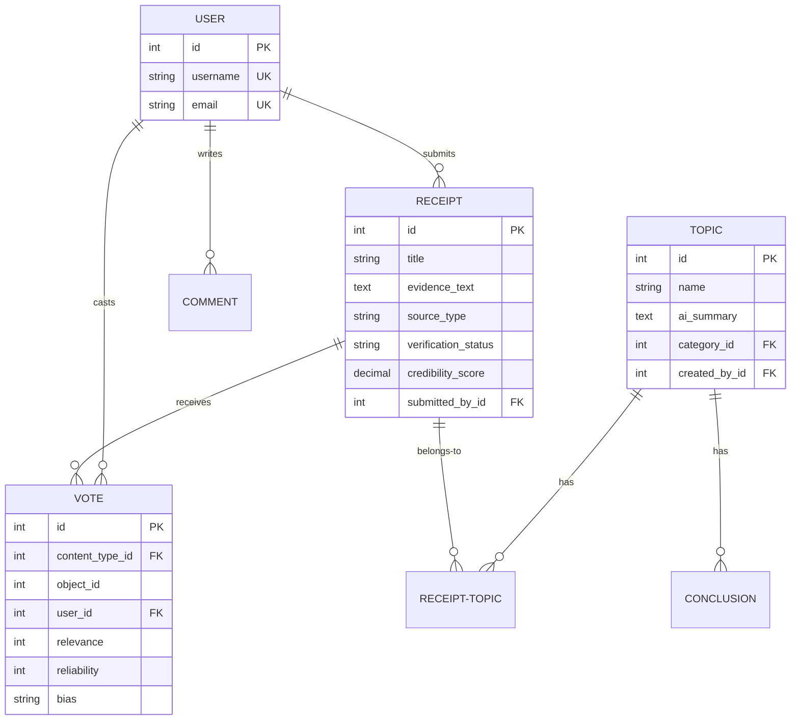

### Class Diagram (classDiagram)

#### Relationship Types

| Syntax | Type | Description |
|---|---|---|
| `<\|--` | Inheritance | Child extends Parent |
| `*--` | Composition | Part cannot exist without Whole |
| `o--` | Aggregation | Part can exist independently |
| `-->` | Association | Uses / references |
| `..>` | Dependency | Depends on |
| `..\|>` | Realization | Implements interface |

#### Visibility Markers

| Marker | Access |
|---|---|
| `+` | Public |
| `-` | Private |
| `#` | Protected |
| `~` | Package/Internal |

#### Annotations

```
classDiagram
    class ClassName {
        <<abstract>>
        +String field
        +method() ReturnType
    }
```

#### Complete Example

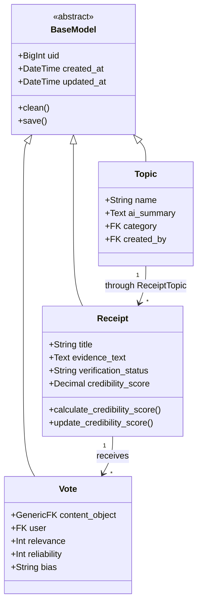

### Flowchart

#### Direction Options

| Keyword | Direction |
|---|---|
| `TB` or `TD` | Top to Bottom |
| `BT` | Bottom to Top |
| `LR` | Left to Right |
| `RL` | Right to Left |

#### Node Shapes

| Syntax | Shape |
|---|---|
| `A[text]` | Rectangle |
| `A(text)` | Rounded rectangle |
| `A{text}` | Diamond (decision) |
| `A[(text)]` | Cylinder (database) |
| `A([text])` | Stadium (start/end) |
| `A[[text]]` | Subroutine |

#### Edge Labels

```
A -->|label text| B
A ---|label text| B
A -.->|label text| B
A ==>|label text| B
```

#### Subgraphs

```
flowchart LR
    subgraph Backend
        direction TB
        A --> B
    end
    subgraph Frontend
        C --> D
    end
    Backend --> Frontend
```

#### Complete Example

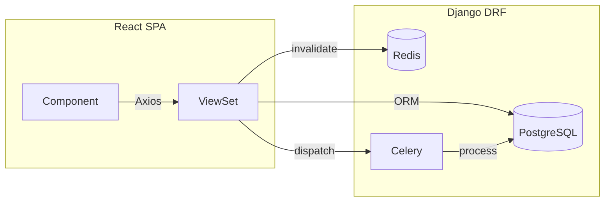

### C4 Diagrams

#### C4Context (System Context)

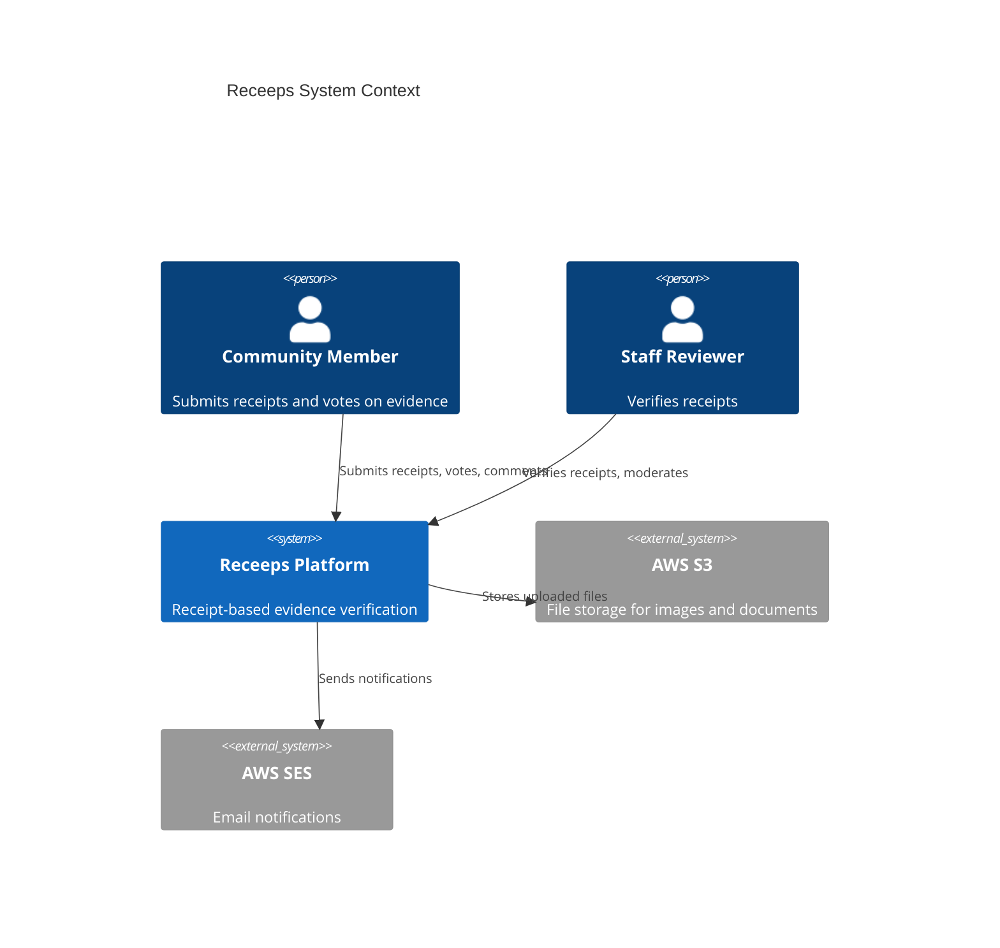

#### C4Container (Container Diagram)

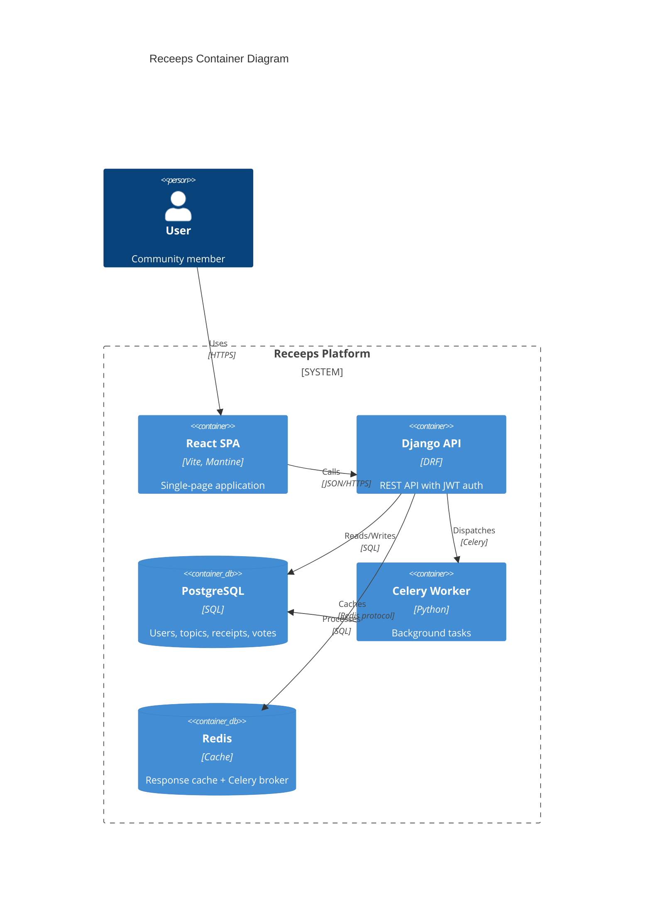

#### C4 Syntax Elements

| Function | Purpose |
|---|---|
| `Person(alias, label, description)` | Human actor |
| `System(alias, label, description)` | Software system (internal) |
| `System_Ext(alias, label, description)` | External system |
| `System_Boundary(alias, label)` | Groups containers |
| `Container(alias, label, technology, description)` | Application component |
| `ContainerDb(alias, label, technology, description)` | Database |
| `Rel(from, to, label, technology)` | Relationship |

---

## LLM Parsing Effectiveness

### Research Findings

1. **LLMs parse mermaid natively.** Claude, GPT-4, and other frontier models have been trained on extensive mermaid examples in documentation and code. The syntax is unambiguous -- `A --> B` means A connects to B, with no room for creative interpretation.

2. **Structured DSL beats natural language.** Mermaid provides "strict, non-negotiable logic to ground text." The model can cross-reference prose descriptions against the diagram's structural logic, improving long-term attention to relationships.

3. **Mermaid acts as a cognitive scaffold.** When placed in a system prompt, mermaid diagrams give the LLM a parseable summary that constrains its reasoning about model relationships, preventing it from inventing connections that do not exist.

4. **LLMermaid pattern.** The fladdict/llmermaid project demonstrates using mermaid flowcharts within system prompts to define execution flows. The LLM follows the diagram as a state machine, processing tasks according to the specified structure.

5. **Benchmarking evidence.** The MermaidSeqBench benchmark (arxiv.org/abs/2511.14967) formally evaluates LLM ability to generate and parse mermaid sequence diagrams, confirming that frontier models handle mermaid syntax with high accuracy.

### What Works Well

- **ER diagrams**: LLMs can reason about foreign keys, cardinality, and join paths from erDiagram syntax alone.
- **Class hierarchies**: `<|--` inheritance chains are parsed correctly and used in code generation.
- **Flowchart logic**: LLMs can follow decision diamonds and subgraph boundaries.
- **Relationship labels**: Labels on edges (`: submits`, `: belongs-to`) provide semantic context that improves reasoning.

### What to Avoid

- **Overly complex diagrams**: More than 20 nodes in a single diagram degrades LLM attention. Split into multiple focused diagrams.
- **C4 verbose syntax**: The function-call style (`Person(alias, label, description)`) uses significantly more tokens than ER/class syntax for equivalent information.
- **Nested subgraphs**: More than 2 levels of nesting can confuse LLM parsing.
- **Style/theme directives**: `%%{init: {'theme': 'dark'}}%%` wastes tokens; LLMs ignore visual styling.

---

## Token Efficiency Analysis

### Comparative Token Costs

The same data architecture described three ways:

**Natural Language (~320 tokens):**
> The system has Users who can create Topics. Each Topic has a name, AI summary, and belongs to a Category. Users submit Receipts which are pieces of evidence with a title, evidence text, source URL, source type, and verification status. Receipts are linked to Topics through a ReceiptTopic join table that tracks relevance scores. Users can vote on Receipts with relevance and reliability ratings plus a bias assessment. Votes use a generic foreign key to support voting on different content types. Comments can be attached to both Receipts and Topics using a generic foreign key, and comments support threading via a self-referential parent field.

**erDiagram (~180 tokens, 44% reduction):**
```
erDiagram
    USER ||--o{ TOPIC : creates
    USER ||--o{ RECEIPT : submits
    USER ||--o{ VOTE : casts
    USER ||--o{ COMMENT : writes
    TOPIC }o--o{ RECEIPT : "linked via ReceiptTopic"
    RECEIPT ||--o{ VOTE : receives
    TOPIC ||--o{ CONCLUSION : has
    COMMENT ||--o{ COMMENT : "replies (self-ref)"

    TOPIC {
        string name
        text ai_summary
        int category_id FK
    }
    RECEIPT {
        string title
        text evidence_text
        string source_type
        string verification_status
        decimal credibility_score
    }
    VOTE {
        int content_type_id FK "generic FK"
        int relevance
        int reliability
        string bias
    }
    COMMENT {
        text content
        int content_type_id FK "generic FK"
        int parent_id FK "threading"
    }
```

**Hybrid (erDiagram + brief notes, ~210 tokens, 34% reduction):**
The hybrid approach pairs a minimal erDiagram with 2-3 lines of prose for nuances that diagrams cannot express (like "GenericFK targets Receipt or Topic only").

### Key Insight

erDiagram syntax achieves 40-50% token reduction while being MORE precise than natural language. The reduction comes from eliminating filler words ("which are", "that tracks", "can be attached to") while the structured format forces complete field declarations.

### Token Budget Guidelines

| Diagram Size | Approximate Tokens | Recommended For |
|---|---|---|
| 5-8 entities, no attributes | 60-100 | Quick relationship overview |
| 5-8 entities with key fields | 150-250 | Standard CLAUDE.md data section |
| 10-15 entities with full fields | 300-500 | Dedicated architecture doc |
| C4Context (5-8 elements) | 200-300 | System overview |
| Flowchart (8-12 nodes) | 100-180 | Data flow / API lifecycle |

---

## Best Practices for CLAUDE.md Integration

### 1. Use the Right Diagram for the Right Purpose

Place diagrams in the architecture section of CLAUDE.md or in a dedicated `.claude/docs/architecture.md` file.

| Purpose | Diagram Type | Where to Place |
|---|---|---|
| Data model overview (all models + relationships) | erDiagram | CLAUDE.md or architecture.md |
| Inheritance hierarchy (BaseModel pattern) | classDiagram | architecture.md |
| API request lifecycle | flowchart | architecture.md |
| System context (for complex multi-service apps) | C4Context | CLAUDE.md (top of architecture section) |

### 2. Keep Diagrams Focused

- **One diagram per concern.** Do not put all models, all flows, and all services in one diagram.
- **Maximum 12-15 entities per erDiagram.** Split by domain if larger.
- **Maximum 10-12 nodes per flowchart.** Create separate flows for separate processes.
- **Omit obvious fields.** Do not list `id PK`, `created_at`, `updated_at` if every model has them via BaseModel. Document the base pattern once, then only show unique fields.

### 3. Pair Diagrams with Minimal Prose

Mermaid cannot express everything. Add 1-3 lines of prose after each diagram for:
- Generic foreign key targets (which content types are allowed)
- Custom managers or querysets
- Validation rules that affect data integrity
- Through-model semantics

### 4. Avoid Visual-Only Syntax

Strip these from CLAUDE.md diagrams -- they waste tokens and LLMs ignore them:
- `%%{init: ...}%%` theme/config blocks
- `style` directives
- `class` CSS assignments
- `click` event handlers
- Color/stroke customizations

### 5. Use Relationship Labels

Always include labels on relationship lines. The label is semantic context that helps the LLM understand the nature of the relationship:

```
%% Good: labels explain the relationship
USER ||--o{ RECEIPT : submits
USER ||--o{ VOTE : casts

%% Bad: no labels -- LLM must guess the relationship type
USER ||--o{ RECEIPT : ""
USER ||--o{ VOTE : ""
```

### 6. Modular Loading Strategy

For large projects, do not dump all diagrams into CLAUDE.md. Instead:
- Put the high-level overview (5-8 entities, relationships only) in CLAUDE.md
- Put detailed field-level diagrams in `.claude/docs/data-models.md`
- Reference with `@.claude/docs/data-models.md` so Claude can load on demand

---

## Template Examples

### Template 1: Django App (Receeps -- actual project models)

This template uses real models from `/Users/trey/Desktop/Apps/receipts/`.

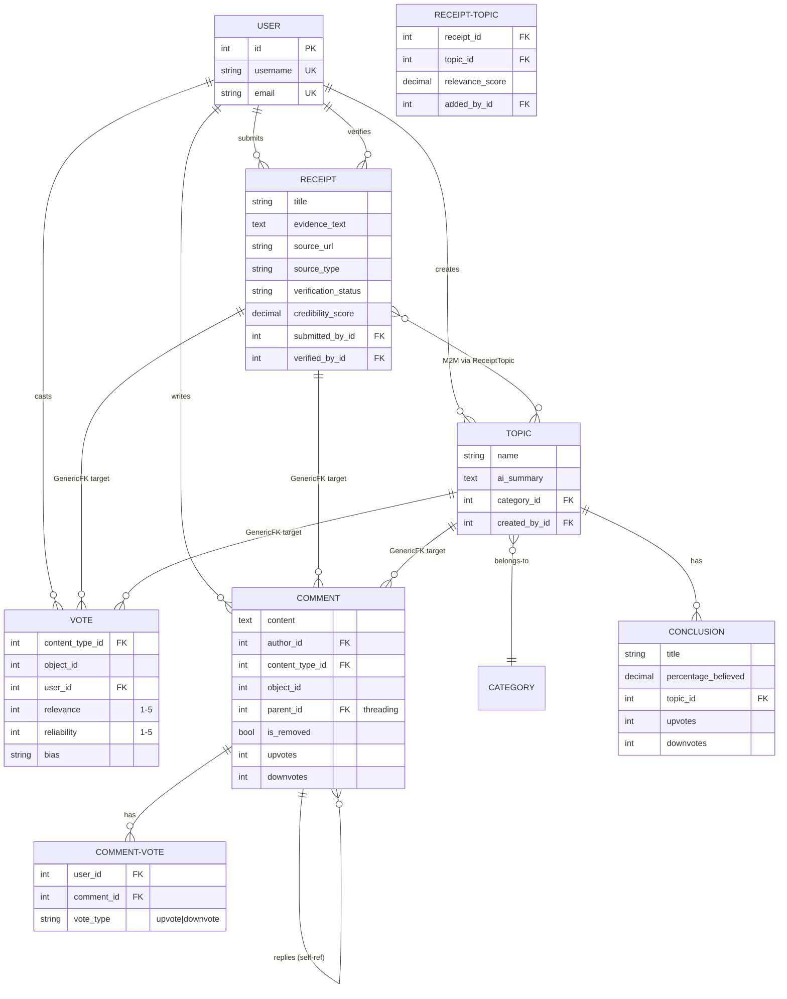

**Notes for prose supplement:**
- All models extend `BaseModel` (provides `uid`, `created_at`, `updated_at`)
- `Vote.content_type` targets `Receipt` or `Topic` only (generic FK)
- `Comment.content_type` limited to `Receipt` and `Topic` via `limit_choices_to`
- `ReceiptTopic` is the through-model with `unique_receipt_topic` constraint
- `CommentVote` enforces `unique_comment_vote_per_user` constraint

---

### Template 2: Mobile App with SQLite (EasyStreet)

This template represents the EasyStreet native app SQLite schema from `/Users/trey/Desktop/Apps/Parks/EasyStreet/`.

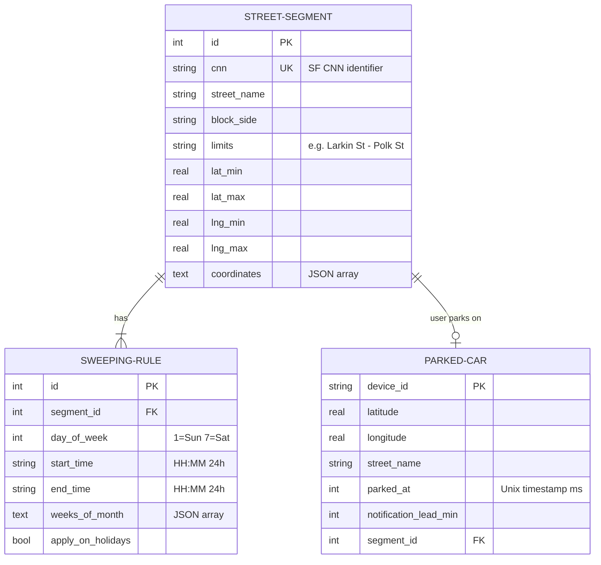

**Notes:**
- Database ships pre-loaded with 37,856 street segments (read-only)
- `ParkedCar` is stored in UserDefaults (iOS) / SharedPreferences (Android), not SQLite
- `SweepingRuleEngine` evaluates rules against current time + `HolidayCalculator`
- `SweepingStatus` is a computed enum: safe | today | activeNow | imminent | upcoming | noData | unknown

---

### Template 3: TypeScript Monorepo with Shared Types (easystreet-monorepo)

This template represents the shared type system from `/Users/trey/Desktop/Apps/Parks/easystreet-monorepo/`.

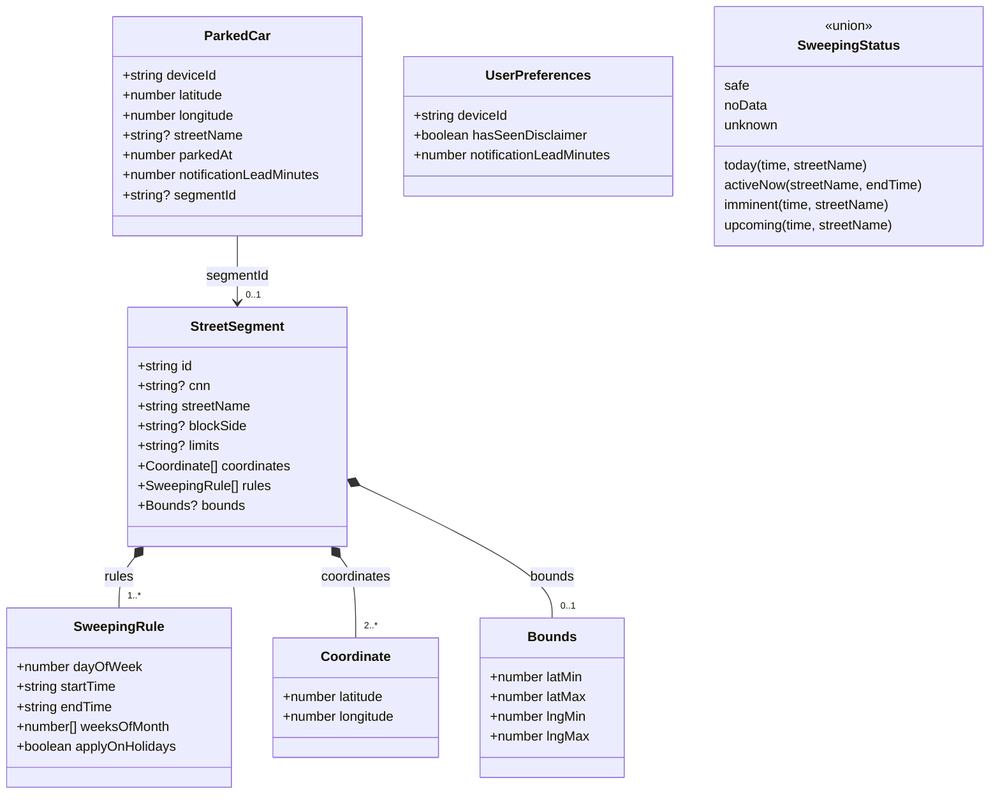

**Convex backend schema mirrors these types:**

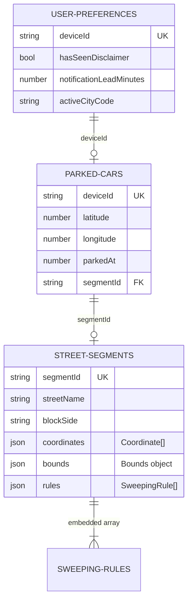

**Notes:**
- Shared types in `packages/shared/src/types.ts` consumed by both `apps/web/` and `apps/mobile/`
- Convex schema in `packages/backend/convex/schema.ts` -- rules and coordinates are embedded arrays, not separate tables
- `SweepingStatus` is a discriminated union (tagged by `type` field), not a database entity

---

### Template 4: System Architecture Overview (Flowchart)

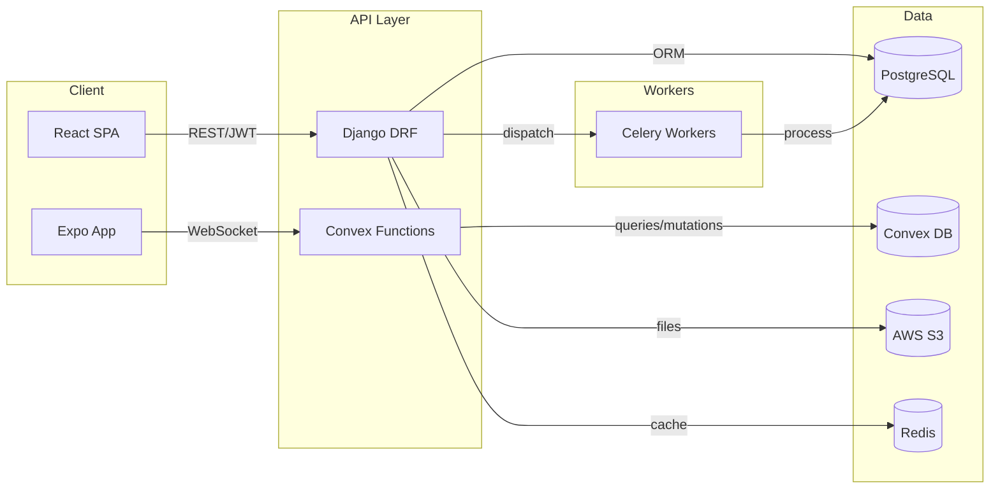

---

### Template 5: Minimal erDiagram for CLAUDE.md (Relationships Only)

When token budget is tight, use this pattern -- relationships only, no attributes:

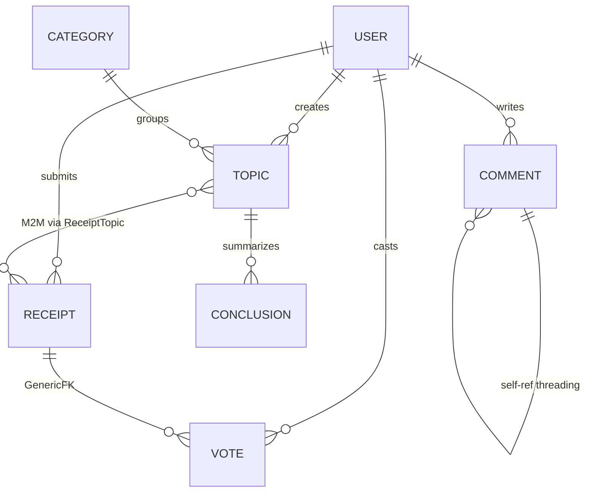

This captures the entire data architecture in approximately 80 tokens.

---

## Recommendations

### For This Workspace

1. **Add erDiagram to each project's CLAUDE.md or architecture.md.** Start with the receipts project (richest data model) and EasyStreet (simplest, good proof of concept).

2. **Use the "tiered" approach:**
   - CLAUDE.md: Minimal relationships-only erDiagram (Template 5 pattern, ~80 tokens)
   - `.claude/docs/data-models.md`: Full erDiagram with attributes (Template 1 pattern, ~250 tokens)
   - `.claude/docs/architecture.md`: Flowchart for system overview (Template 4 pattern, ~120 tokens)

3. **Prefer erDiagram over classDiagram for database models.** Class diagrams are better for TypeScript/Swift type hierarchies where methods matter. For Django models, the ER diagram captures what Claude needs: fields, types, and relationships.

4. **Pair every diagram with 3-5 lines of supplementary notes.** Cover: base class inheritance, generic FK constraints, unique constraints, computed fields, and any relationship semantics that crow's foot notation cannot express.

5. **Do not use C4 diagrams in CLAUDE.md unless the system has 3+ services.** For single-service apps (receipts, EasyStreet), the token cost of C4 syntax is not justified. A simple flowchart covers the same ground in fewer tokens.

6. **Keep diagrams up to date.** When models change, update the diagram in the same commit. Stale diagrams are worse than no diagrams -- they actively mislead the LLM.

### General Guidelines

| Guideline | Rationale |
|---|---|
| Max 12-15 entities per diagram | LLM attention degrades beyond this |
| Always include relationship labels | Labels are semantic context the LLM uses for reasoning |
| Omit inherited/common fields | Document base pattern once, show only unique fields |
| Strip visual styling directives | Wastes tokens, LLMs cannot render visuals |
| Use `erDiagram` for data, `flowchart` for process | Match diagram type to information type |
| Place in loadable doc files, reference from CLAUDE.md | Keeps CLAUDE.md lean while data is accessible |
| One diagram per concern | Avoid mega-diagrams mixing models, flows, and infrastructure |

---

## Sources

- [Entity Relationship Diagrams -- Mermaid Official Docs](https://mermaid.js.org/syntax/entityRelationshipDiagram.html)
- [Class Diagrams -- Mermaid Official Docs](https://mermaid.js.org/syntax/classDiagram.html)
- [C4 Diagrams -- Mermaid Official Docs](https://mermaid.js.org/syntax/c4.html)
- [Flowcharts Syntax -- Mermaid Official Docs](https://mermaid.js.org/syntax/flowchart.html)
- [Architecture Diagrams -- Mermaid Official Docs (v11.1.0+)](https://mermaid.js.org/syntax/architecture.html)
- [Mermaid Syntax Reference](https://mermaid.js.org/intro/syntax-reference.html)
- [Analyzing the Best Diagramming Tools for the LLM Age Based on Token Efficiency -- DEV Community](https://dev.to/akari_iku/analyzing-the-best-diagramming-tools-for-the-llm-age-based-on-token-efficiency-5891)
- [Improve AI Code Awareness with Mermaid Diagram Context -- ChatPRD](https://www.chatprd.ai/how-i-ai/workflows/improve-ai-code-awareness-with-mermaid-diagram-context)
- [Advanced Claude Code Techniques: Context Loading, Mermaid Diagrams -- Lenny's Newsletter](https://www.lennysnewsletter.com/p/advanced-claude-code-techniques-context)
- [LLMermaid -- GitHub (fladdict)](https://github.com/fladdict/llmermaid)
- [MermaidSeqBench: Evaluation Benchmark for LLM-to-Mermaid Generation -- arXiv](https://arxiv.org/html/2511.14967v1)
- [Agent Mermaid Reporting for Duty -- Korny's Blog](https://blog.korny.info/2025/10/10/agent-mermaid-reporting-for-duty)
- [LLM + Mermaid: How Modern Teams Create UML Diagrams Without Lucidchart -- Mike Vincent](https://mike-vincent.medium.com/llm-mermaid-how-modern-teams-create-uml-diagrams-without-lucidchart-e54c56350804)
- [Building C4 Diagrams in Mermaid -- Luke Merrett](https://lukemerrett.com/building-c4-diagrams-in-mermaid/)
- [Improve Your Prompt Engineering with Mermaid -- DEV Community](https://dev.to/grimch/improve-your-prompt-engineering-with-the-help-of-a-little-mermaid-2j60)
