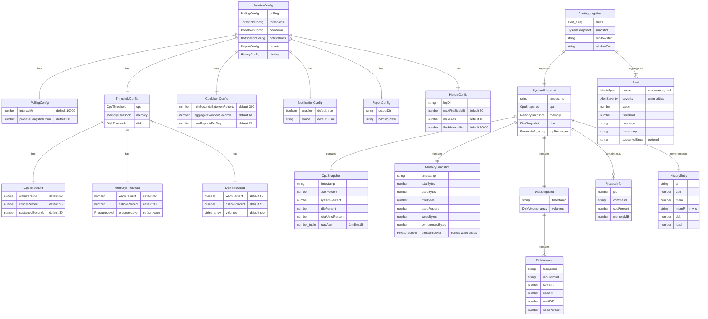
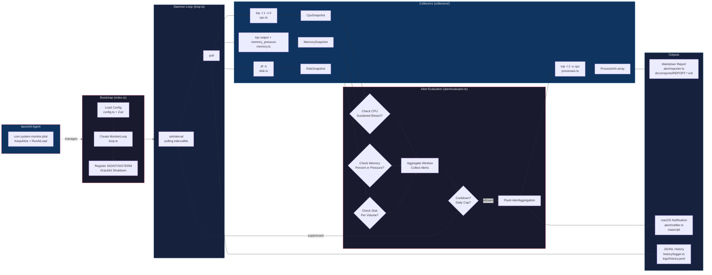
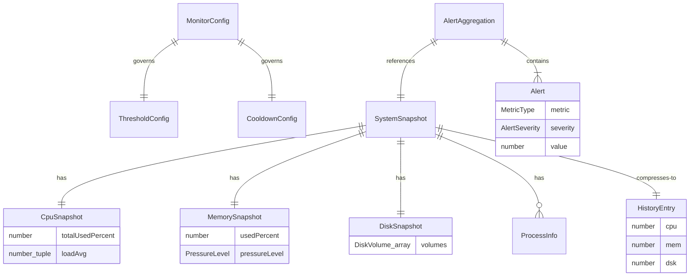

# system-monitor Data Models & Architecture Diagrams

Generated: 2026-02-09

---

## 1. Entity Relationship Diagram (Data Types)

This erDiagram captures every TypeScript interface in `src/types.ts` plus the Zod config schema from `src/config.ts`. Relationships show how snapshots compose into aggregations and how config governs thresholds.

---

## 2. System Architecture Flowchart (Monitoring Pipeline)

This flowchart shows the runtime data flow from process startup through collection, evaluation, and output stages. Each box maps to a source file.

---

## 3. Minimal Entity Diagram (Quick Reference)

Compact version showing only the core data flow entities and their primary relationships.

---

## Key Architectural Notes

1. **Single top invocation:** CPU and memory collectors share a single `top -l 1` call per poll cycle. Process list collection (`top -l 2`) only runs when an alert fires (expensive operation deferred).

2. **Sustained breach tracking:** CPU alerts require the threshold to be exceeded for `sustainedSeconds` continuously. The evaluator tracks `cpuBreachStart` and resets it when CPU drops below warn level.

3. **Three-tier suppression:** Alerts pass through (a) aggregate window collection (60s default), (b) cooldown timer (300s between reports), and (c) daily cap (20 reports/day).

4. **History compression:** Full `SystemSnapshot` objects are compressed to minimal `HistoryEntry` records (6 fields vs ~20+) before JSONL logging. Memory pressure is reduced to a single character (`n`/`w`/`c`).

5. **Log rotation:** JSONL files rotate at 50 MB by default, keeping up to 10 rotated files (`history.1.jsonl` through `history.10.jsonl`).

6. **No shell execution:** All system commands use `execFile()` (not shell-based execution) to prevent injection. Commands use hardcoded absolute paths (`/usr/bin/top`, `/bin/df`, `//usr/bin/memory_pressure`).
