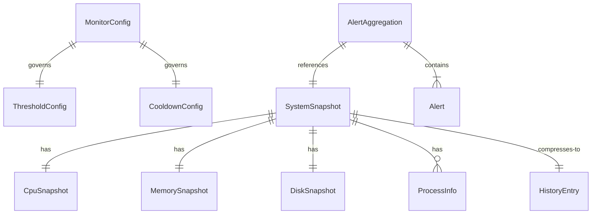

# system-monitor — macOS System Monitor Daemon

24/7 background daemon that monitors CPU, memory, and disk usage. Generates markdown reports with full process snapshots when thresholds are breached, sends native macOS notifications, and logs history for trend analysis.

## Stack

Node.js (ES modules), TypeScript 5.9, Zod 3.24. Zero runtime dependencies beyond Zod. Runs as a macOS launchd agent.

## Key Commands

```bash
npm run build            # Compile TypeScript to dist/
npm run dev              # Run with tsx (dev mode, no build needed)
npm start                # Run compiled JS
npm run test             # Test collectors against live system data
npm run install-daemon   # Build + install launchd agent (starts immediately)
npm run uninstall-daemon # Stop + remove launchd agent (preserves logs)
```

## Architecture

```
src/
├── index.ts              # Entry point — bootstrap + graceful shutdown
├── types.ts              # All shared interfaces
├── config.ts             # Zod config loader with defaults
├── loop.ts               # Main monitoring loop orchestrator
├── collectors/           # System metric parsers
│   ├── cpu.ts            # top -l 1 → CPU usage %
│   ├── memory.ts         # top + memory_pressure → memory stats
│   ├── disk.ts           # df -h → disk usage
│   └── processes.ts      # top -l 2 → per-process CPU/memory
├── alert/
│   ├── evaluator.ts      # Threshold checks, sustained tracking, cooldown
│   ├── notifier.ts       # osascript display notification
│   └── reporter.ts       # Markdown report generator
├── history/
│   └── logger.ts         # JSONL logger with rotation
└── utils/
    ├── exec.ts           # execFile wrapper (never use shell exec)
    ├── logger.ts         # Stderr logger
    └── format.ts         # Number/byte formatting
```

**Key pattern:** Collectors parse system command output into typed snapshots. Evaluator checks thresholds with sustained-breach and cooldown state machines. Reporter writes markdown to docs/reports/. History logs compressed JSONL for trend analysis.

## Config

All config is in `config/monitor.json`. Every field has a Zod default — an empty `{}` config works fine.

Key settings:
- `polling.intervalMs` — poll frequency (default 10s)
- `thresholds.cpu.sustainedSeconds` — CPU must stay above warn for this long before alerting (default 30s)
- `cooldown.minSecondsBetweenReports` — suppress duplicate reports (default 5min)
- `cooldown.maxReportsPerDay` — hard daily cap (default 20)

## Code Style

- ES modules everywhere (`.js` extensions in imports)
- All system commands via `execFile()` — never shell-based execution (prevents injection)
- Logger writes to stderr (matches macos-hub pattern)
- One collector per file

## Architecture Diagrams

Full diagrams with all entities, fields, and data flow: [.claude/docs/data-models.md](.claude/docs/data-models.md)

**Quick reference — core data model:**



## Context7 — Live Documentation

When writing or modifying code that uses external libraries, automatically use Context7 MCP tools (`resolve-library-id` → `query-docs`) to fetch current documentation instead of relying on training data.

**Pre-resolved library IDs for this project:**
- Zod: `/colinhacks/zod`

Use when: implementing library APIs, upgrading dependencies, debugging API behavior, writing framework configuration.
Skip when: pure business logic, editing docs/config with no framework dependency.

## Parallel Agent Work

This project participates in the workspace plan queue system. See `/Users/trey/Desktop/Apps/CLAUDE.md` for the full Plan Queue Protocol.

### Worktree Setup
- Bootstrap: `.cmux/setup` handles env symlinks and dependency installation
- Branch naming: `plan/[plan-name]` for plan-driven work, `feature/[name]` for ad-hoc

### File Ownership Boundaries
When multiple agents work on this project simultaneously, use these boundaries to avoid conflicts:

| Agent Role | Owned Paths |
|------------|-------------|
| Collectors | `src/collectors/` (cpu.ts, memory.ts, disk.ts, processes.ts) |
| Alert | `src/alert/` (evaluator.ts, notifier.ts, reporter.ts) |
| History | `src/history/` (JSONL logger, rotation logic) |
| Core | `src/index.ts`, `src/types.ts`, `src/config.ts`, `src/loop.ts`, `src/utils/` |
| Config | `config/monitor.json`, launchd plist, daemon install/uninstall scripts |
| Tests | `tests/` (all test suites) |
| Docs | `timeline.md`, `README.md`, `CLAUDE.md`, `AGENTS.md`, `.claude/docs/` |

**Rules:**
- Each file belongs to exactly one zone
- Never have two agents editing the same file simultaneously

### Conflict Prevention
- Check which files other active plans target before starting (read `docs/plans/active/*.md`)
- If your scope overlaps with an active plan, coordinate or wait
- After completing work, run `npm run build && npm run test` before marking the plan done

### Agent Teams Strategy
When `/dispatch` detects 2+ plans targeting this project with overlapping scope, it creates an Agent Team instead of parallel subagents. Custom agent definitions from `/Users/trey/Desktop/Apps/.claude/agents/` are available:
- `plan-executor` — Execute plan phases with testing and verification
- `test-writer` — Write tests without modifying source code
- `docs-agent` — Update documentation (CLAUDE.md, timeline, diagrams)
- `reviewer` — Read-only code review and quality gates (uses Sonnet)

## Git Workflow

- Branch naming: `feature/`, `fix/`, `docs/` prefixes
- Always `npm run build` before committing
- Update `timeline.md` after work sessions


## Writing Style
- Do not use em dashes in documents or writing.


### Code Intelligence

Prefer LSP over Grep/Read for code navigation - it's faster, precise, and avoids reading entire files:
- `workspaceSymbol` to find where something is defined
- `findReferences` to see all usages across the codebase
- `goToDefinition` / `goToImplementation` to jump to source
- `hover` for type info without reading the file

Use Grep only when LSP isn't available or for text/pattern searches (comments, strings, config).

After writing or editing code, check LSP diagnostics and fix errors before proceeding.